# Advanced CSS and Sass: Flexbox, Grid, Animations and More!

## Table of Contents
- [Advanced CSS and Sass: Flexbox, Grid, Animations and More!](#advanced-css-and-sass-flexbox-grid-animations-and-more)
  - [Table of Contents](#table-of-contents)
  - [**Section 1: Welcome, Welcome, Welcome!**](#section-1-welcome-welcome-welcome)
  - [**Section 2: Natours Project — Setup and First Steps (Part 1)**](#section-2-natours-project--setup-and-first-steps-part-1)
    - [4. Section Intro](#4-section-intro)
    - [5. Project Overview](#5-project-overview)
    - [6. Building the Header - Part 1](#6-building-the-header---part-1)
      - [The best way to perform a basic reset using the universal selector](#the-best-way-to-perform-a-basic-reset-using-the-universal-selector)
      - [How to set project-wide font definitions?](#how-to-set-project-wide-font-definitions)
      - [How to clip parts of elements using clip-path?](#how-to-clip-parts-of-elements-using-clip-path)
    - [7. Building the Header - Part 2](#7-building-the-header---part-2)
    - [8. Creating Cool CSS Animations](#8-creating-cool-css-animations)
      - [How to create CSS animations using @keyframes and the animation property?](#how-to-create-css-animations-using-keyframes-and-the-animation-property)
    - [9. Building a Complex Animated Button - Part 1](#9-building-a-complex-animated-button---part-1)
      - [What pseudo-classes are?](#what-pseudo-classes-are)
      - [How to create a creative hover animation effect using the transition property?](#how-to-create-a-creative-hover-animation-effect-using-the-transition-property)
    - [10. Building a Complex Animated Button - Part 2](#10-building-a-complex-animated-button---part-2)
      - [What pseudo-elements are?](#what-pseudo-elements-are)
      - [How and why to use the ::after pseudoelement;](#how-and-why-to-use-the-after-pseudoelement)
  - [**Section 3: How CSS Works: A Look Behind the Scenes**](#section-3-how-css-works-a-look-behind-the-scenes)
    - [12. Three Pillars of Writing Good HTML and CSS (Never Forget Them!)](#12-three-pillars-of-writing-good-html-and-css-never-forget-them)
    - [13. How CSS Works Behind the Scenes: An Overview](#13-how-css-works-behind-the-scenes-an-overview)
    - [14. How CSS is Parsed, Part 1: The Cascade and Specificity](#14-how-css-is-parsed-part-1-the-cascade-and-specificity)
    - [15. Specificity in Practice](#15-specificity-in-practice)
    - [16. How CSS is Parsed, Part 2: Value Processing](#16-how-css-is-parsed-part-2-value-processing)
      - [How CSS values are processed?](#how-css-values-are-processed)
      - [How units are converted from relative to absolute?](#how-units-are-converted-from-relative-to-absolute)
    - [17. How CSS is Parsed, Part 3: Inheritance](#17-how-css-is-parsed-part-3-inheritance)
    - [18. Converting px to rem: An Effective Workflow](#18-converting-px-to-rem-an-effective-workflow)
    - [19. How CSS Renders a Website: The Visual Formatting Model](#19-how-css-renders-a-website-the-visual-formatting-model)
      - [The box model](#the-box-model)
      - [Box types](#box-types)
      - [Positioning Schemes](#positioning-schemes)
      - [Stacking Contexts](#stacking-contexts)
    - [20. CSS Architecture, Components and BEM](#20-css-architecture-components-and-bem)
      - [Thinking about the layout](#thinking-about-the-layout)
      - [Building with meaningful class names](#building-with-meaningful-class-names)
      - [Architecting with files and folders](#architecting-with-files-and-folders)
    - [21. Implementing BEM in the Natours Project](#21-implementing-bem-in-the-natours-project)
  - [**Section 4: Introduction to Sass and NPM**](#section-4-introduction-to-sass-and-npm)
    - [22. Section Intro](#22-section-intro)
    - [23. What is Sass?](#23-what-is-sass)
    - [24. First Steps with Sass: Variables and Nesting](#24-first-steps-with-sass-variables-and-nesting)
    - [25. First Steps with Sass: Mixins, Extends and Functions](#25-first-steps-with-sass-mixins-extends-and-functions)
    - [27. NPM Packages: Let's Install Sass Locally](#27-npm-packages-lets-install-sass-locally)
    - [28. NPM Scripts: Let's Write and Compile Sass Locally](#28-npm-scripts-lets-write-and-compile-sass-locally)
    - [29. The Easiest Way of Automatically Reloading a Page on File Changes](#29-the-easiest-way-of-automatically-reloading-a-page-on-file-changes)
  - [**Section 5: Natours Project — Using Advanced CSS and Sass (Part 2)**](#section-5-natours-project--using-advanced-css-and-sass-part-2)
    - [31. Converting Our CSS Code to Sass: Variables and Nesting](#31-converting-our-css-code-to-sass-variables-and-nesting)
    - [32. Implementing the 7-1 CSS Architecture with Sass](#32-implementing-the-7-1-css-architecture-with-sass)
    - [33. Review: Basic Principles of Responsive Design and Layout Types](#33-review-basic-principles-of-responsive-design-and-layout-types)
    - [34. Building a Custom Grid with Floats](#34-building-a-custom-grid-with-floats)
    - [35. Building the About Section - Part 1](#35-building-the-about-section---part-1)
      - [Thinking about components](#thinking-about-components)
      - [How and why to use utility classes?](#how-and-why-to-use-utility-classes)
      - [How to use the background-clip property?](#how-to-use-the-background-clip-property)
      - [How to transform multiple properties simultaneously?](#how-to-transform-multiple-properties-simultaneously)
    - [36. Building the About Section - Part 2](#36-building-the-about-section---part-2)
      - [Tertiary Heading component](#tertiary-heading-component)
      - [Paragraph component](#paragraph-component)
      - [Text Button component](#text-button-component)
    - [37. Building the About Section - Part 3](#37-building-the-about-section---part-3)
      - [How to use the outline-offset property together with outline?](#how-to-use-the-outline-offset-property-together-with-outline)
      - [How to style elements that are NOT hovered while others are?](#how-to-style-elements-that-are-not-hovered-while-others-are)
    - [38. Building the Features Section](#38-building-the-features-section)
      - [How to include and use an icon font?](#how-to-include-and-use-an-icon-font)
      - [Another way of creating the "skewed section"](#another-way-of-creating-the-skewed-section)
      - [How and when to use the direct child selector?](#how-and-when-to-use-the-direct-child-selector)
    - [39. Building the Tours Section - Part 1](#39-building-the-tours-section---part-1)
      - [Thinking about components](#thinking-about-components-1)
      - [How to build an amazing, rotating card?](#how-to-build-an-amazing-rotating-card)
    - [40. Building the Tours Section - Part 2](#40-building-the-tours-section---part-2)
      - [Front Side Card component: Picture, Heading, Details](#front-side-card-component-picture-heading-details)
      - [How to use perspective in CSS?](#how-to-use-perspective-in-css)
      - [How to use the backface-visibility property?](#how-to-use-the-backface-visibility-property)
      - [Using background blend modes?](#using-background-blend-modes)
      - [How and when to use box-decoration-break;](#how-and-when-to-use-box-decoration-break)
    - [41. Building the Tours Section - Part 3](#41-building-the-tours-section---part-3)
      - [Back Side Card component: CTA](#back-side-card-component-cta)
      - [Green Button](#green-button)
    - [42. Building the Stories Section - Part 1](#42-building-the-stories-section---part-1)
      - [Thinking about components](#thinking-about-components-2)
      - [Story component](#story-component)
      - [How to make text flow around shapes with shape-outside and float?](#how-to-make-text-flow-around-shapes-with-shape-outside-and-float)
    - [43. Building the Stories Section - Part 2](#43-building-the-stories-section---part-2)
      - [Story Shape component - Figure Caption](#story-shape-component---figure-caption)
    - [44. Building the Stories Section - Part 3](#44-building-the-stories-section---part-3)
      - [Story component - Background video](#story-component---background-video)
      - [How to use the <video> HTML element?](#how-to-use-the-video-html-element)
      - [How to create a background video covering an entire section?](#how-to-create-a-background-video-covering-an-entire-section)
      - [How and when to use the object-fit property?](#how-and-when-to-use-the-object-fit-property)
    - [45. Building the Booking Section - Part 1](#45-building-the-booking-section---part-1)
      - [Thinking about components](#thinking-about-components-3)
      - [How to implement "solid-color gradients"?](#how-to-implement-solid-color-gradients)
    - [46. Building the Booking Section - Part 2](#46-building-the-booking-section---part-2)
      - [Input component: Full name and Email address](#input-component-full-name-and-email-address)
      - [How the general and adjacent sibling selectors work and why we need them?](#how-the-general-and-adjacent-sibling-selectors-work-and-why-we-need-them)
      - [How to use the ::input-placeholder pseudo-element?](#how-to-use-the-input-placeholder-pseudo-element)
      - [How and when to use the :focus, :invalid, :placeholder-shown?](#how-and-when-to-use-the-focus-invalid-placeholder-shown)
    - [47. Building the Booking Section - Part 3](#47-building-the-booking-section---part-3)
      - [Techniques to build custom radio buttons](#techniques-to-build-custom-radio-buttons)
      - [Green button](#green-button-1)
      - [How and when to use the :checked pseudo-classes?](#how-and-when-to-use-the-checked-pseudo-classes)
    - [48. Building the Footer](#48-building-the-footer)
      - [How to design a simple website footer?](#how-to-design-a-simple-website-footer)
    - [49. Building the Navigation - Part 1](#49-building-the-navigation---part-1)
    - [50. Building the Navigation - Part 2](#50-building-the-navigation---part-2)
      - [What the "checkbox hack" is and how it works?](#what-the-checkbox-hack-is-and-how-it-works)
      - [How to animate "solid-color gradients"?](#how-to-animate-solid-color-gradients)
      - [How to create custom animation timing functions using cubic bezier curves?](#how-to-create-custom-animation-timing-functions-using-cubic-bezier-curves)
    - [51. Building the Navigation - Part 3](#51-building-the-navigation---part-3)
      - [Navigation button animation](#navigation-button-animation)
      - [How and why to use transform-origin?](#how-and-why-to-use-transform-origin)
      - [In general: create an amazingly creative effect?](#in-general-create-an-amazingly-creative-effect)
    - [52. Building a Pure CSS Popup - Part 1](#52-building-a-pure-css-popup---part-1)
      - [How to build a nice popup with only CSS?](#how-to-build-a-nice-popup-with-only-css)
      - [How to create boxes with equal height using display: table-cell?](#how-to-create-boxes-with-equal-height-using-display-table-cell)
      - [How to create CSS text columns?](#how-to-create-css-text-columns)
      - [How to automatically hyphenate words using hyphens?](#how-to-automatically-hyphenate-words-using-hyphens)
    - [53. Building a Pure CSS Popup - Part 2](#53-building-a-pure-css-popup---part-2)
      - [How to use the :target pseudo-class?](#how-to-use-the-target-pseudo-class)
  - [**Section 6: Natours Project — Advanced Responsive Design (Part 3)**](#section-6-natours-project--advanced-responsive-design-part-3)
    - [55. Mobile-First vs Desktop-First and Breakpoints](#55-mobile-first-vs-desktop-first-and-breakpoints)
    - [56. Let's Use the Power of Sass Mixins to Write Media Queries](#56-lets-use-the-power-of-sass-mixins-to-write-media-queries)
      - [How to use the @content and @if Sass directives?](#how-to-use-the-content-and-if-sass-directives)
      - [Taking advantage of Chrome DevTools for responsive design.](#taking-advantage-of-chrome-devtools-for-responsive-design)
    - [57. Writing Media Queries - Base, Typography and Layout](#57-writing-media-queries---base-typography-and-layout)
      - [Base](#base)
      - [Typography](#typography)
      - [Layout](#layout)
    - [58. Writing Media Queries - About and Features Sections](#58-writing-media-queries---about-and-features-sections)
      - [Home page](#home-page)
      - [About Section](#about-section)
      - [Features Section](#features-section)
    - [59. Writing Media Queries - Tours, Stories and Booking Sections](#59-writing-media-queries---tours-stories-and-booking-sections)
      - [Tours section](#tours-section)
      - [Stories section](#stories-section)
      - [Booking section](#booking-section)
    - [60. An Overview of Responsive Images](#60-an-overview-of-responsive-images)
    - [61. Responsive Images in HTML - Density Switching and Art Direction](#61-responsive-images-in-html---density-switching-and-art-direction)
      - [Density Switching](#density-switching)
      - [Art Direction](#art-direction)
    - [62. Responsive Images in HTML - Resolution Switching](#62-responsive-images-in-html---resolution-switching)
    - [63. Responsive Images in CSS](#63-responsive-images-in-css)
    - [64. Testing for Browser Support with @supports](#64-testing-for-browser-support-with-supports)
      - [How to use backdrop-filter? Only work in safari](#how-to-use-backdrop-filter-only-work-in-safari)
      - [Safari 9 - 13 still require a prefix for the related backface-visibility property](#safari-9---13-still-require-a-prefix-for-the-related-backface-visibility-property)
      - [Media Queries - Safari don't support standard min/max-resolution](#media-queries---safari-dont-support-standard-minmax-resolution)
    - [65. Setting up a Simple Build Process with NPM Scripts](#65-setting-up-a-simple-build-process-with-npm-scripts)
      - [Build CSS workflow](#build-css-workflow)
      - [Development workflow](#development-workflow)
    - [66. Wrapping up the Natours Project: Final Considerations](#66-wrapping-up-the-natours-project-final-considerations)
      - [Change the style of selected text](#change-the-style-of-selected-text)
      - [Change media query to cater to touch and non-touch device](#change-media-query-to-cater-to-touch-and-non-touch-device)
  - [**Section 7: Trillo Project — Master Flexbox!**](#section-7-trillo-project--master-flexbox)
    - [68. Why Flexbox: An Overview of the Philosophy Behind Flexbox](#68-why-flexbox-an-overview-of-the-philosophy-behind-flexbox)
    - [69. A Basic Intro to Flexbox: The Flex Container](#69-a-basic-intro-to-flexbox-the-flex-container)
    - [70. A Basic Intro to Flexbox: Flex Items](#70-a-basic-intro-to-flexbox-flex-items)
    - [71. A Basic Intro to Flexbox: Adding More Flex Items](#71-a-basic-intro-to-flexbox-adding-more-flex-items)
    - [72. Project Overview](#72-project-overview)
    - [73. Defining Project Settings and Custom Properties](#73-defining-project-settings-and-custom-properties)
      - [How and why to use CSS custom properties?](#how-and-why-to-use-css-custom-properties)
    - [74. Building the Overall Layout](#74-building-the-overall-layout)
      - [How to think about the overall layout of an app?](#how-to-think-about-the-overall-layout-of-an-app)
      - [Use flexbox in a real-world project for the first time](#use-flexbox-in-a-real-world-project-for-the-first-time)
    - [75. Building the Header - Part 1](#75-building-the-header---part-1)
      - [Why to use SVG icons vs. font icons?](#why-to-use-svg-icons-vs-font-icons)
      - [How to find, generate and use SVG sprites in HTML?](#how-to-find-generate-and-use-svg-sprites-in-html)
    - [76. Building the Header - Part 2](#76-building-the-header---part-2)
      - [How to use more advanced flexbox alignment techniques, including justify-content, align-items, align-self and flex?](#how-to-use-more-advanced-flexbox-alignment-techniques-including-justify-content-align-items-align-self-and-flex)
      - [How to change the color of an SVG icon in CSS?](#how-to-change-the-color-of-an-svg-icon-in-css)
    - [77. Building the Header - Part 3](#77-building-the-header---part-3)
    - [78. Building the Navigation - Part 1](#78-building-the-navigation---part-1)
      - [How to use some more advanced flexbox alignment techniques, including flex-direction, justify-content and align-items?](#how-to-use-some-more-advanced-flexbox-alignment-techniques-including-flex-direction-justify-content-and-align-items)
    - [79. Building the Navigation - Part 2](#79-building-the-navigation---part-2)
      - [How to use scaleY and multiple transition properties with different settings, to create a creative hover effect?](#how-to-use-scaley-and-multiple-transition-properties-with-different-settings-to-create-a-creative-hover-effect)
      - [How and why to use the currentColor CSS variable?](#how-and-why-to-use-the-currentcolor-css-variable)
    - [80. Building the Hotel Overview - Part 1](#80-building-the-hotel-overview---part-1)
      - [How to use margin: auto with flexbox, and why it’s so powerful?](#how-to-use-margin-auto-with-flexbox-and-why-its-so-powerful)
    - [81. Building the Hotel Overview - Part 2](#81-building-the-hotel-overview---part-2)
      - [Continue to use flexbox properties for easy positioning and alignment.](#continue-to-use-flexbox-properties-for-easy-positioning-and-alignment)
      - [How to create an infinite animation?](#how-to-create-an-infinite-animation)
    - [82. Building the Description Section - Part 1](#82-building-the-description-section---part-1)
    - [83. Building the Description Section - Part 2](#83-building-the-description-section---part-2)
      - [Continue to use flexbox, including flex-wrap to build a multi-column list](#continue-to-use-flexbox-including-flex-wrap-to-build-a-multi-column-list)
      - [How and why to use CSS masks with mask-image and mask-size?](#how-and-why-to-use-css-masks-with-mask-image-and-mask-size)
    - [84. Building the User Reviews Section](#84-building-the-user-reviews-section)
    - [85. Building the CTA Section](#85-building-the-cta-section)
    - [86. Writing Media Queries - Part 1](#86-writing-media-queries---part-1)
    - [87. Writing Media Queries - Part 2](#87-writing-media-queries---part-2)
    - [88. Wrapping up the Trillo Project: Final Considerations](#88-wrapping-up-the-trillo-project-final-considerations)
  - [**Section 8: A Quick Introduction to CSS Grid Layouts**](#section-8-a-quick-introduction-to-css-grid-layouts)
  - [**Section 9: Nexter Project — Master CSS Grid Layouts!**](#section-9-nexter-project--master-css-grid-layouts)
  - [**Section 10: That's It, Everyone!**](#section-10-thats-it-everyone)

## **Section 1: Welcome, Welcome, Welcome!**

- [Course Material and FAQ for my Advanced CSS Course](https://github.com/jonasschmedtmann/advanced-css-course)
- [Jonas' resources page](http://codingheroes.io/resources)
- [Jonas Schmedtmann](https://www.youtube.com/channel/UCNsU-y15AwmU2Q8QTQJG1jw)

**[⬆ back to top](#table-of-contents)**

## **Section 2: Natours Project — Setup and First Steps (Part 1)**

### 4. Section Intro

[Natours](https://natours.netlify.app)
  
**[⬆ back to top](#table-of-contents)**

### 5. Project Overview

[Starter](https://github.com/jonasschmedtmann/advanced-css-course/tree/master/Natours/starter)
  
**[⬆ back to top](#table-of-contents)**

### 6. Building the Header - Part 1

#### The best way to perform a basic reset using the universal selector

```html
<body>
  <header class="header">

  </header>
</body>
```

```css
* {
  margin: 0;
  padding: 0;
  box-sizing: border-box; 
}
```

**[⬆ back to top](#table-of-contents)**

#### How to set project-wide font definitions?

```css
body {
  font-family: "Lato", sans-serif;
  font-weight: 400;
  font-size: 16px;
  line-height: 1.7;
  color: #777;
  padding: 30px;
}
```

**[⬆ back to top](#table-of-contents)**

#### How to clip parts of elements using clip-path?

- [CSS clip-path maker](https://bennettfeely.com/clippy/)
```css
.header {
  clip-path: polygon(0 0, 100% 0, 100% 75vh, 0 100%); 
}
```

**[⬆ back to top](#table-of-contents)**

### 7. Building the Header - Part 2

```html
<body>
  <header class="header">
    <div class="logo-box">
      
    </div>
    <div class="text-box">
      <h1 class="heading-primary">
        <span class="heading-primary-main">Outdoors</span>
        <span class="heading-primary-sub">is where life happens</span>
      </h1>
    </div>
  </header>
</body>
```

```css
.header {
  position: relative;
}

.logo-box {
  position: absolute;
  top: 40px;
  left: 40px;
}

.logo {
  height: 35px;
}

/* The easiest way to center anything with the transform, top and left properties. */
.text-box {
  position: absolute;
  top: 40%;
  left: 50%;
  transform: translate(-50%, -50%);
}

.heading-primary {
  color: #fff;
  text-transform: uppercase;
}

.heading-primary-main {
  display: block;
  font-size: 60px;
  font-weight: 400;
  letter-spacing: 35px;
}

.heading-primary-sub {
  display: block;
  font-size: 20px;
  font-weight: 700;
  letter-spacing: 17.4px;
}
```

**[⬆ back to top](#table-of-contents)**

### 8. Creating Cool CSS Animations

#### How to create CSS animations using @keyframes and the animation property?

```css
.heading-primary {
  backface-visibility: hidden;
}

.heading-primary-main {
  animation-name: moveInLeft;
  animation-duration: 1s;
  animation-timing-function: ease-out;
}

.heading-primary-sub {
  animation: moveInRight 1s ease-out;
}

@keyframes moveInLeft {
  0% {
    opacity: 0;
    transform: translateX(-100px); 
  }
  
  80% {
    transform: translateX(10px); 
  }

  100% {
    opacity: 1;
    transform: translate(0); 
  } 
}

@keyframes moveInRight {
  0% {
    opacity: 0;
    transform: translateX(100px); 
  }
  
  80% {
    transform: translateX(-10px); 
  }

  100% {
    opacity: 1;
    transform: translate(0); 
  } 
}
```

**[⬆ back to top](#table-of-contents)**

### 9. Building a Complex Animated Button - Part 1

#### What pseudo-classes are?

A CSS pseudo-class is a keyword added to a selector that specifies a special state of the selected element(s)

For example, :link, :visited, :hover, :active

**[⬆ back to top](#table-of-contents)**

#### How to create a creative hover animation effect using the transition property?

```html
<a href="" class="btn btn-white">Discover our tours</a>
```

```css
.btn:link,
.btn:visited {
  text-transform: uppercase;
  text-decoration: none;
  padding: 15px 40px;
  display: inline-block;
  border-radius: 100px;
  transition: all .2s;
}

.btn:hover {
  transform: translateY(-3px);
  box-shadow: 0 10px 20px rgba(0, 0, 0, .2);
}

.btn:active {
  transform: translateY(-1px);
  box-shadow: 0 5px 10px rgba(0, 0, 0, .2);
}

.btn-white {
  background-color: #fff;
  color: #777;
}
```

**[⬆ back to top](#table-of-contents)**

### 10. Building a Complex Animated Button - Part 2

#### What pseudo-elements are?

A CSS pseudo-element is a keyword added to a selector that lets you style a specific part of the selected element(s). 

For example, ::after

**[⬆ back to top](#table-of-contents)**

#### How and why to use the ::after pseudoelement; 

In CSS, ::after creates a pseudo-element that is the last child of the selected element. It is often used to add cosmetic content to an element with the content property. It is inline by default.

```css
@keyframes moveInBottom {
  0% {
    opacity: 0;
    transform: translateY(30px); 
  }

  100% {
    opacity: 1;
    transform: translate(0); 
  } 
}

.btn:link,
.btn:visited {
  position: relative;
}

.btn::after {
  content: "";
  display: inline-block;
  height: 100%;
  width: 100%;
  border-radius: 100px;
  position: absolute;
  top: 0;
  left: 0;
  z-index: -1;
  transition: all .4s;
}

.btn-white::after {
  background-color: #fff;
}

.btn:hover::after {
  transform: scaleX(1.4) scaleY(1.6);
  opacity: 0;
}

.btn-animated {
  animation: moveInBottom .5s ease-out .75s;
  animation-fill-mode: backwards;
}
```

**[⬆ back to top](#table-of-contents)**

## **Section 3: How CSS Works: A Look Behind the Scenes**

### 12. Three Pillars of Writing Good HTML and CSS (Never Forget Them!)

| Responsive design             | Maintainable and scalable code | Web performance        |
| ----------------------------- | ------------------------------ | ---------------------- |
| Fluid layouts                 | Clean                          | Less HTTP requests     |
| Media queries                 | Easy-to-understand             | Less code              |
| Responsive images             | Growth                         | Compress code          |
| Correct units                 | Reusable                       | Use a CSS preprocessor |
| Desktop-first vs mobile-first | How to organize files          | Less images            |
|                               | How to name classes            | Compress images        |
|                               | How to structure HTML          |                        |

**[⬆ back to top](#table-of-contents)**

### 13. How CSS Works Behind the Scenes: An Overview

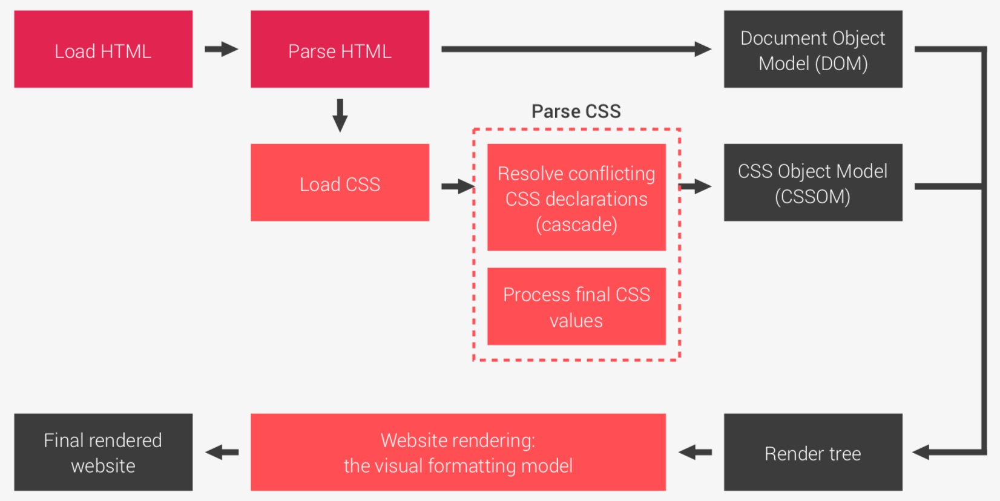

**[⬆ back to top](#table-of-contents)**

### 14. How CSS is Parsed, Part 1: The Cascade and Specificity

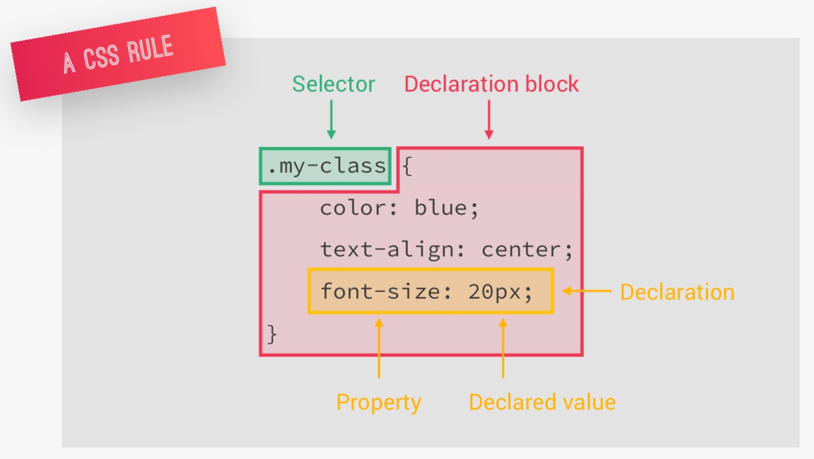

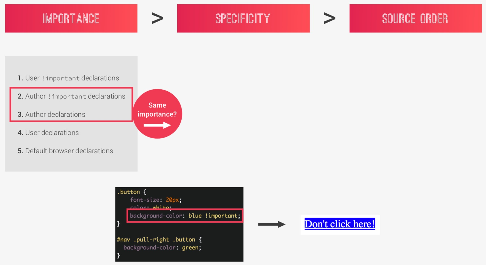
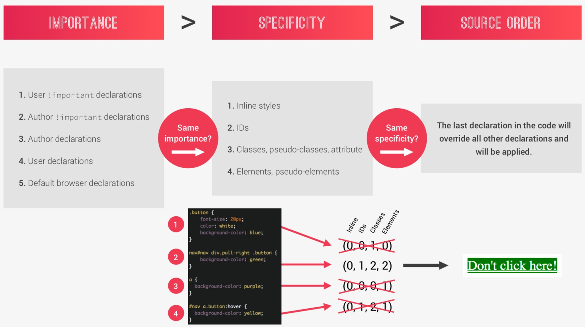

Maintainable and scalable code

- CSS declarations marked with !important have the highest priority;
- But, only use !important as a last resource. It’s better to use correct specificities — *more maintainable code!*
- Inline styles will always have priority over styles in external stylesheets;
- A selector that contains **1** ID is more specific than one with *1000* classes;
- A selector that contains **1** class is more specific than one with *1000* elements;
- The universal selector * has no specificity value (0, 0, 0, 0);
- Rely more on **specificity** than on the **order** of selectors;
- But, rely on order when using 3rd-party stylesheets — always put your author stylesheet last.

**[⬆ back to top](#table-of-contents)**

### 15. Specificity in Practice

- [Specificity Calculator](https://specificity.keegan.st)
- [CSS Specificity calculator](https://polypane.app/css-specificity-calculator)

```html
<nav id="nav">
  <div class="pull-right">
    <a class="button button-danger" href="link.html">Don't click here!</a>
  </div>
</nav>
```

```css
body {
  padding: 50px;
}

.button {
  font-size: 20px;
  color: white;
  background-color: blue e
}

a {
  background-color: purple;
}

/* (Inline, IDs, Classes, Elements) */
/* (0, 1, 2, 2) */
#nav div.pull-right a.button {
  background-color: orangered;
}

/* (0, 1, 3, 2) */
#nav div.pull-right a.button:hover {
  background-color: green;
}

/* (0, 1, 2, 1) */
#nav a.button:hover {
  background-color: yellow;
}
```

**[⬆ back to top](#table-of-contents)**

### 16. How CSS is Parsed, Part 2: Value Processing

#### How CSS values are processed?

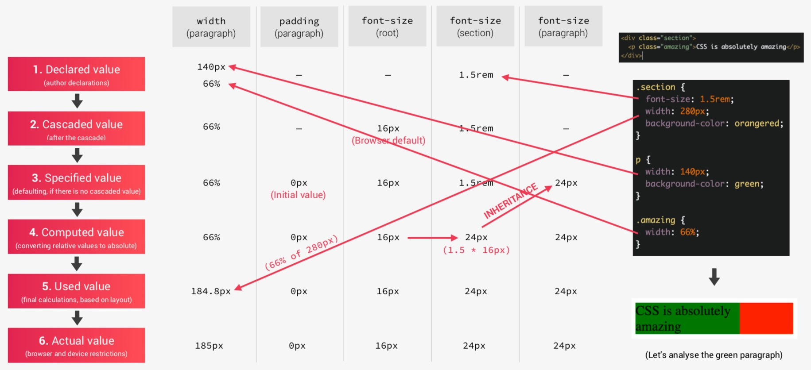

**[⬆ back to top](#table-of-contents)**

#### How units are converted from relative to absolute?

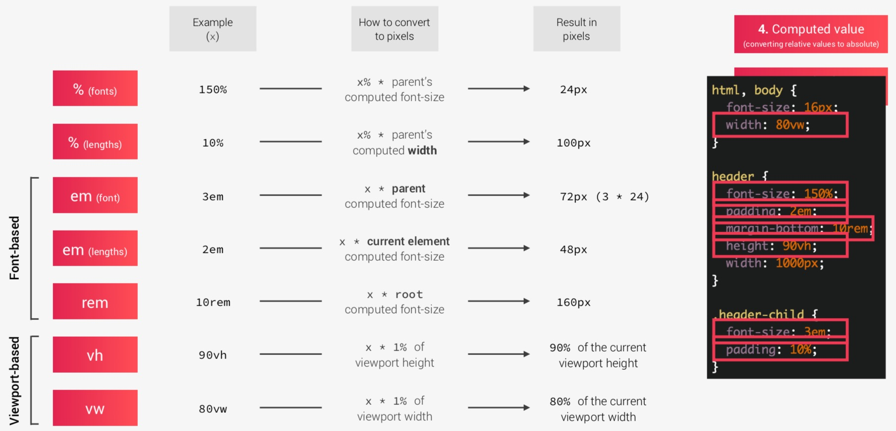

**[⬆ back to top](#table-of-contents)**

- Each property has an initial value, used if nothing is declared (and if there is no inheritance — see next lecture); 
- Browsers specify a **root font-size** for each page (usually 16px);
- Percentages and relative values are always converted to pixels;
- Percentages are measured relative to their parent’s **font-size**, if used to specify font-size;
- Percentages are measured relative to their parent’s **width**, if used to specify lengths; 
- em are measured relative to their **parent** font-size, if used to specify font-size; 
- em are measured relative to the **current** font-size, if used to specify lengths;
- rem are always measured relative to the **document’s root** font-size;
- vh and vw are simply percentage measurements of the viewport’s height and width.

**[⬆ back to top](#table-of-contents)**

### 17. How CSS is Parsed, Part 3: Inheritance

Inheritance in CSS

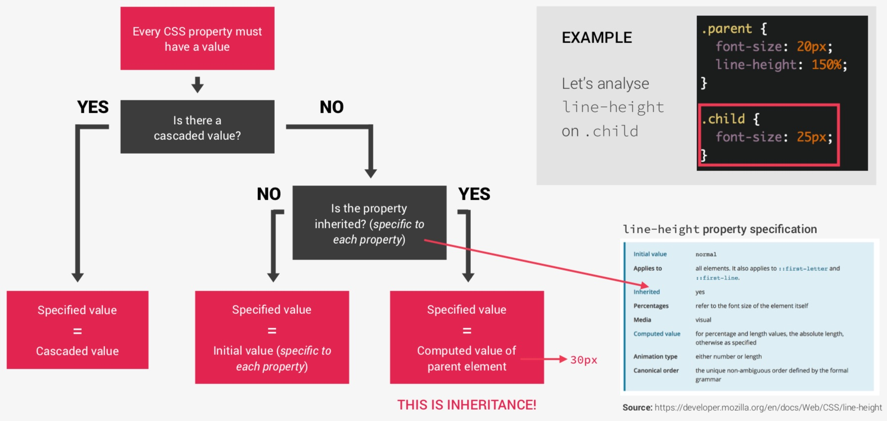

- Inheritance passes the values for some specific properties from parents to children — **more maintainable code**;
- Properties related to text are inherited: font-family, font-size, color, etc; 
- The computed value of a property is what gets inherited, **not** the declared value. 
- Inheritance of a property only works if no one declares a value for that property; 
- The inherit keyword forces inheritance on a certain property;
- The initial keyword resets a property to its initial value.

**[⬆ back to top](#table-of-contents)**

### 18. Converting px to rem: An Effective Workflow

```css
html {
  font-size: 62.5%;
}

body {
  font-family: "Lato", sans-serif;
  font-weight: 400;
  /* font-size: 16px; */
  line-height: 1.7;
  color: #777;
  padding: 3rem;
}
```

- The inherit keyword specifies that a property should inherit its value from its parent element.
- The * selector selects all elements.
- All element will have the property `box-sizing: inherit;`
- All Child elements will inherit the property `box-sizing: border-box;` from parent element `body` 

```css
*,
*::after,
*::before {
  margin: 0;
  padding: 0;
  box-sizing: inherit; 
}

body {
  box-sizing: border-box; 
}
```

**[⬆ back to top](#table-of-contents)**

### 19. How CSS Renders a Website: The Visual Formatting Model

The Visual Formatting Model

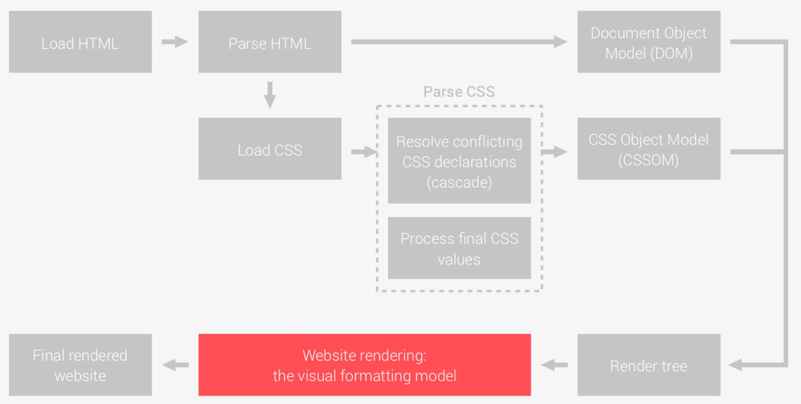

Algorithm that calculates boxes and determines the layout of theses boxes, for each element in the render tree, in order to determine the final layout of the page.

- **Dimensions of boxes**: the box model;
- **Box type**: inline, block and inline-block; 
- **Positioning scheme**: floats and positioning; 
- **Stacking contexts**;
- Other elements in the render tree;
- Viewport size, dimensions of images, etc.

**[⬆ back to top](#table-of-contents)**

#### The box model

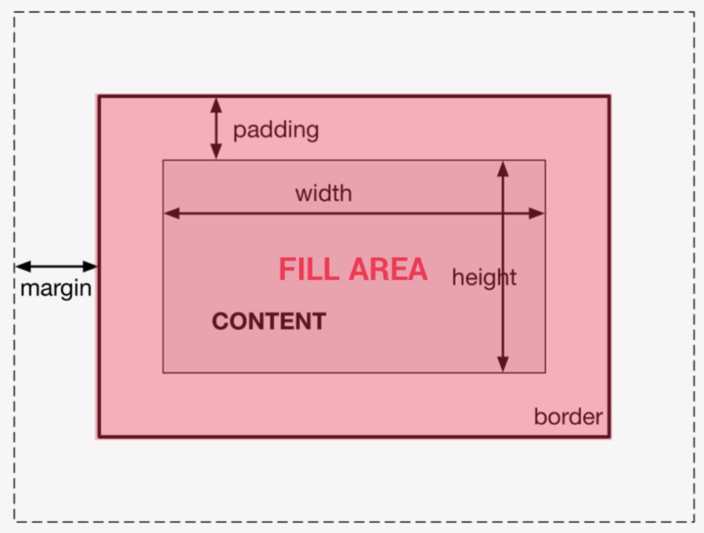

- **Content**: text, images, etc;
- **Padding**: transparent area around the content, inside of the box;
- **Border**: goes around the padding and the content;
- **Margin**: space between boxes;
- Fill area: area that gets filled with background color or background image.

The box model - Heights and Widths (default)

- total width = right border + right padding + specified width + left padding + left border
- total height = top border + top padding + specified height + bottom padding + bottom border 
- Example: height = 0 + 20px + 100px + 20px + 0 = 140px

The box model - Heights and Widths (box-sizing: border-box)

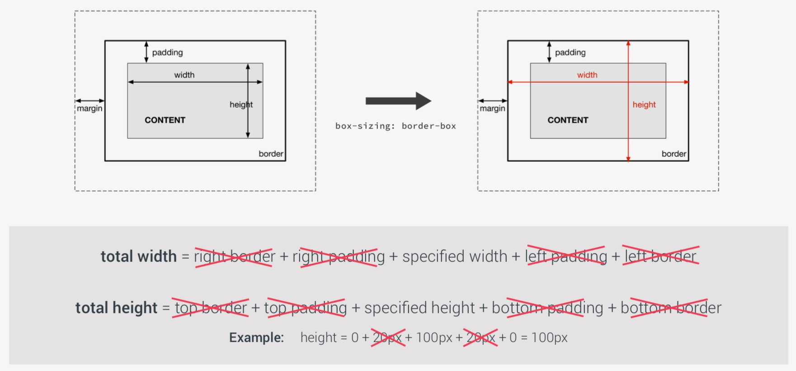

**[⬆ back to top](#table-of-contents)**

#### Box types

| Block-level boxes                     | Inline-block boxes            | Inline boxes                                          |
| ------------------------------------- | ----------------------------- | ----------------------------------------------------- |
| Elements formatted visually as blocks | A mix of block and inline     | Content is distributed in lines                       |
| 100% of parent’s width                | Occupies only content’s space | Occupies only content’s space                         |
| Vertically, one after another         | No line-breaks                | No line-breaks                                        |
| Box-model applies as showed           | Box-model applies as showed   | No heights and widths                                 |
|                                       |                               | Paddings and margins only horizontal (left and right) |
| display: block                        | display: inline-block         | display: inline                                       |
| display: flex                         |                               |                                                       |
| display: list-item                    |                               |                                                       |
| display: table                        |                               |                                                       |

**[⬆ back to top](#table-of-contents)**

#### Positioning Schemes

| Normal flow                                        | Floats                                                         | Absolute positioning                                                                               |
| -------------------------------------------------- | -------------------------------------------------------------- | -------------------------------------------------------------------------------------------------- |
| Default positioning scheme;                        | Element is removed from the normal flow;                       | Element is removed from the normal flow                                                            |
| NOT floated;                                       | Text and inline elements will wrap around the floated element; | No impact on surrounding content or elements;                                                      |
| NOT absolutely positioned;                         | The container will not adjust its height to the element.       | We use top, bottom, left and right to offset the element from its relatively positioned container. |
| Elements laid out according to their source order. |                                                                |                                                                                                    |
| default                                            | float: left                                                    | position: absolute                                                                                 |
| position: relative                                 | float: right                                                   | position: fixed                                                                                    |

**[⬆ back to top](#table-of-contents)**

#### Stacking Contexts

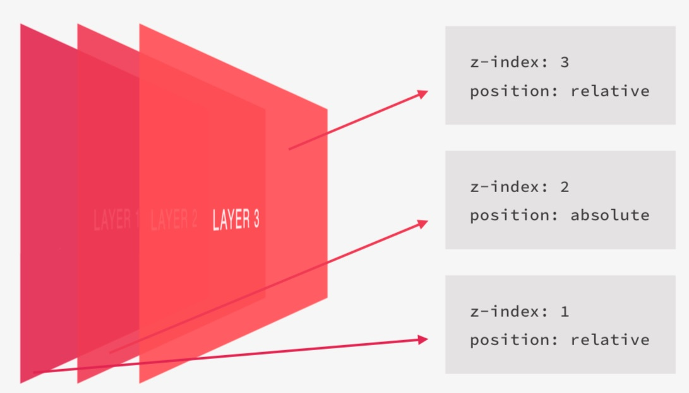

**[⬆ back to top](#table-of-contents)**

### 20. CSS Architecture, Components and BEM

The Think - Build - Architect Mindset

| Responsive design | Maintainable and scalable code | Web performance |
| ----------------- | ------------------------------ | --------------- |
|                   | Clean                          |                 |
|                   | Modular                        |                 |
|                   | Reusable                       |                 |
|                   | Ready for growth               |                 |

Think -> Build -> Architect

- **Think** about the layout of your webpage or web app before writing code.
- **Build** your layout in HTML and CSS with a consistent structure for naming classes.
- Create a logical **architecture** for your CSS with files and folders.

**[⬆ back to top](#table-of-contents)**

#### Thinking about the layout

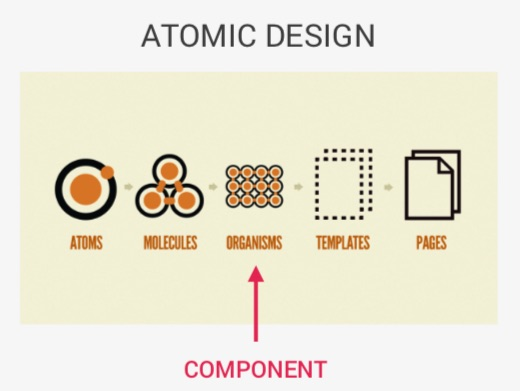

Component-driven design

- **Modular building blocks** that make up interfaces;
- Held together by the **layout** of the page;
- **Re-usable** across a project, and between different projects; 
- **Independent**, allowing us to use them anywhere on the page.

**[⬆ back to top](#table-of-contents)**

#### Building with meaningful class names

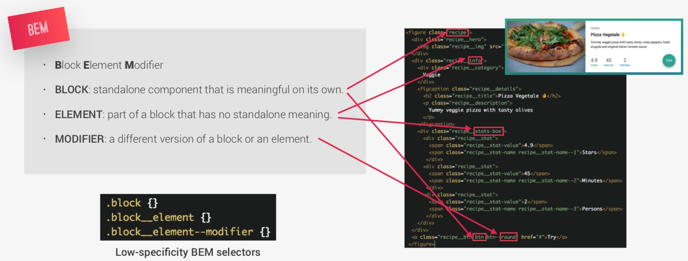

**[⬆ back to top](#table-of-contents)**

#### Architecting with files and folders

The 7-1 pattern

- 7 different folders for partial Sass files, and 1 main Sass file to import all other files into a compiled CSS stylesheet.

The 7 Folders

- base/ 
- components/ 
- layout/ 
- pages/ 
- themes/ 
- abstracts/ 
- vendors/

**[⬆ back to top](#table-of-contents)**

### 21. Implementing BEM in the Natours Project

```html
<header class="header">
  <div class="header__logo-box">
    
  </div>
  <div class="header__text-box">
    <h1 class="heading-primary">
      <span class="heading-primary--main">Outdoors</span>
      <span class="heading-primary--sub">is where life happens</span>
    </h1>

    <a href="" class="btn btn--white btn--animated">Discover our tours</a>
  </div>
</header>
```

```css
.header {
  height: 95vh;
  background-image: linear-gradient(to right bottom, rgba(126, 213, 111, 0.8), rgba(40, 180, 133, 0.8)), url(../img/hero.jpg);
  background-size: cover;
  background-position: top;
  position: relative;

  clip-path: polygon(0 0, 100% 0, 100% 75vh, 0 100%); 
}

.header__logo-box {
  position: absolute;
  top: 4rem;
  left: 4rem;
}

.header__logo {
  height: 3.5rem;
}

.header__text-box {
  position: absolute;
  top: 40%;
  left: 50%;
  transform: translate(-50%, -50%);
  text-align: center;
}

.heading-primary {
  color: #fff;
  text-transform: uppercase;

  backface-visibility: hidden;
  margin-bottom: 6rem;
}

.heading-primary--main {
  display: block;
  font-size: 6rem;
  font-weight: 400;
  letter-spacing: 3.5rem;

  animation-name: moveInLeft;
  animation-duration: 1s;
  animation-timing-function: ease-out;
  /* animation-delay: 3s; */
}

.heading-primary--sub {
  display: block;
  font-size: 2rem;
  font-weight: 700;
  letter-spacing: 1.75rem;

  animation: moveInRight 1s ease-out;
}

.btn:link,
.btn:visited {
  text-transform: uppercase;
  text-decoration: none;
  padding: 1.5rem 4rem;
  display: inline-block;
  border-radius: 10rem;
  transition: all .2s;
  position: relative;
  font-size: 1.6rem;
}

.btn:hover {
  transform: translateY(-.3rem);
  box-shadow: 0 1rem 2rem rgba(0, 0, 0, .2);
}

.btn:active {
  transform: translateY(-.1rem);
  box-shadow: 0 .5rem 1rem rgba(0, 0, 0, .2);
}

.btn--white {
  background-color: #fff;
  color: #777;
}

.btn--white::after {
  background-color: #fff;
}

.btn--animated {
  animation: moveInBottom .5s ease-out .75s;
  animation-fill-mode: backwards;
}
```

**[⬆ back to top](#table-of-contents)**

## **Section 4: Introduction to Sass and NPM**

### 22. Section Intro
**[⬆ back to top](#table-of-contents)**

### 23. What is Sass?

Sass is a CSS preprocessor, an extension of CSS that adds power and elegance to the basic language.

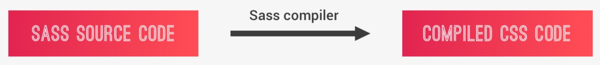

Main SASS features

- **Variables**: for reusable values such as colors, font-sizes, spacing, etc;
- **Nesting**: to nest selectors inside of one another, allowing us to write less code;
- **Operators**: for mathematical operations right inside of CSS;
- **Partials and imports**: to write CSS in different files and importing them all into one single file;
- **Mixins**: to write reusable pieces of CSS code;
- **Functions**: similar to mixins, with the difference that they produce a value that can than be used; 
- **Extends**: to make different selectors inherit declarations that are common to all of them;
- **Control directives**: for writing complex code using conditionals and loops (not covered in this course).

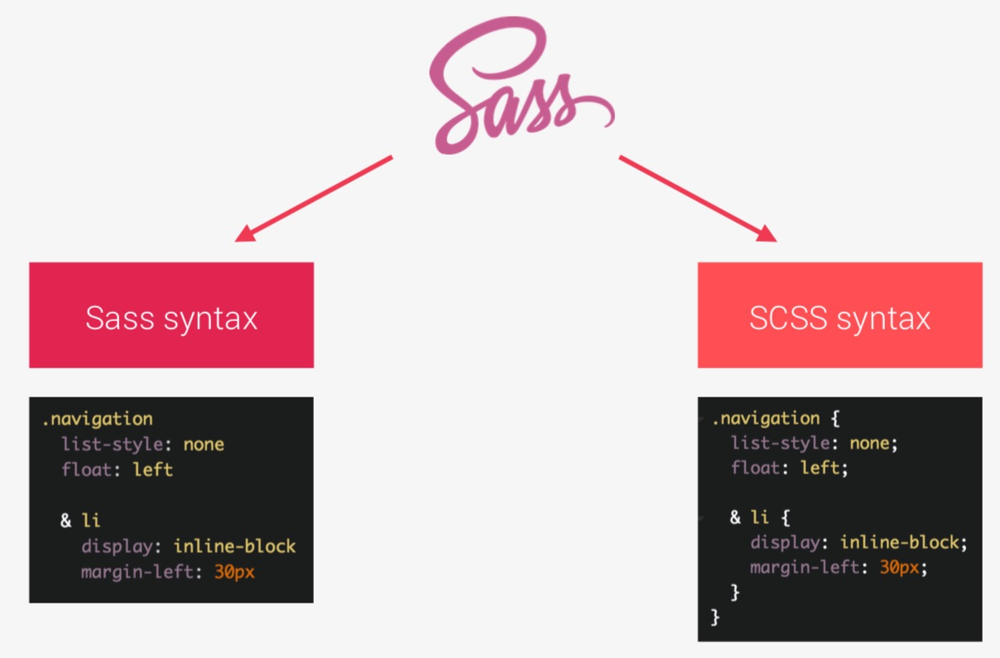

**[⬆ back to top](#table-of-contents)**

### 24. First Steps with Sass: Variables and Nesting

```html
<nav>
  <ul class="navigation">
    <li><a href="#">About us</a></li>
    <li><a href="#">Pricing</a></li>
    <li><a href="#">Contact</a></li>
  </ul>
  <div class="buttons">
    <a class="btn-main" href="#">Sign up</a>
    <a class="btn-hot" href="#">Get a quote</a>
  </div>
</nav>
```

```scss
* {
  margin: 0;
  padding: 0;
}

// SaSS variables
$color-primary: #f9ed69; //yellow color
$color-secondary: #f08a5d; //orange color
$color-tertiary: #b83b5e; //pink color
$color-text-dark: #333; //dark grey
$color-text-light: #eee; //light grey

$width-button: 150px;

nav {
  margin: 30px;
  background-color: $color-primary;

  // Fix for displaying no background when using floats
  &:after {
    content: "";
    clear: both;
    display: table;
  }
}

.navigation {
  list-style: none;
  float: left;

  // Nested selector
  li {
    display: inline-block;
    margin-left: 30px;

    // No limit on how many nested selectors you have
    // &: === .nagivation li
    &:first-child {
      margin: 0;
    }
    
    a:link, 
    a:active {
      text-decoration: none;
      text-transform: uppercase;
      color: $color-text-dark;
    }
  }
}

.buttons {
  float: right;
}

.btn-main:link,
.btn-hot:link {
  padding: 10px;
  display: inline-block;
  text-align: center;
  border-radius: 100px;
  text-decoration: none;
  text-transform: uppercase;
  width: $width-button;
  color: $color-text-light;
}

.btn-main {
  &:link {
    background-color: $color-secondary;
  }

  &:hover {
    background-color: darken($color-secondary, 15%);
  }
}

.btn-hot {
  &:link {
    background-color: $color-tertiary;
  }

  &:hover {
    background-color: lighten($color-tertiary, 15%);
  }
}
```

**[⬆ back to top](#table-of-contents)**

### 25. First Steps with Sass: Mixins, Extends and Functions

- Mixins allow you to define styles that can be re-used throughout your stylesheet.
- Extends allows you to share styles between two selectors.
- Functions allow you to define complex operations on SassScript values that you can re-use throughout your stylesheet.

```scss
$color-text-dark: #333; //dark grey
$color-text-light: #eee; //light grey

@mixin clearfix {
   &::after{
    content:"";
    clear:both;
    display:table;
  }
}

@mixin style-link-text($color) {
  text-decoration: none;
  text-transform: uppercase;
  color: $color;
}

@function divide($a, $b) {
  @return $a / $b;
}

nav {
  margin: divide(60, 2) * 1px; // 30px
  background-color: $color-primary;

  @include clearfix
}

.navigation {
  list-style: none;
  float: left;

  li {
    a:link, 
    a:active {
      @include style-link-text($color-text-dark)
    }
  }
}

// both .btn-main:link, .btn-hot:link will share styles
%btn-placeholder {
  padding: 10px;
  display: inline-block;
  text-align: center;
  border-radius: 100px;
  width: $width-button;
  @include style-link-text($color-text-light)
}

.btn-main {
  &:link {
    @extend %btn-placeholder;
    background-color: $color-secondary;
  }
}

.btn-hot {
  &:link {
    @extend %btn-placeholder;
    background-color: $color-tertiary;
  }
}
```

**[⬆ back to top](#table-of-contents)**

### 27. NPM Packages: Let's Install Sass Locally

[node-sass](https://github.com/sass/node-sass)

**[⬆ back to top](#table-of-contents)**

### 28. NPM Scripts: Let's Write and Compile Sass Locally

```console
npm run compile:sass
```

**[⬆ back to top](#table-of-contents)**

### 29. The Easiest Way of Automatically Reloading a Page on File Changes

[Live Server](https://github.com/tapio/live-server)

```console
npm i live-server -g
live-server
```

**[⬆ back to top](#table-of-contents)**

## **Section 5: Natours Project — Using Advanced CSS and Sass (Part 2)**

### 31. Converting Our CSS Code to Sass: Variables and Nesting

```scss
$color-primary: #55c57a;
$color-primary-light: #7ed56f;
$color-primary-dark: #28b485;

$color-grey-dark: #777;
$color-white: #fff;
$color-black: #000;

.header {
  height: 95vh;
  background-image: linear-gradient(to right bottom, rgba($color-primary-light, 0.8), rgba($color-primary-dark, 0.8)), url(../img/hero.jpg);
  background-size: cover;
  background-position: top;
  position: relative;

  clip-path: polygon(0 0, 100% 0, 100% 75vh, 0 100%);

  &__logo-box {
    position: absolute;
    top: 4rem;
    left: 4rem;
  }

  &__logo {
    height: 3.5rem;
  }
  
  &__text-box {
    position: absolute;
    top: 40%;
    left: 50%;
    transform: translate(-50%, -50%);
    text-align: center;
  }
}
```

**[⬆ back to top](#table-of-contents)**

### 32. Implementing the 7-1 CSS Architecture with Sass

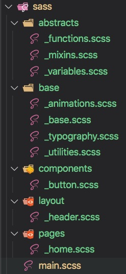

**[⬆ back to top](#table-of-contents)**

### 33. Review: Basic Principles of Responsive Design and Layout Types

Basic Responsive Design Principles

- Fluid Grids And Layouts

To allow content to easily adapt to the current viewport width used to browse the website. Uses % rather than px for all layout-related lengths.

- Flexible/Responsive Images

Images behave differently than text content, and so we need to ensure that they also adapt nicely to the current viewport.

- Media Queries

To change styles on certain viewport widths (breakpoints), allowing us to create different version of our website for different widths.

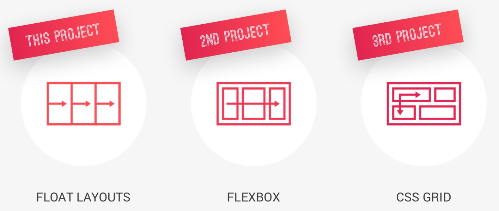

**[⬆ back to top](#table-of-contents)**

### 34. Building a Custom Grid with Floats

- How to architect and build a simple grid system; 
- How the attribute selector works;
- How the :not pseudo-class works;
- How calc() works, and what’s the difference between calc() and simple Sass operations.

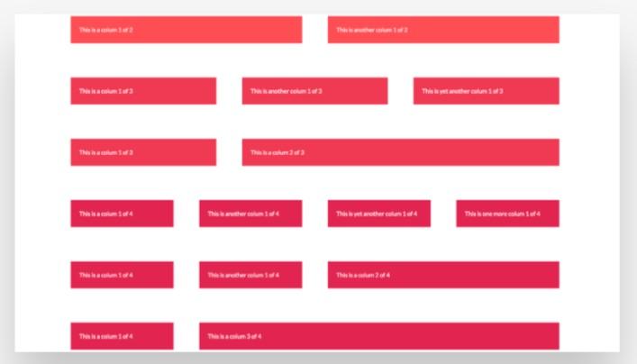

```html
    <section class="grid-test">
      <div class="row">
        <div class="col-1-of-2">Col 1 of 2</div>
        <div class="col-1-of-2">Col 1 of 2</div>
      </div>
      <div class="row">
        <div class="col-1-of-3">Col 1 of 3</div>
        <div class="col-1-of-3">Col 1 of 3</div>
        <div class="col-1-of-3">Col 1 of 3</div>
      </div>
      <div class="row">
        <div class="col-1-of-3">Col 1 of 3</div>
        <div class="col-2-of-3">Col 2 of 3</div>
      </div>
      <div class="row">
        <div class="col-1-of-4">Col 1 of 4</div>
        <div class="col-1-of-4">Col 1 of 4</div>
        <div class="col-1-of-4">Col 1 of 4</div>
        <div class="col-1-of-4">Col 1 of 4</div>
      </div>
      <div class="row">
        <div class="col-1-of-4">Col 1 of 4</div>
        <div class="col-1-of-4">Col 1 of 4</div>
        <div class="col-2-of-4">Col 2 of 4</div>
      </div>
      <div class="row">
        <div class="col-1-of-4">Col 1 of 4</div>
        <div class="col-3-of-4">Col 3 of 4</div>
      </div>
    </section>
```

```scss
.row {
  max-width: $grid-width;
  background-color: #eee;
  // center block element
  margin: 0 auto;

  // select everything except last child
  &:not(:last-child) {
    margin-bottom: $gutter-vertical;
  }

  @include clearfix;

  // select all class selector start with "col-"
  [class^="col-"] {
    background-color: orangered;
    float: left;

    &:not(:last-child) {
      margin-right: $gutter-horizontal;
    }
  }

  .col-1-of-2 {
    width: calc((100% - #{$gutter-horizontal}) / 2);
  }

  .col-1-of-3 {
    width: calc((100% - 2 * #{$gutter-horizontal}) / 3);
  }

  .col-2-of-3 {
    width: calc(2 * ((100% - 2 * #{$gutter-horizontal}) / 3) + #{$gutter-horizontal});
  }

  .col-1-of-4 {
    width: calc((100% - 3 * #{$gutter-horizontal}) / 4);
  }

  .col-2-of-4 {
    width: calc(2 * ((100% - 3 * #{$gutter-horizontal}) / 4) + #{$gutter-horizontal});
  }

  .col-3-of-4 {
    width: calc(3 * ((100% - 3 * #{$gutter-horizontal}) / 4) + 2 * #{$gutter-horizontal});
  }
}
```

**[⬆ back to top](#table-of-contents)**

### 35. Building the About Section - Part 1

#### Thinking about components

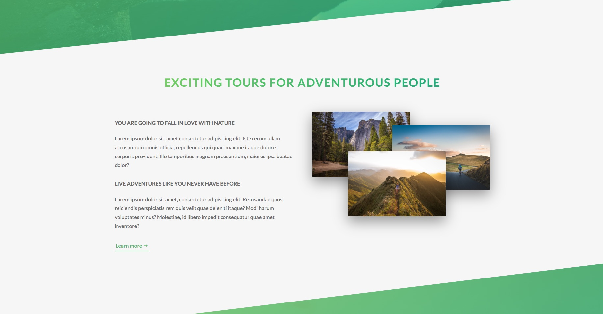

- Secondary Heading
- Tertiary Heading
- Paragraph
- Text Button
- Image Composition

```html
      <section class="section-about">
        <div class="u-center-text u-margin-bottom-big">
          <h2 class="heading-secondary">
            Exciting tours for adventurous people
          </h2>
        </div>
        <div class="row">
          <div class="col-1-of-2"></div>
          <div class="col-1-of-2"></div>
        </div>
      </section>
```

```css
.section-about {
  background-color: $color-grey-light-1;
  padding: 25rem 0;
  margin-top: -20vh;
}
```

**[⬆ back to top](#table-of-contents)**

Secondary Heading component

```html
<div class="u-center-text u-margin-bottom-big">
  <h2 class="heading-secondary">
    Exciting tours for adventurous people
  </h2>
</div>
```

```scss
.heading-secondary {
  font-size: 3.5rem;
  text-transform: uppercase;
  font-weight: 700;
  display: inline-block;
  background-image: linear-gradient(to right, $color-primary-light, $color-primary-dark);
  background-clip: text;
  -webkit-background-clip: text;
  color: transparent;
  letter-spacing: .2rem;
  transition: all .2s;

  &:hover {
    transform: skewY(2deg) skewX(15deg) scale(1.1);
    text-shadow: .5rem 1rem 2rem rgba($color-black, .2);
  }
}
```

**[⬆ back to top](#table-of-contents)**

#### How and why to use utility classes?

```scss
.u-center-text {
  // center inline-block child
  text-align: center;
}

.u-margin-bottom-small { margin-bottom: 2rem; }
.u-margin-bottom-medium { margin-bottom: 4rem; }
.u-margin-bottom-big { margin-bottom: 8rem; }
```

**[⬆ back to top](#table-of-contents)**

#### How to use the background-clip property?

```scss
.heading-secondary {
  display: inline-block;
  background-image: linear-gradient(to right, $color-primary-light, $color-primary-dark);
  -webkit-background-clip: text;
  color: transparent;
}
```

**[⬆ back to top](#table-of-contents)**

#### How to transform multiple properties simultaneously?

```scss
.heading-secondary {
  transition: all .2s;

  &:hover {
    transform: skewY(2deg) skewX(15deg) scale(1.1);
    text-shadow: .5rem 1rem 2rem rgba($color-black, .2);
  }
}
```

**[⬆ back to top](#table-of-contents)**

### 36. Building the About Section - Part 2

```html
<h3 class="heading-tertiary u-margin-bottom-small">You are going to fall in love with nature</h3>
<p class="paragraph">
  Lorem ipsum dolor sit, amet consectetur adipisicing elit. Iste rerum ullam accusantium omnis officia, repellendus qui quae, maxime itaque dolores corporis provident. Illo temporibus magnam praesentium, maiores ipsa beatae dolor?
</p>
<h3 class="heading-tertiary u-margin-bottom-small">Live adventures like you never have before</h3>
<p class="paragraph">
  Lorem ipsum dolor sit amet, consectetur adipisicing elit. Recusandae quos, reiciendis perspiciatis rem quis velit quae deleniti itaque? Modi harum voluptates minus? Molestiae, id libero impedit consequatur quae amet inventore?
</p>

<a href="#" class="btn-text">
  Learn more &rarr;
</a>
```

**[⬆ back to top](#table-of-contents)**

#### Tertiary Heading component

```scss
.heading-tertiary {
  font-size: $default-font-size;
  font-weight: 700;
  text-transform: uppercase;
}
```

**[⬆ back to top](#table-of-contents)**

#### Paragraph component

```scss
.paragraph {
  font-size: $default-font-size;

  &:not(:last-child) {
    margin-bottom: 3rem;
  }
}
```

**[⬆ back to top](#table-of-contents)**

#### Text Button component

```scss
.btn-text {
  &:link,
  &:visited {
    font-size: $default-font-size;
    color: $color-primary;
    display: inline-block;
    text-decoration: none;
    border-bottom: 1px solid $color-primary;
    padding: 3px;
    transition: all .2s;
  }

  &:hover {
    background-color: $color-primary;
    color: $color-white;
    box-shadow: 0 1rem 2rem rgba($color-black, .15);
    transform: translateY(-2px);
  }

  &:active {
    box-shadow: 0 .5rem 1rem rgba($color-black, .15);
    transform: translateY(0);
  }
}
```

**[⬆ back to top](#table-of-contents)**

### 37. Building the About Section - Part 3

Image Composition component

```html
<div class="composition">
  
  
  
</div>
```

```scss
.composition {
  position: relative;

  &__photo {
    width: 55%;
    box-shadow: 0 1.5rem 4rem rgba($color-black, 0.4);
    border-radius: 2px;
    position: absolute;
    z-index: 10;
    transition: all .2s;
    outline-offset: 2rem;

    &--p1 {
      left: 0;
      top: -2rem;
    }

    &--p2 {
      right: 0;
      top: 2rem;
    }

    &--p3 {
      left: 20%;
      top: 10rem;
    }

    &:hover {
      outline: 1.5rem solid $color-primary;
      transform: scale(1.05) translateY(-.5rem);
      box-shadow: 0 2.5rem 4rem rgba($color-black, .5);
      z-index: 20;
    }
  }

  // composition:hover composition__photo:not(:hover)
  &:hover &__photo:not(:hover) {
    transform: scale(0.95);
  }
}
```

**[⬆ back to top](#table-of-contents)**

#### How to use the outline-offset property together with outline?

```scss
.composition {
  position: relative;

  &__photo {
    outline-offset: 2rem;

    &:hover {
      outline: 1.5rem solid $color-primary;
    }
  }
}
```

**[⬆ back to top](#table-of-contents)**

#### How to style elements that are NOT hovered while others are?

```scss
.composition {
  position: relative;

  &__photo {
    &:hover {
      outline: 1.5rem solid $color-primary;
      transform: scale(1.05) translateY(-.5rem);
      box-shadow: 0 2.5rem 4rem rgba($color-black, .5);
      z-index: 20;
    }
  }

  // composition:hover composition__photo:not(:hover)
  &:hover &__photo:not(:hover) {
    transform: scale(0.95);
  }
}
```

**[⬆ back to top](#table-of-contents)**

### 38. Building the Features Section

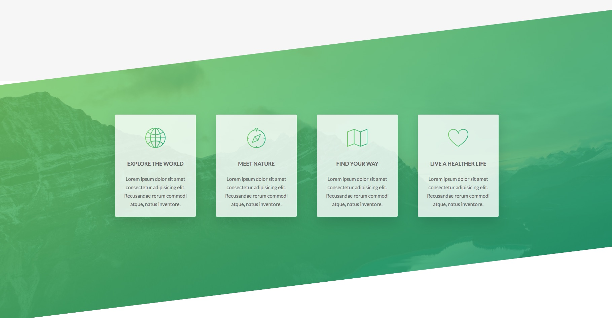

```html
<section class="section-features">
  <div class="row">
    <div class="col-1-of-4">
      <div class="feature-box">
        <i class="feature-box__icon icon-basic-world"></i>
        <h3 class="heading-tertiary u-margin-bottom-small">Explore the world</h3>
        <p class="feature-box__text">
          Lorem ipsum dolor sit amet consectetur adipisicing elit. Recusandae rerum commodi atque, natus inventore.
        </p>
      </div>
    </div>
    <div class="col-1-of-4">
      <div class="feature-box">
        <i class="feature-box__icon icon-basic-compass"></i>
        <h3 class="heading-tertiary u-margin-bottom-small">Meet nature</h3>
        <p class="feature-box__text">
          Lorem ipsum dolor sit amet consectetur adipisicing elit. Recusandae rerum commodi atque, natus inventore.
        </p>
      </div>
    </div>
    <div class="col-1-of-4">
      <div class="feature-box">
        <i class="feature-box__icon icon-basic-map"></i>
        <h3 class="heading-tertiary u-margin-bottom-small">Find your way</h3>
        <p class="feature-box__text">
          Lorem ipsum dolor sit amet consectetur adipisicing elit. Recusandae rerum commodi atque, natus inventore.
        </p>
      </div>
    </div>
    <div class="col-1-of-4">
      <div class="feature-box">
        <i class="feature-box__icon icon-basic-heart"></i>
        <h3 class="heading-tertiary u-margin-bottom-small">Live a healther life</h3>
        <p class="feature-box__text">
          Lorem ipsum dolor sit amet consectetur adipisicing elit. Recusandae rerum commodi atque, natus inventore.
        </p>
      </div>
    </div>
  </div>
</section>
```

```scss
.section-features {
  padding: 20rem 0;
  background-image: linear-gradient(to right bottom, rgba($color-primary-light, 0.8), rgba($color-primary-dark, 0.8)), url(../img/nat-4.jpg);
  background-size: cover;

  transform: skewY(-7deg);
  margin-top: -10rem;

  // select all direct child: row selector in this case
  & > * {
    transform: skewY(7deg);
  }
}
```

```scss
.feature-box {
  background-color: rgba($color-white, .8);
  font-size: 1.5rem;
  padding: 2.5rem;
  text-align: center;
  border-radius: 3px;
  box-shadow: 0 1.5rem 4rem rgba($color-black, .15);
  transition: transform .3s;

  &__icon {
    font-size: 6rem;
    margin-bottom: .5rem;
    display: inline-block;
    background-image: linear-gradient(to right, $color-primary-light, $color-primary-dark);
    -webkit-background-clip: text;
    color: transparent;
  }

  &:hover {
    transform: translateY(-1.5rem) scale(1.03);
  }

  &__text {

  }
}
```

**[⬆ back to top](#table-of-contents)**

#### How to include and use an icon font?

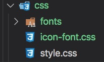

- Goto [Linea Icon](https://linea.io/)
- Download linea_complete_1.0.zip
- Unzip linea_complete_1.0.zip
- Goto _basic/_ICONFONT/ folder
- Rename styles.css to icon-font.css
- Copy fonts folder to css project folder
- Copy icon-font.css file to css project folder
- Include icon-font.css in index.html
- Refer to linea_complete_1.0/_basic/_ICONFONT/icons-reference.html for icon name

**[⬆ back to top](#table-of-contents)**

#### Another way of creating the "skewed section"

```scss
.section-features {
  transform: skewY(-7deg);
  margin-top: -10rem;
}
```

**[⬆ back to top](#table-of-contents)**

#### How and when to use the direct child selector?

```html
<section class="section-features">
  <div class="row">
  </div>
</section>
```

```scss
.section-features {
  // select all direct child of section-features
  // Example: row selector
  & > * {
    transform: skewY(7deg);
  }
}
```

**[⬆ back to top](#table-of-contents)**

### 39. Building the Tours Section - Part 1

#### Thinking about components

- Secondary Heading
- 3 Cards
  - Front: Picture, Heading, Details
  - Back: CTA
- Green Button

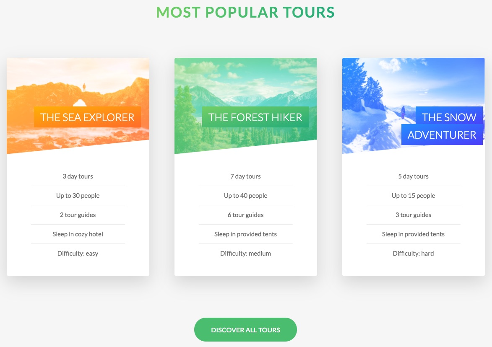
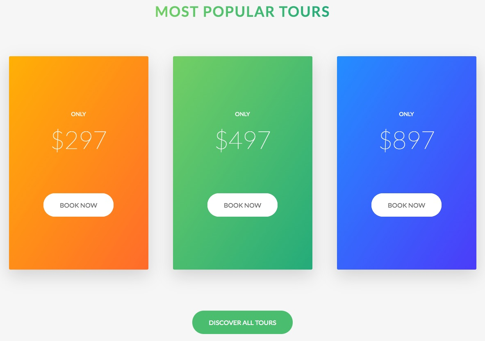

```html
<section class="section-tours">
  <div class="u-center-text u-margin-bottom-big">
    <h2 class="heading-secondary">
      Most popular tours
    </h2>
  </div>
  <div class="row">
    <div class="col-1-of-3">
      <div class="card">
        <div class="card__side card__side--front">
          <div class="card__picture card__picture--1">&nbsp</div>
          <h4 class="card__heading">
            <span class="card__heading-span card__heading-span--1">
              The Sea Explorer
            </span>
          </h4>
          <div class="card__details">
            <ul>
              <li>3 day tours</li>
              <li>Up to 30 people</li>
              <li>2 tour guides</li>
              <li>Sleep in cozy hotel</li>
              <li>Difficulty: easy</li>
            </ul>
          </div>
        </div>
        <div class="card__side card__side--back card__side--back--1">
          <div class="card__cta">
            <div class="card__price-box">
              <p class="card__price-only">Only</p>
              <p class="card__price-value">$297</p>
            </div>
            <a href="" class="btn btn--white">Book now</a>
          </div>
        </div>
      </div>
    </div>
  </div>
  <div class="u-center-text u-margin-top-huge">
    <a href="#" class="btn btn--green">Discover all tours</a>
  </div>
</section>
```

```scss
.section-tours {
  background-color: $color-grey-light-1;
  padding: 25rem 0 15rem 0;
  margin-top: -10rem;
}

.card {
  // FUNCTIONALITY
  perspective: 150rem;
  -moz-perspective: 150rem;
  position: relative;
  height: 52rem;

  &__side {
    height: 52rem;
    transition: all .8s ease;
    position: absolute;
    top: 0;
    left: 0;
    width: 100%;
    backface-visibility: hidden;
    border-radius: 3px;
    overflow: hidden;
    box-shadow: 0 1.5rem 4rem rgba($color-black, .15);

    &--front {
      background-color: $color-white;
    }

    &--back {
      transform: rotateY(180deg);

      &--1 {
        background-image: linear-gradient(to right bottom, $color-secondary-light, $color-secondary-dark);
      }
    }
  }

  &:hover &__side--front {
    transform: rotateY(180deg);
  }

  &:hover &__side--back {
    transform: rotateY(0);
  }

  // FRONT SIDE STYLING
  &__picture {
    background-size: cover;
    height: 23rem;
    background-blend-mode: screen;
    -webkit-clip-path: polygon(0 0, 100% 0, 100% 85%, 0 100%);
    clip-path: polygon(0 0, 100% 0, 100% 85%, 0 100%);
    border-top-left-radius: 3px;
    border-top-right-radius: 3px;

    &--1 {
      background-image: linear-gradient(to right bottom, $color-secondary-light, $color-secondary-dark), url(../img/nat-5.jpg);
    }
  }

  &__heading {
    font-size: 2.5rem;
    font-weight: 300;
    text-transform: uppercase;
    text-align: right;
    color: $color-white;
    position: absolute;
    top: 12rem;
    right: 2rem;
    width: 75%;
  }

  &__heading-span {
    padding: 1rem 1.5rem;
    -webkit-box-decoration-break: clone;
    box-decoration-break: clone;

    &--1 {
      background-image: linear-gradient(to right bottom, $color-secondary-light, $color-secondary-dark);
    }
  }

  &__details {
    padding: 3rem;

    ul {
      list-style: none;
      width: 80%;
      margin: 0 auto;

      li {
        text-align: center;
        font-size: 1.5rem;
        padding: 1rem;

        &:not(:last-child) {
          border-bottom: 1px solid $color-grey-light-2;
        }
      }
    }
  }

  // BACK SIDE STYLING
  &__cta {
    position: absolute;
    top: 50%;
    left: 50%;
    transform: translate(-50%, -50%);
    width: 90%;
    text-align: center;
  }

  &__price-box {
    text-align: center;
    color: $color-white;
    margin-bottom: 8rem;
  }

  &__price-only {
    font-size: 1.4rem;
    text-transform: uppercase;
  }

  &__price-value {
    font-size: 6rem;
    font-weight: 100;
  }
}
```

**[⬆ back to top](#table-of-contents)**

#### How to build an amazing, rotating card?

```html
<div class="card">
  <div class="card__side card__side--front">
    FRONT
  </div>
  <div class="card__side card__side--back card__side--back--1">
    BACK
  </div>
</div>
```

```scss
.card {
  perspective: 150rem;
  -moz-perspective: 150rem;
  position: relative;
  height: 52rem;

  &__side {
    height: 52rem;
    transition: all .8s ease;
    position: absolute;
    top: 0;
    left: 0;
    width: 100%;
    backface-visibility: hidden;
    border-radius: 3px;
    overflow: hidden;
    box-shadow: 0 1.5rem 4rem rgba($color-black, .15);

    &--front {
      background-color: $color-white;
    }

    &--back {
      transform: rotateY(180deg);
    }
  }

  &:hover &__side--front {
    transform: rotateY(180deg);
  }

  &:hover &__side--back {
    transform: rotateY(0);
  }
}
```

**[⬆ back to top](#table-of-contents)**

### 40. Building the Tours Section - Part 2

#### Front Side Card component: Picture, Heading, Details

```html
<section class="section-tours">
  <div class="u-center-text u-margin-bottom-big">
    <h2 class="heading-secondary">
      Most popular tours
    </h2>
  </div>
  <div class="row">
    <div class="col-1-of-3">
      <div class="card">
        <div class="card__side card__side--front">
          <div class="card__picture card__picture--1">&nbsp</div>
          <h4 class="card__heading">
            <span class="card__heading-span card__heading-span--1">
              The Sea Explorer
            </span>
          </h4>
          <div class="card__details">
            <ul>
              <li>3 day tours</li>
              <li>Up to 30 people</li>
              <li>2 tour guides</li>
              <li>Sleep in cozy hotel</li>
              <li>Difficulty: easy</li>
            </ul>
          </div>
        </div>
        <div class="card__side card__side--back card__side--back--1">
          BACK
        </div>
      </div>
    </div>
  </div>
  <div class="u-center-text u-margin-top-huge">
    <a href="#" class="btn btn--green">Discover all tours</a>
  </div>
</section>
```

```scss
.card {
  &__picture {
    background-size: cover;
    height: 23rem;
    background-blend-mode: screen;
    -webkit-clip-path: polygon(0 0, 100% 0, 100% 85%, 0 100%);
    clip-path: polygon(0 0, 100% 0, 100% 85%, 0 100%);
    border-top-left-radius: 3px;
    border-top-right-radius: 3px;

    &--1 {
      background-image: linear-gradient(to right bottom, $color-secondary-light, $color-secondary-dark), url(../img/nat-5.jpg);
    }
  }

  &__heading {
    font-size: 2.5rem;
    font-weight: 300;
    text-transform: uppercase;
    text-align: right;
    color: $color-white;
    position: absolute;
    top: 12rem;
    right: 2rem;
    width: 75%;
  }

  &__heading-span {
    padding: 1rem 1.5rem;
    -webkit-box-decoration-break: clone;
    box-decoration-break: clone;

    &--1 {
      background-image: linear-gradient(to right bottom, $color-secondary-light, $color-secondary-dark);
    }
  }

  &__details {
    padding: 3rem;

    ul {
      list-style: none;
      width: 80%;
      margin: 0 auto;

      li {
        text-align: center;
        font-size: 1.5rem;
        padding: 1rem;

        &:not(:last-child) {
          border-bottom: 1px solid $color-grey-light-2;
        }
      }
    }
  }
}
```

**[⬆ back to top](#table-of-contents)**

#### How to use perspective in CSS?

The [perspective](https://developer.mozilla.org/en-US/docs/Web/CSS/perspective) CSS property determines the distance between the z=0 plane and the user in order to give a 3D-positioned element some perspective.

The perspective property defines how far the object is away from the user. So, a lower value will result in a more intensive 3D effect than a higher value.

When defining the perspective property for an element, it is the CHILD elements that get the perspective view, NOT the element itself.

```scss
.card {
  perspective: 150rem;
  -moz-perspective: 150rem;
}
```

**[⬆ back to top](#table-of-contents)**

#### How to use the backface-visibility property?

The [backface-visibility](https://developer.mozilla.org/en-US/docs/Web/CSS/backface-visibility) CSS property sets whether the back face of an element is visible when turned towards the user.

This div element has "backface-visibility: hidden", and the back face of the div element is invisible:

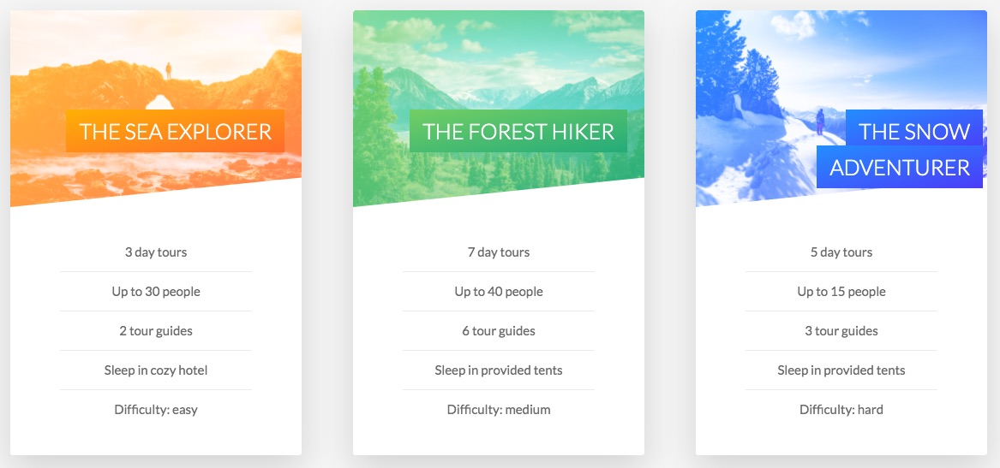

This div element has "backface-visibility: visible", and the back face of the div element shows a mirror image of the front face:

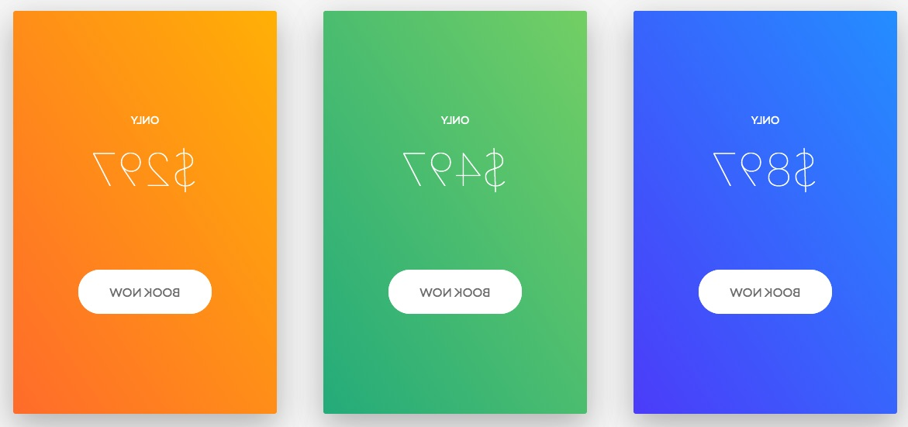

```html
<div class="card">
  <div class="card__side card__side--front">
    
  </div>
  <div class="card__side card__side--back card__side--back--1">
    
  </div>
</div>
```

```scss
.card {
  &__side {
    backface-visibility: hidden;

    &--front {
      background-color: $color-white;
    }

    &--back {
      transform: rotateY(180deg);
    }
  }

  &:hover &__side--front {
    transform: rotateY(180deg);
  }

  &:hover &__side--back {
    transform: rotateY(0);
  }
}
```

**[⬆ back to top](#table-of-contents)**

#### Using background blend modes?

The [background-blend-mode](https://developer.mozilla.org/en-US/docs/Web/CSS/background-blend-mode) CSS property sets how an element's background images should blend with each other and with the element's background color.


```scss
.card {
  &__picture {
    background-size: cover;
    height: 23rem;
    background-blend-mode: screen;

    &--1 {
      background-image: linear-gradient(to right bottom, $color-secondary-light, $color-secondary-dark), url(../img/nat-5.jpg);
    }
  }
}
```

**[⬆ back to top](#table-of-contents)**

#### How and when to use box-decoration-break;

The [box-decoration-break](https://developer.mozilla.org/en-US/docs/Web/CSS/box-decoration-break) CSS property specifies how an element's fragments should be rendered when broken across multiple lines, columns, or pages.

```scss
.card {
  &__heading-span {
    padding: 1rem 1.5rem;
    -webkit-box-decoration-break: clone;
    box-decoration-break: clone;

    &--1 {
      background-image: linear-gradient(to right bottom, $color-secondary-light, $color-secondary-dark);
    }
  }
}
```

**[⬆ back to top](#table-of-contents)**

### 41. Building the Tours Section - Part 3

#### Back Side Card component: CTA

```html
<section class="section-tours">
  <div class="u-center-text u-margin-bottom-big">
    <h2 class="heading-secondary">
      Most popular tours
    </h2>
  </div>
  <div class="row">
    <div class="col-1-of-3">
      <div class="card">
        <div class="card__side card__side--front">
          FRONT
        </div>
        <div class="card__side card__side--back card__side--back--1">
          <div class="card__cta">
            <div class="card__price-box">
              <p class="card__price-only">Only</p>
              <p class="card__price-value">$297</p>
            </div>
            <a href="" class="btn btn--white">Book now</a>
          </div>
        </div>
      </div>
    </div>
  </div>
</section>
```

```scss
.card {
  &__cta {
    position: absolute;
    top: 50%;
    left: 50%;
    transform: translate(-50%, -50%);
    width: 90%;
    text-align: center;
  }

  &__price-box {
    text-align: center;
    color: $color-white;
    margin-bottom: 8rem;
  }

  &__price-only {
    font-size: 1.4rem;
    text-transform: uppercase;
  }

  &__price-value {
    font-size: 6rem;
    font-weight: 100;
  }
}
```

**[⬆ back to top](#table-of-contents)**

#### Green Button

```html
<div class="u-center-text u-margin-top-huge">
  <a href="#" class="btn btn--green">Discover all tours</a>
</div>
```

```scss
.btn {
  &--green {
    background-color: $color-primary;
    color: $color-white;

    &::after {
      background-color: $color-primary;
    }
  }
}
```

**[⬆ back to top](#table-of-contents)**

### 42. Building the Stories Section - Part 1

#### Thinking about components

- Secondary Heading
- Story
  - Shape
  - Text
  - Background video
- Text button
 
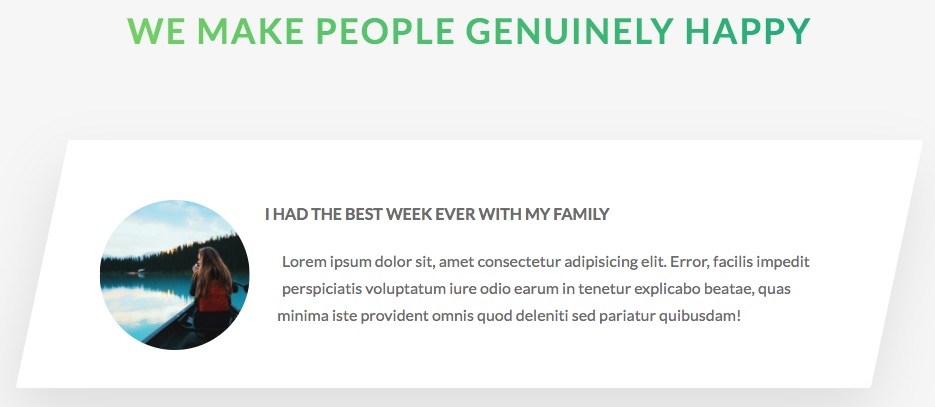

**[⬆ back to top](#table-of-contents)**

#### Story component

```html
<section class="section-stories">
  <div class="u-center-text u-margin-bottom-big">
    <h2 class="heading-secondary">
      We make people genuinely happy
    </h2>
  </div>
  <div class="row">
    <div class="story">
      <figure class="story__shape">
        
      </figure>
      <div class="story__text">
        <h3 class="heading-tertiary u-margin-bottom-small">I had the best week ever with my family</h3>
        <p>Lorem ipsum dolor sit, amet consectetur adipisicing elit. Error, facilis impedit perspiciatis voluptatum iure odio earum in tenetur explicabo beatae, quas minima iste provident omnis quod deleniti sed pariatur quibusdam!</p>
      </div> 
    </div>
  </div>
</section>
```

```scss
.section-stories {
  padding: 15rem 0;
  background-color: $color-grey-light-1;
}

.story {
  width: 75%;
  margin: 0 auto;
  box-shadow: 0 3rem 6rem rgba($color-black, .1);
  background-color: $color-white;
  border-radius: 3px;
  padding: 6rem;
  padding-left: 9rem;
  font-size: $default-font-size;
  transform: skewX(-12deg);

  &__shape {
    width: 15rem;
    height: 15rem;
    float: left;
    -webkit-shape-outside: circle(50% at 50% 50%);
    shape-outside: circle(50% at 50% 50%);
    -webkit-clip-path: circle(50% at 50% 50%);
    clip-path: circle(50% at 50% 50%);
    transform: translateX(-3rem) skewX(12deg);
  }

  &__img {
    height: 100%;
  }

  &__text {
    transform: skewX(12deg);
  }
}
```

**[⬆ back to top](#table-of-contents)**

#### How to make text flow around shapes with shape-outside and float?

The [shape-outside](https://developer.mozilla.org/en-US/docs/Web/CSS/shape-outside) CSS property defines a shape—which may be non-rectangular—around which adjacent inline content should wrap.

```scss
.story {
  width: 75%;
  margin: 0 auto;
  box-shadow: 0 3rem 6rem rgba($color-black, .1);
  background-color: $color-white;
  border-radius: 3px;
  padding: 6rem;
  padding-left: 9rem;
  font-size: $default-font-size;
  transform: skewX(-12deg);

  &__shape {
    width: 15rem;
    height: 15rem;
    float: left;
    -webkit-shape-outside: circle(50% at 50% 50%);
    shape-outside: circle(50% at 50% 50%);
    -webkit-clip-path: circle(50% at 50% 50%);
    clip-path: circle(50% at 50% 50%);
    transform: translateX(-3rem) skewX(12deg);
  }

  &__img {
    height: 100%;
  }
}
```

**[⬆ back to top](#table-of-contents)**

### 43. Building the Stories Section - Part 2

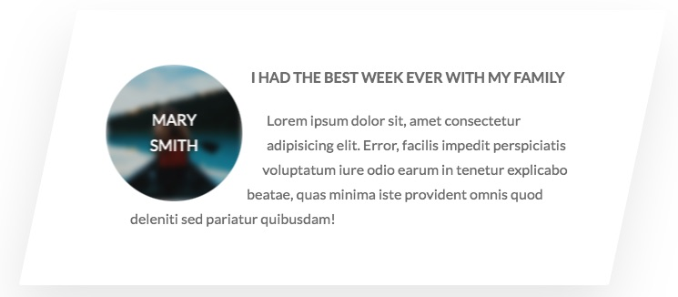

**[⬆ back to top](#table-of-contents)**

#### Story Shape component - Figure Caption

The HTML [`<figcaption>`](https://developer.mozilla.org/en-US/docs/Web/HTML/Element/figcaption) or Figure Caption element represents a caption or legend describing the rest of the contents of its parent `<figure>` element.

```html
<div class="story">
  <figure class="story__shape">
    
    <figcaption class="story__caption">
      Mary Smith
    </figcaption>
  </figure>
</div>
```

```scss
.story {
  &__shape {
    position: relative;
    overflow: hidden;
  }

  &__img {
    height: 100%;
    transform: translateX(-4rem) scale(1.4);
    backface-visibility: hidden;
    transition: all 0.5s;
  }

  &__caption {
    position: absolute;
    top: 50%;
    left: 50%;
    transform: translate(-50%, 20%);
    color: $color-white;
    text-transform: uppercase;
    font-size: 1.7rem;
    text-align: center;
    opacity: 0;
    transition: all 0.5s;
    backface-visibility: hidden;
  }

  &:hover &__caption {
    opacity: 1;
    transform: translate(-50%, -50%);
  }

  &:hover &__img {
    transform: translateX(-4rem) scale(1);
    filter: blur(3px) brightness(80%);
  }
}
```

**[⬆ back to top](#table-of-contents)**

### 44. Building the Stories Section - Part 3

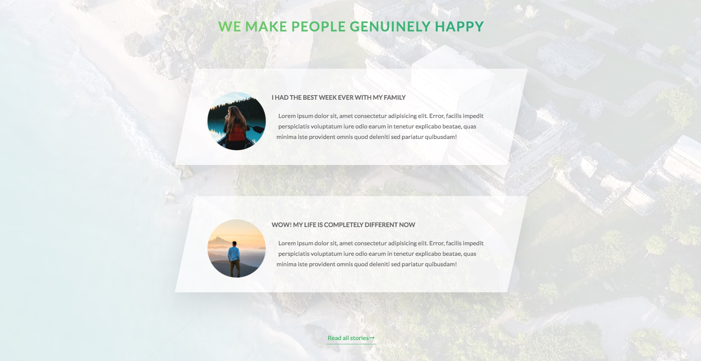

**[⬆ back to top](#table-of-contents)**

#### Story component - Background video

[Coverr: Free Stock Footage | Royalty Free Videos for Download](https://coverr.co)

```html
<div class="bg-video">
  <video class="bg-video__content" autoplay muted>
    <source src="img/video.mp4" type="video/mp4" />
    <source src="img/video.webm" type="video/webm" />
    Your browser is not supported!
  </video>
</div>
```

```scss
.section-stories {
  position: relative;
}

.story {
  background-color: rgba($color-white, .6);
}

.bg-video {
  position: absolute;
  top: 0;
  left: 0;
  height: 100%;
  width: 100%;
  z-index: -1;
  opacity: .15;
  overflow: hidden;

  &__content {
    height: 100%;
    width: 100%;
    object-fit: cover;
  }
}
```

#### How to use the <video> HTML element?

```html
<div class="bg-video">
  <video class="bg-video__content" autoplay muted>
    <source src="img/video.mp4" type="video/mp4" />
    <source src="img/video.webm" type="video/webm" />
    Your browser is not supported!
  </video>
</div>
```

**[⬆ back to top](#table-of-contents)**

#### How to create a background video covering an entire section?

```scss
.section-stories {
  position: relative;
}

.bg-video {
  position: absolute;
  top: 0;
  left: 0;
  height: 100%;
  width: 100%;
  z-index: -1;
  opacity: .15;
  overflow: hidden;

  &__content {
    height: 100%;
    width: 100%;
    object-fit: cover;
  }
}
```

**[⬆ back to top](#table-of-contents)**

#### How and when to use the object-fit property?

The [object-fit](https://developer.mozilla.org/en-US/docs/Web/CSS/object-fit) CSS property sets how the content of a replaced element, such as an  or <video>, should be resized to fit its container.

```scss
.section-stories {
  position: relative;
}

.bg-video {
  position: absolute;
  top: 0;
  left: 0;
  height: 100%;
  width: 100%;
  z-index: -1;
  opacity: .15;
  overflow: hidden;

  &__content {
    height: 100%;
    width: 100%;
    object-fit: cover;
  }
}
```

**[⬆ back to top](#table-of-contents)**

### 45. Building the Booking Section - Part 1

#### Thinking about components

- Form
  - Secondary Heading
  - Input: Full name and Email address
  - Radio button
  - Green button


```html
<section class="section-book">
  <div class="row">
    <div class="book">
      <div class="book__form">
        <form action="" class="form">
          <div class="u-margin-bottom-medium">
            <h2 class="heading-secondary">
              Start booking now
            </h2>
          </div>
          <div class="form__group">
            <input type="text" class="form__input" placeholder="Full Name" id="name" required>
            <label for="name" class="form__label">Full name</label>
          </div>
          <div class="form__group">
            <input type="email" class="form__input" placeholder="Email address" id="email" required>
            <label for="email" class="form__label">Email address</label>
          </div>
        </form>
      </div>
    </div>
  </div>
</section>
```

```scss
.section-book {
  padding: 15rem 0;
  background-image: linear-gradient(to right bottom, $color-primary-light, $color-primary-dark);
}

.book {
  background-image: 
    linear-gradient(
      105deg, 
      rgba($color-white, 0.9) 0%, 
      rgba($color-white, 0.9) 50%, 
      transparent 50%), 
    url(../img/nat-10.jpg);
  background-size: cover;
  border-radius: 3px;
  box-shadow: 0 1.5rem 4rem rgba($color-black, 0.2);

  height: 50rem;

  &__form {
    width: 50%;
    padding: 6rem;
  }
}
```

**[⬆ back to top](#table-of-contents)**

#### How to implement "solid-color gradients"?

The [linear-gradient()](https://developer.mozilla.org/en-US/docs/Web/CSS/linear-gradient) CSS function creates an image consisting of a progressive transition between two or more colors along a straight line. Its result is an object of the `<gradient>` data type, which is a special kind of `<image>`.

```scss
.book {
  background-image: 
    linear-gradient(
      105deg, 
      rgba($color-white, 0.9) 0%, 
      rgba($color-white, 0.9) 50%, 
      transparent 50%), 
    url(../img/nat-10.jpg);
  background-size: cover;
  border-radius: 3px;
  box-shadow: 0 1.5rem 4rem rgba($color-black, 0.2);
  height: 50rem;
}
```

**[⬆ back to top](#table-of-contents)**

### 46. Building the Booking Section - Part 2

#### Input component: Full name and Email address


```scss
.form {
  &__group:not(:last-child) {
    margin-bottom: 2rem;
  }

  &__input {
    font-size: 1.5rem;
    font-family: inherit;
    color: inherit;
    padding: 1.5rem 2rem;
    border-radius: 2px;
    background-color: rgba($color-white, .5);
    border: none;
    border-bottom: 3px solid transparent;
    width: 90%;
    display: block;
    transition: all .3s;

    &:focus {
      outline: none;
      box-shadow: 0 1rem 2rem rgba($color-black, .2);
      border-bottom: 3px solid $color-primary;
    }

    &:focus:invalid {
      border-bottom: 3px solid $color-secondary-dark;
    }

    &::-webkit-input-placeholder {
      color: $color-grey-dark-2;
    }
  }

  &__label {
    font-size: 1.2rem;
    font-weight: 700;
    margin-left: 2rem;
    margin-top: .7rem;
    display: block;
    transition: all .3s;
  }

  &__input:placeholder-shown + &__label {
    opacity: 0;
    visibility: hidden;
    transform: translateY(-4rem);
  }
}
```

**[⬆ back to top](#table-of-contents)**

#### How the general and adjacent sibling selectors work and why we need them?

The [general sibling combinator](https://developer.mozilla.org/en-US/docs/Web/CSS/General_sibling_combinator) (~) separates two selectors and matches the second element only if it follows the first element (though not necessarily immediately), and both are children of the same parent element.

The [adjacent sibling combinator](https://developer.mozilla.org/en-US/docs/Web/CSS/Adjacent_sibling_combinator) (+) separates two selectors and matches the second element only if it immediately follows the first element, and both are children of the same parent element.

```html
<form action="" class="form">
  <div class="form__group">
    <input type="text" class="form__input" placeholder="Full Name" id="name" required>
    <label for="name" class="form__label">Full name</label>
  </div>
</div>
```

```scss
.form {
  // form__input and form__label are adjacent siblings
  &__input:placeholder-shown + &__label {
    opacity: 0;
    visibility: hidden;
    transform: translateY(-4rem);
  }
}
```

**[⬆ back to top](#table-of-contents)**

#### How to use the ::input-placeholder pseudo-element?

```scss
.form {
  &__input {
    // customise placeholder text
    &::-webkit-input-placeholder {
      color: $color-grey-dark-2;
    }
  }
}
```

**[⬆ back to top](#table-of-contents)**

#### How and when to use the :focus, :invalid, :placeholder-shown?

The [:focus](https://developer.mozilla.org/en-US/docs/Web/CSS/:focus) CSS pseudo-class represents an element (such as a form input) that has received focus. It is generally triggered when the user clicks or taps on an element or selects it with the keyboard's "tab" key.

The [:invalid](https://developer.mozilla.org/en-US/docs/Web/CSS/:invalid) CSS pseudo-class represents any `<input>` or other `<form>` element whose contents fail to validate.

The [:placeholder-shown](https://developer.mozilla.org/en-US/docs/Web/CSS/:placeholder-shown) CSS pseudo-class represents any `<input>` or `<textarea>` element that is currently displaying placeholder text.

```scss
.form {
  &__group:not(:last-child) {
    margin-bottom: 2rem;
  }

  &__input {
    &:focus {
      outline: none;
      box-shadow: 0 1rem 2rem rgba($color-black, .2);
      border-bottom: 3px solid $color-primary;
    }

    &:focus:invalid {
      border-bottom: 3px solid $color-secondary-dark;
    }

    &::-webkit-input-placeholder {
      color: $color-grey-dark-2;
    }
  }

  // css property is applied when placeholder is shown
  // css property is remove when placeholder is gone, user key in value
  &__input:placeholder-shown + &__label {
    opacity: 0;
    visibility: hidden;
    transform: translateY(-4rem);
  }
}
```

**[⬆ back to top](#table-of-contents)**

### 47. Building the Booking Section - Part 3

#### Techniques to build custom radio buttons


```html
<div class="form__group u-margin-bottom-medium">
  <div class="form__radio-group">
    <input type="radio" class="form__radio-input" id="small" name="size">
    <label for="small" class="form__radio-label">
      <span class="form__radio-button"></span>
      Small tour group
    </label>
  </div>
  <div class="form__radio-group">
    <input type="radio" class="form__radio-input" id="large" name="size">
    <label for="large" class="form__radio-label">
      <span class="form__radio-button"></span>
      Large tour group
    </label>
  </div>
</div>
```

```scss
.form {
  &__radio-group {
    width: 49%;
    display: inline-block;
  }

  &__radio-input {
    display: none;
  }

  &__radio-label {
    font-size: $default-font-size;
    cursor: pointer;
    position: relative;
    padding-left: 4.5rem;
  }

  &__radio-button {
    height: 3rem;
    width: 3rem;
    border: 5px solid $color-primary;
    border-radius: 50%;
    display: inline-block;
    position: absolute;
    left: 0;
    top: -.4rem;

    &::after {
      content: "";
      display: block;
      height: 1.3rem;
      width: 1.3rem;
      border-radius: 50%;
      position: absolute;
      top: 50%;
      left: 50%;
      transform: translate(-50%, -50%);
      background-color: $color-primary;
      opacity: 0;
      transition: opacity .2s;
    }
  }

  // form__radio-input:checked
  // form__radio-label is sibling of form__radio-input:checked
  // form__radio-button::after is child of form__radio-label
  &__radio-input:checked ~ &__radio-label &__radio-button::after {
    opacity: 1;
  }
}
```

**[⬆ back to top](#table-of-contents)**

#### Green button

```html
<div class="form__group">
  <button class="btn btn--green">Next step &rarr;</button>
</div>
```

```scss
.btn {
  // add & for the <button> element
  &,
  &:link,
  &:visited {
    ...

    // change for the <button> element
    border: none;
    cursor: pointer;
  }

  // add :focus for the <button> element
  &:active,
  &:focus {
    outline: none;
    ...
  }
}
```

**[⬆ back to top](#table-of-contents)**

#### How and when to use the :checked pseudo-classes?

The [:checked](https://developer.mozilla.org/en-US/docs/Web/CSS/:checked) CSS pseudo-class selector represents any radio (`<input type="radio">`), checkbox (`<input type="checkbox">`), or option (`<option>` in a `<select>`) element that is checked or toggled to an on state.

```scss
.form {
  // form__radio-input:checked
  // form__radio-label is sibling of form__radio-input:checked
  // form__radio-button::after is child of form__radio-label
  &__radio-input:checked ~ &__radio-label &__radio-button::after {
    opacity: 1;
  }
}
```

**[⬆ back to top](#table-of-contents)**

### 48. Building the Footer

#### How to design a simple website footer?

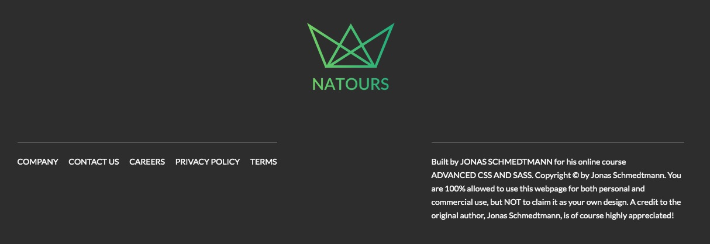

```html
<footer class="footer">
  <div class="footer__logo-box">
    
  </div>
  <div class="row">
    <div class="col-1-of-2">
      <div class="footer__navigation">
        <ul class="footer__list">
          <li class="footer__item"><a href="#" class="footer__link">Company</a></li>
          <li class="footer__item"><a href="#" class="footer__link">Contact us</a></li>
          <li class="footer__item"><a href="#" class="footer__link">Careers</a></li>
          <li class="footer__item"><a href="#" class="footer__link">Privacy policy</a></li>
          <li class="footer__item"><a href="#" class="footer__link">Terms</a></li>
        </ul>
      </div>
    </div>
    <div class="col-1-of-2">
      <p class="footer__copyright">
        Built by <a href="#" class="footer__link">Jonas Schmedtmann</a> for his online course <a href="#" class="footer__link">Advanced CSS and Sass</a>.
        Copyright &copy; by Jonas Schmedtmann. You are 100% allowed to use this webpage for both personal
        and commercial use, but NOT to claim it as your own design. A credit to the original author, Jonas
        Schmedtmann, is of course highly appreciated!
      </p>
    </div>
  </div>
</footer>
```

```scss
.footer {
  background-color: $color-grey-dark-3;
  padding: 10rem 0;
  font-size: 1.4rem;
  color: $color-grey-light-1;

  &__logo-box {
    text-align: center;
    margin-bottom: 8rem;
  }

  &__logo {
    width: 15rem;
    height: auto
  }
  
  &__navigation {
    border-top: 1px solid $color-grey-dark;
    padding-top: 2rem;
    display: inline-block;
  }
  
  &__list {
    list-style: none;
  }
  
  &__item {
    display: inline-block;

    &:not(:last-child) {
      margin-right: 1.5rem;
    }
  }
  
  &__link {
    &:link,
    &:visited {
      color: $color-grey-light-1;
      background-color: $color-grey-dark-3;
      text-decoration: none;
      text-transform: uppercase;
      display: inline-block;
      transition: all .2s;
    }

    &:hover,
    &:active {
      color: $color-primary;
      box-shadow: 0 1rem 2rem rgba($color-black, .4);
      transform: rotate(5deg) scale(1.3);
    }
  }
  
  &__copyright {
    border-top: 1px solid $color-grey-dark;
    padding-top: 2rem;
    width: 80%;
    float: right;
  }
}
```

**[⬆ back to top](#table-of-contents)**

### 49. Building the Navigation - Part 1

Think in components

- Navigation button
- Navigation list
- Navigation background

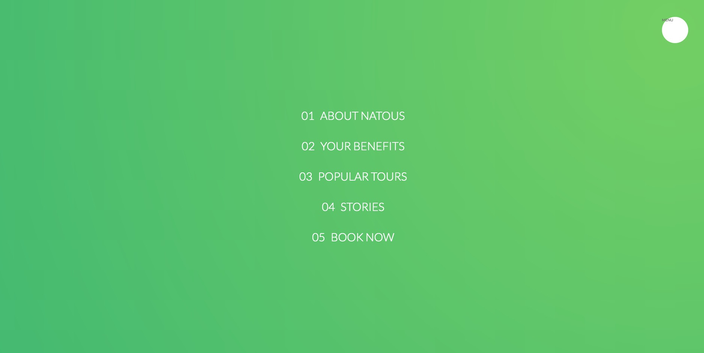

| component             | css selector           | z-index |
| --------------------- | ---------------------- | ------- |
| Navigation button     | navigation__button     | 2000    |
| Navigation list       | navigation__nav        | 1500    |
| Navigation background | navigation__background | 1000    |

```html
<div class="navigation">
  <input type="checkbox" class="navigation__checkbox" id="navi-toggle">
  <label for="navi-toggle" class="navigation__button">MENU</label>
  <div class="navigation__background">&nbsp;</div>
  <nav class="navigation__nav">
    <ul class="navigation__list">
      <li class="navigation__item"><a href="#" class="navigation__link"><span>01</span>About Natous</a></li>
      <li class="navigation__item"><a href="#" class="navigation__link"><span>02</span>Your benefits</a></li>
      <li class="navigation__item"><a href="#" class="navigation__link"><span>03</span>Popular tours</a></li>
      <li class="navigation__item"><a href="#" class="navigation__link"><span>04</span>Stories</a></li>
      <li class="navigation__item"><a href="#" class="navigation__link"><span>05</span>Book now</a></li>
    </ul>
  </nav>
</div>
```

```scss
.navigation {
  &__checkbox {
    display: none;
  }

  &__button {
    background-color: $color-white;
    height: 7rem;
    width: 7rem;
    position: fixed;
    top: 6rem;
    right: 6rem;
    border-radius: 50%;
    z-index: 2000;
  }

  &__background {
    height: 6rem;
    width: 6rem;
    border-radius: 50%;
    position: fixed;
    top: 6.5rem;
    right: 6.5rem;
    background-image: radial-gradient($color-primary-light, $color-primary-dark);
    z-index: 1000;

    transform: scale(80);
  }

  &__nav {
    height: 100vh;
    width: 100%;
    position: fixed;
    top: 0;
    left: 0;
    z-index: 1500;
  }

  &__list {
    position: absolute;
    top: 50%;
    left: 50%;
    transform: translate(-50%, -50%);
    list-style: none;
    text-align: center;
  }
  
  &__item {
    margin: 1rem;
  }
  
  &__link {
    &:link,
    &:visited {
      display: inline-block;
      font-size: 3rem;
      font-weight: 300;
      padding: 1rem 2rem;
      color: $color-white;
      text-decoration: none;
      text-transform: uppercase;
      background-image: linear-gradient(120deg, transparent 0%, transparent 50%, $color-white 50%);
      background-size: 220%;
      transition: all .4s;

      span {
        margin-right: 1.5rem;
        display: inline-block;
      }
    }

    &:hover,
    &:active {
      background-position: 100%;
      color: $color-primary;
      transform: translateX(1rem);
    }
  }
}
```

**[⬆ back to top](#table-of-contents)**

### 50. Building the Navigation - Part 2

#### What the "checkbox hack" is and how it works?

- label element is link to checkbox with id navi-toggle
- click label element will check/uncheck checkbox with id navi-toggle
- if checkbox is checked, scale background by 80 times
- if checkbox is checked, show Navigation list

```html
<div class="navigation">
  <input type="checkbox" class="navigation__checkbox" id="navi-toggle">
  <label for="navi-toggle" class="navigation__button">MENU</label>
  <div class="navigation__background">&nbsp;</div>
  <nav class="navigation__nav">
  </nav>
</div>
```

```scss
.navigation {
  &__background {
    height: 6rem;
    width: 6rem;
  }

  &__nav {
    z-index: 1500;
    opacity: 0;
    width: 0;
  }

  &__checkbox:checked ~ &__background{
    transform: scale(80);
  }

  &__checkbox:checked ~ &__nav{
    opacity: 1;
    width: 100%;
  }
}
```

**[⬆ back to top](#table-of-contents)**

#### How to animate "solid-color gradients"?

```html
<div class="navigation">
  <input type="checkbox" class="navigation__checkbox" id="navi-toggle">
  <label for="navi-toggle" class="navigation__button"></label>
  <div class="navigation__background">&nbsp;</div>
<div>
```

```scss
.navigation {

  &__checkbox {
    display: none;
  }

  &__button {
    background-color: $color-white;
    height: 7rem;
    width: 7rem;
    position: fixed;
    top: 6rem;
    right: 6rem;
    border-radius: 50%;
    z-index: 2000;
    box-shadow: 0 1rem 3rem rgba($color-black, .1);
    text-align: center;
    cursor: pointer;
  }

  &__background {
    background-image: radial-gradient($color-primary-light, $color-primary-dark);
    z-index: 1000;
    transition: transform .8s cubic-bezier(0.83, 0, 0.17, 1);
  }

  &__checkbox:checked ~ &__background {
    transform: scale(80);
  }
}
```

**[⬆ back to top](#table-of-contents)**

#### How to create custom animation timing functions using cubic bezier curves?

- [Easing functions ](https://easings.net)
- [cubic-bezier](https://cubic-bezier.com)

```scss
.navigation {
  &__background {
    transition: transform .8s cubic-bezier(0.83, 0, 0.17, 1);
  }

  &__nav {
    transition: all .8s cubic-bezier(0.68, -0.6, 0.32, 1.6);
  }

  &__checkbox:checked ~ &__background{
    transform: scale(80);
  }

  &__checkbox:checked ~ &__nav{
    opacity: 1;
    width: 100%;
  }
}
```

**[⬆ back to top](#table-of-contents)**

### 51. Building the Navigation - Part 3

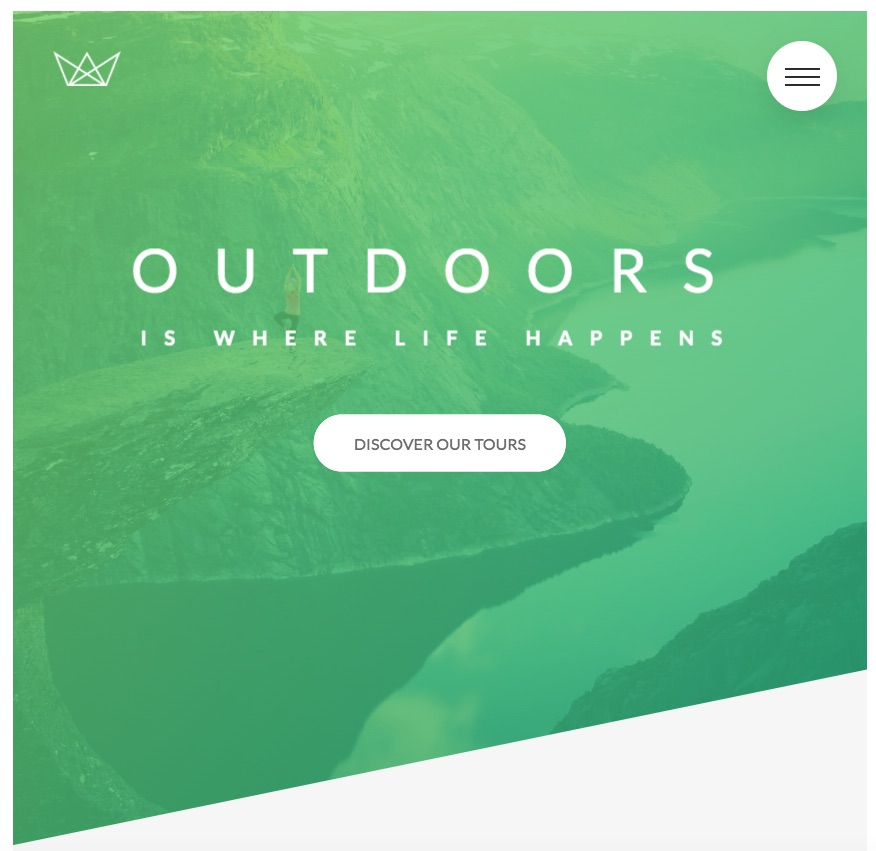
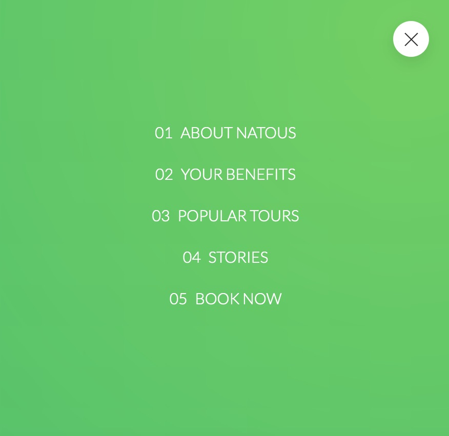

**[⬆ back to top](#table-of-contents)**

#### Navigation button animation

```html
<label for="navi-toggle" class="navigation__button">
  <span class="navigation__icon">&nbsp;</span>
</label>
```

```scss
.navigation {
  
  // ICON
  &__icon {
    position: relative;
    margin-top: 3.5rem;

    &,
    &::before,
    &::after {
      width: 3.5rem;
      height: 2px;
      background-color: $color-grey-dark-3;
      display: inline-block;
    }

    &::before,
    &::after {
      content: "";
      position: absolute;
      left: 0;
      transition: all .2s;
    }

    &::before { top: -.8rem; }
    &::after { top: .8rem; }
  }

  &__button:hover &__icon::before {
    top: -1rem;
  }

  &__button:hover &__icon::after {
    top: 1rem;
  }

  &__checkbox:checked + &__button &__icon {
    background-color: transparent;
  }

  &__checkbox:checked + &__button &__icon::before {
    top: 0;
    transform: rotate(135deg);
  }

  &__checkbox:checked + &__button &__icon::after {
    top: 0;
    transform: rotate(-135deg);
  }
}
```

**[⬆ back to top](#table-of-contents)**

#### How and why to use transform-origin?

The [transform-origin](https://developer.mozilla.org/en-US/docs/Web/CSS/transform-origin) CSS property sets the origin for an element's transformations.

**[⬆ back to top](#table-of-contents)**

#### In general: create an amazingly creative effect?

[Using CSS transitions](https://developer.mozilla.org/en-US/docs/Web/CSS/CSS_Transitions/Using_CSS_transitions)

```html
<div class="box">Sample</div>
```

```css
.box {
    border-style: solid;
    border-width: 1px;
    display: block;
    width: 100px;
    height: 100px;
    background-color: #0000FF;
    transition: width 2s, height 2s, background-color 2s, transform 2s;
}

.box:hover {
    background-color: #FFCCCC;
    width: 200px;
    height: 200px;
    transform: rotate(180deg);
}
```

**[⬆ back to top](#table-of-contents)**

### 52. Building a Pure CSS Popup - Part 1

Thinking in components
- Popup container
- Popup content
  - Left content: 2 tour photos
  - Right content: secondary and tertiary heading, text, green button

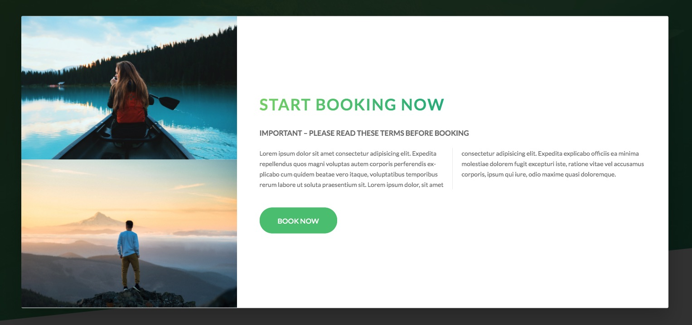

**[⬆ back to top](#table-of-contents)**

#### How to build a nice popup with only CSS?

```html
<div class="popup">
  <div class="popup__content">
    <div class="popup__left">
      
      
    </div>
    <div class="popup__right">
      <h2 class="heading-secondary u-margin-bottom-small">Start booking now</h2>
      <h3 class="heading-tertiary u-margin-bottom-small">Important &ndash; Please read these terms before booking</h3>
      <p class="popup__text">
        Lorem ipsum dolor sit amet consectetur adipisicing elit. Expedita repellendus quos magni voluptas autem corporis perferendis explicabo cum quidem beatae vero itaque, voluptatibus temporibus rerum labore ut soluta praesentium sit. Lorem ipsum dolor, sit amet consectetur adipisicing elit. Expedita explicabo officiis ea minima molestiae dolorem fugit excepturi iste, ratione vitae vel accusamus corporis, ipsum qui iure, odio maxime quasi doloremque.
      </p>
      <a href="#" class="btn btn--green">Book now</a>
    </div>
  </div>
</div>
```

```scss
.popup {
  height: 100vh;
  width: 100%;
  position: fixed;
  top: 0;
  left: 0;
  background-color: rgba($color-black, .8);
  z-index: 9999;

  &__content {
    @include absCenter;
    width: 75%;
    background-color: $color-white;
    box-shadow: 0 2rem 4rem rgba($color-black, .2);
    border-radius: 3px;
    display: table;
    overflow: hidden;
  }

  &__left {
    width: 33.333333%;
    display: table-cell;
  }

  &__right {
    width: 66.666667%;
    display: table-cell;
    vertical-align: middle;
    padding: 3rem 5rem;
  }

  &__img {
    display: block;
    width: 100%;
  }

  &__text {
    font-size: 1.4rem;
    margin-bottom: 4rem;

    column-count: 2;
    column-gap: 4rem; // 1em = 14px
    column-rule: 1px solid $color-grey-light-2;

    hyphens: auto;
  }
}
```

**[⬆ back to top](#table-of-contents)**


#### How to create boxes with equal height using display: table-cell?

```scss
.popup {
  &__content {
    display: table;
  }

  &__left {
    width: 33.333333%;
    display: table-cell;
  }

  &__right {
    width: 66.666667%;
    display: table-cell;
    vertical-align: middle;
  }
}
```

**[⬆ back to top](#table-of-contents)**

#### How to create CSS text columns?

```scss
.popup {
  &__text {
    column-count: 2;
    column-gap: 4rem;
    column-rule: 1px solid $color-grey-light-2;
  }
}
```

**[⬆ back to top](#table-of-contents)**

#### How to automatically hyphenate words using hyphens?

```scss
.popup {
  &__text {
    hyphens: auto;
  }
}
```

**[⬆ back to top](#table-of-contents)**

### 53. Building a Pure CSS Popup - Part 2

- Click "Discover our tours" button -> Section tours
- Click "Book now" button -> open popup
- Click "x" button -> close popup

```html
<section class="section-tours" id="section-tours">
  <a href="#popup" class="btn btn--white">Book now</a>
</section>

<div class="popup" id="popup">
  <div class="popup__content">
    <div class="popup__left"></div>
    <div class="popup__right">
      <a href="#section-tours" class="popup__close">&times;</a>
    </div>
  </div>
</div>
```

```scss
.popup {
  &__content {
    opacity: 0;
    transform: translate(-50%, -50%) scale(.25);
    transition: all .5s .2s;
  }

  &:target {
    opacity: 1;
    visibility: visible;
  }

  &:target &__content {
    opacity: 1;
    transform: translate(-50%, -50%) scale(1);
  }

  &__close {
    &:link,
    &:visited {
      color: $color-grey-dark;
      position: absolute;
      top: 2.5rem;
      right: 2.5rem;
      font-size: 3rem;
      text-decoration: none;
      display: inline-block;
      transition: all .2s;
      line-height: 1;
    }

    &:hover {
      color: $color-primary;
    }
  }
}
```

**[⬆ back to top](#table-of-contents)**

#### How to use the :target pseudo-class?

- Click "Book now" button in tours section
- `:target` pseudo-class with `id="popup"` -> open popup
- Click "x" button in popup
- `:target` pseudo-class with `id="section-tours"` -> open section-tours -> close popup

```html
<section class="section-tours" id="section-tours">
  <a href="#popup" class="btn btn--white">Book now</a>
</section>

<div class="popup" id="popup">
  <div class="popup__content">
    <div class="popup__left"></div>
    <div class="popup__right">
      <a href="#section-tours" class="popup__close">&times;</a>
    </div>
  </div>
</div>
```

```scss
.popup {
  &__content {
    opacity: 0;
  }

  &:target {
    opacity: 1;
    visibility: visible;
  }
}
```

**[⬆ back to top](#table-of-contents)**

## **Section 6: Natours Project — Advanced Responsive Design (Part 3)**

Order to write media queries

- base + typography
- general layout + grid
- components

[sizzy](https://sizzy.co)

**[⬆ back to top](#table-of-contents)**

### 55. Mobile-First vs Desktop-First and Breakpoints

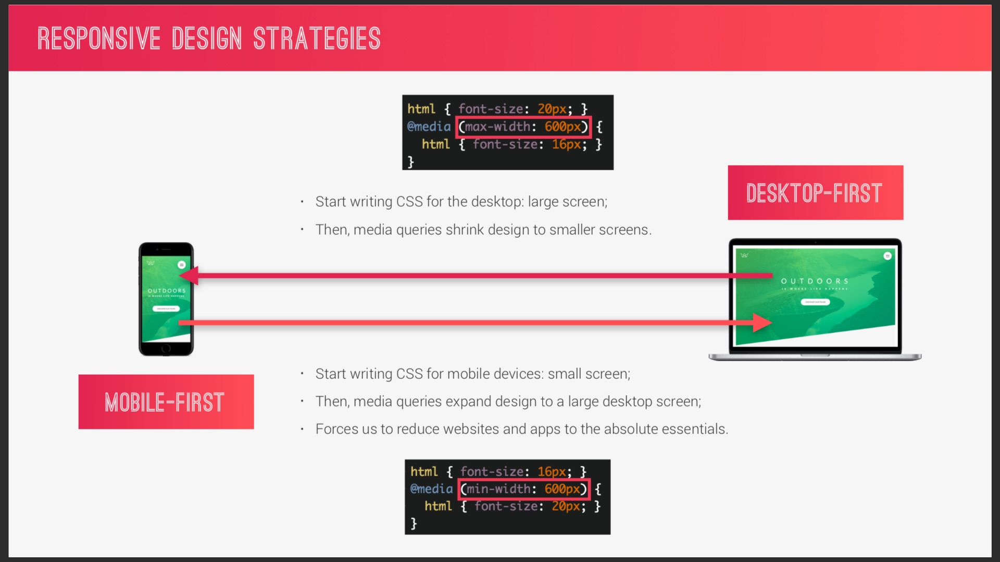
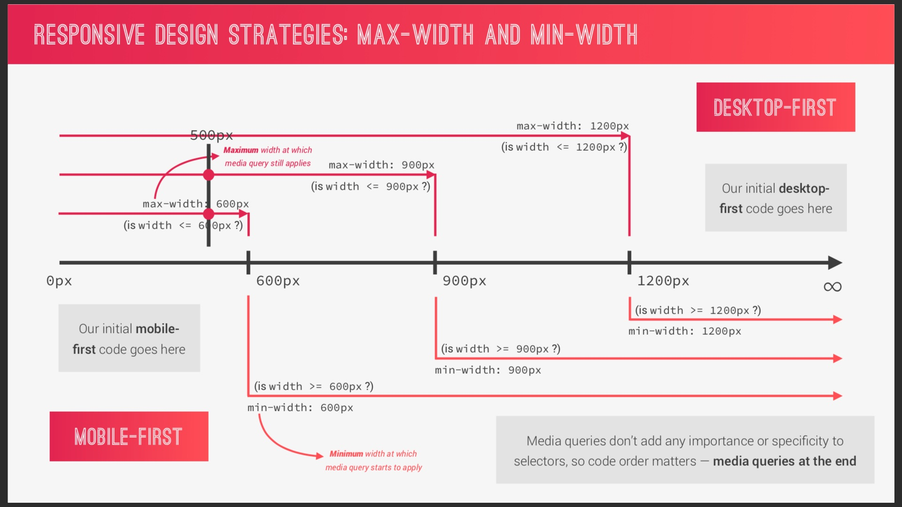
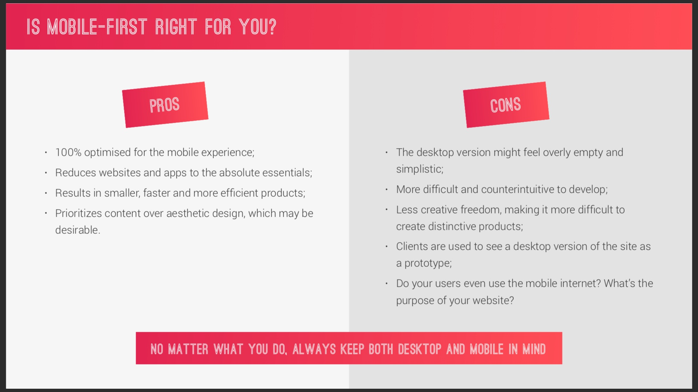
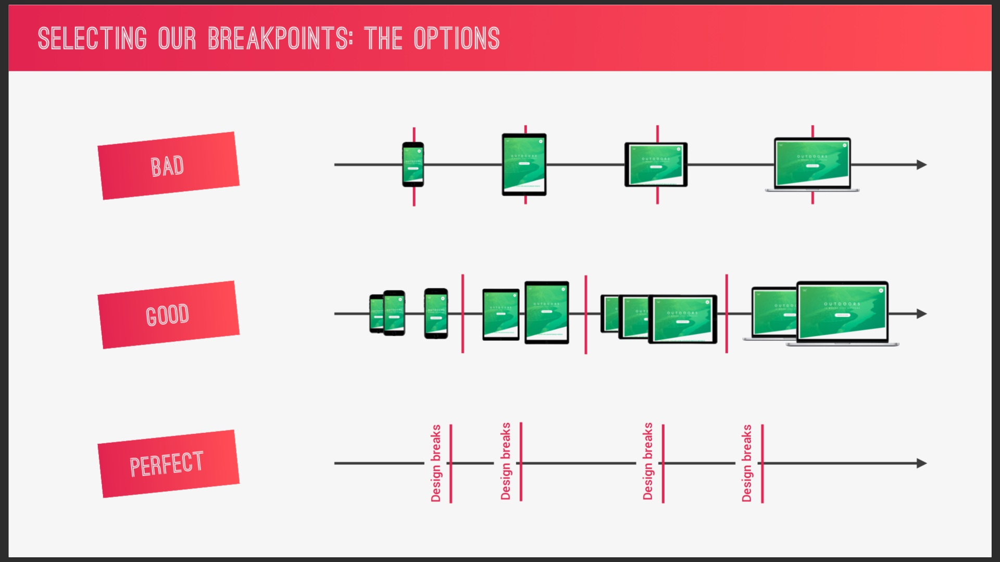
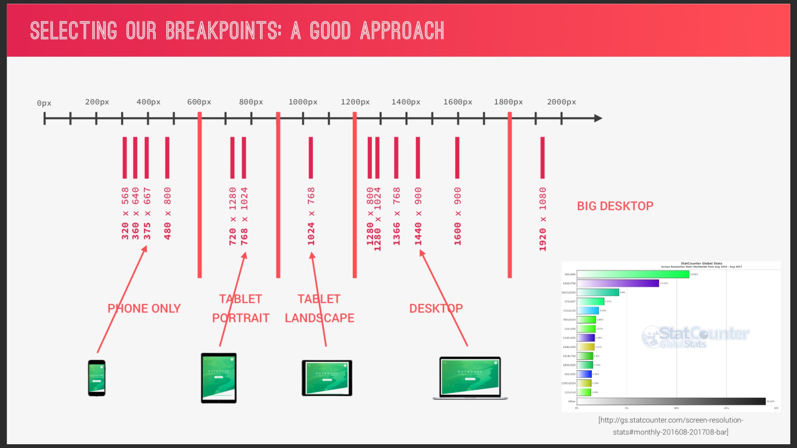

[Screen Resolution Stats Worldwide](https://gs.statcounter.com/screen-resolution-stats#monthly-201907-202007-bar)

**[⬆ back to top](#table-of-contents)**

### 56. Let's Use the Power of Sass Mixins to Write Media Queries

#### How to use the @content and @if Sass directives?

Media Query Manager

| Device Group     | Resolution   | $breakpoint | max-width | min-width |
| ---------------- | ------------ | ----------- | --------- | --------- |
| Phone            | 0 - 600px    | phone       | 37.5em    |           |
| Tablet portrait  | 600 - 900px  | tab-port    | 56.25em   |           |
| Tablet landscape | 900 - 1200px | tab-land    | 75em      |           |
| Desktop          | 1200 - 1800  |             |           |           |
| Big desktop      | 1800 - ~     | big-desktop |           | 112.5em   |

Note: 1em = 16px

```scss
@mixin respond($breakpoint) {
  @if $breakpoint == phone {
    @media (max-width: 37.5em) { @content };
  }

  @if $breakpoint == tab-port {
    @media (max-width: 56.25em) { @content };
  }

  @if $breakpoint == tab-land {
    @media (max-width: 75em) { @content };
  }

  @if $breakpoint == big-desktop {
    @media (min-width: 112.5em) { @content };
  }
}
```

| Device Group     | Resolution (px) | $breakpoint | width     | font-size (%) | font-size    |
| ---------------- | --------------- | ----------- | --------- | ------------- | ------------ |
| Desktop          | 1200 - 1800     |             |           | 62.5          | 1rem = 10px  |
| Tablet landscape | 900 - 1200      | tab-land    | <= 1200px | 56.25         | 1rem = 9px   |
| Tablet portrait  | 600 - 900       | tab-port    | <= 900px  | 50            | 1rem = 8px   |
| Phone            | 0 - 600         | phone       | <= 600px  | 30            | 1rem = 4.8px |
| Big desktop      | 1800 - ~        | big-desktop | >= 1800px | 75            | 1rem = 12px  |

```scss
html {
  font-size: 62.5%; 

  @include respond(tab-land) {  
    font-size: 56.25%; 
  }

  @include respond(tab-port) {  
    font-size: 50%; 
  }

  @include respond(phone) {  
    font-size: 30%; 
  }

  @include respond(big-desktop) { 
    font-size: 75%; 
  }
}
```

**[⬆ back to top](#table-of-contents)**

#### Taking advantage of Chrome DevTools for responsive design.

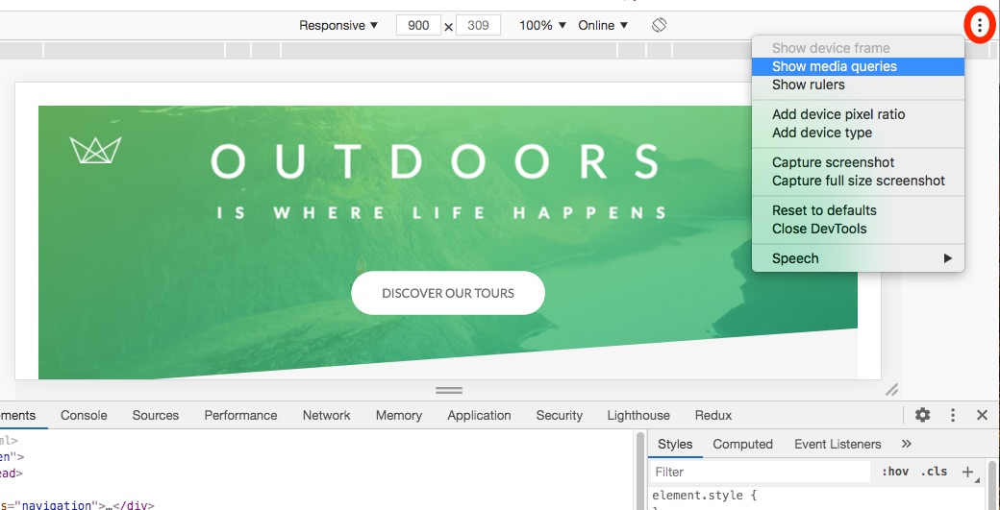

**[⬆ back to top](#table-of-contents)**

### 57. Writing Media Queries - Base, Typography and Layout

#### Base

```scss
body {
  padding: 3rem;

  @include respond(tab-port) {
    padding: 0;
  }
}

.u-margin-bottom-medium { 
  margin-bottom: 4rem !important; 

  @include respond(tab-port) {  // width < 900px ?
    margin-bottom: 3rem !important; 
  }
}

.u-margin-bottom-big { 
  margin-bottom: 8rem !important; 

  @include respond(tab-port) {  // width < 900px ?
    margin-bottom: 5rem !important; 
  }
}
```

**[⬆ back to top](#table-of-contents)**

#### Typography

```scss
.heading-primary {
  &--main {
    font-size: 6rem;
    letter-spacing: 3.5rem;

    @include respond(phone) {  // width < 600px ?
      font-size: 5rem;
      letter-spacing: 1rem;
    }
  }

  &--sub {
    letter-spacing: 1.75rem;

    @include respond(phone) {  // width < 600px ?
      letter-spacing: .5rem;
    }
  }
}

.heading-secondary {
  font-size: 3.5rem;

  @include respond(tab-port) {  // width < 900px ?
    font-size: 3rem;
  }

  @include respond(phone) {  // width < 600px ?
    font-size: 2.5rem;
  }
```

**[⬆ back to top](#table-of-contents)**

#### Layout

```scss
.navigation {
  &__button {
    top: 6rem;
    right: 6rem;

    @include respond(tab-port) {  // width < 900px ?
      top: 4rem;
      right: 4rem;
    }

    @include respond(phone) {  // width < 600px ?
      top: 3rem;
      right: 3rem;
    }
  }

  &__background {
    top: 6.5rem;
    right: 6.5rem;

    @include respond(tab-port) {  // width < 900px ?
      top: 4.5rem;
      right: 4.5rem;
    }

    @include respond(phone) {  // width < 600px ?
      top: 3.5rem;
      right: 3.5rem;
    }
  }
}

.header {
  -webkit-clip-path: polygon(0 0, 100% 0, 100% 75vh, 0 100%);
  clip-path: polygon(0 0, 100% 0, 100% 75vh, 0 100%);

  @include respond(phone) {  // width < 600px ?
    -webkit-clip-path: polygon(0 0, 100% 0, 100% 85vh, 0 100%);
    clip-path: polygon(0 0, 100% 0, 100% 85vh, 0 100%);
  }
}

.row {
  max-width: $grid-width;

  @include respond(tab-port) {  // width < 900px ?
    max-width: 50rem;
    padding: 0 3rem;
  }

  &:not(:last-child) {
    margin-bottom: $gutter-vertical;

    @include respond(tab-port) {  // width < 900px ?
      margin-bottom: $gutter-vertical-small;
    }
  }

  [class^="col-"] {
    float: left;

    &:not(:last-child) {
      margin-right: $gutter-horizontal;

      @include respond(tab-port) {  // width < 900px ?
        margin-right: 0;
        margin-bottom: $gutter-vertical-small;
      }
    }

    @include respond(tab-port) {  // width < 900px ?
      width: 100% !important;
    }
  }
}

.footer {
  padding: 10rem 0;

  @include respond(tab-port) {  // width < 900px ?
    padding: 8rem 0;
  }
  
  &__logo-box {
    margin-bottom: 8rem;

    @include respond(tab-port) {  // width < 900px ?
      margin-bottom: 6rem;
    }
  }

  &__navigation {
    border-top: 1px solid $color-grey-dark;
    padding-top: 2rem;
    display: inline-block;

    @include respond(tab-port) {  // width < 900px ?
      width: 100%;
      text-align: center;
    }
  }
  
  &__copyright {
    width: 80%;
    float: right;

    @include respond(tab-port) {  // width < 900px ?
      width: 100%;
      float: none;
    }
  }
}
```

**[⬆ back to top](#table-of-contents)**

### 58. Writing Media Queries - About and Features Sections

#### Home page

```scss
.section-about {
  padding: 25rem 0;

  @include respond(tab-port) {  // width < 900px ?
    padding: 20rem 0;
  }
}

.section-features {
  padding: 20rem 0;

  @include respond(tab-port) {  // width < 900px ?
    padding: 10rem 0;
  }
}

.section-tours {
  padding: 25rem 0 15rem 0;

  @include respond(tab-port) {  // width < 900px ?
    padding: 20rem 0 10rem 0;
  }
}

.section-stories {
  padding: 15rem 0;

  @include respond(tab-port) {  // width < 900px ?
    padding: 10rem 0;
  }
}

.section-book {
  padding: 15rem 0;

  @include respond(tab-port) {  // width < 900px ?
    padding: 10rem 0;
  }
}
```

**[⬆ back to top](#table-of-contents)**

#### About Section 

```scss
.composition {
  &__photo {
    width: 55%;
    box-shadow: 0 1.5rem 4rem rgba($color-black, .4);
    position: absolute;

    @include respond(tab-port) {  // width < 900px ?
      float: left;
      position: relative;
      width: 33.333333%;
      box-shadow: 0 1.5rem 3rem rgba($color-black, .2);
    }

    &--p1 {
      left: 0;
      top: -2rem;

      @include respond(tab-port) {  // width < 900px ?
        top: 0;
        transform: scale(1.2);
      }
    }

    &--p2 {
      right: 0;
      top: 2rem;

      @include respond(tab-port) {  // width < 900px ?
        top: -1rem;
        transform: scale(1.3);
        z-index: 100;
      }
    }

    &--p3 {
      left: 20%;
      top: 10rem;

      @include respond(tab-port) {  // width < 900px ?
        top: 1rem;
        left: 0;
        transform: scale(1.1);
      }
    }
  }
}
```

**[⬆ back to top](#table-of-contents)**

#### Features Section

```scss
.feature-box {
  padding: 2.5rem;

  @include respond(tab-port) {  // width < 900px ?
    padding: 2rem;
  }

  &__icon {
    margin-bottom: .5rem;

    @include respond(tab-port) {  // width < 900px ?
      margin-bottom: 0;
    }
  }
}
```

**[⬆ back to top](#table-of-contents)**

### 59. Writing Media Queries - Tours, Stories and Booking Sections

#### Tours section

```scss
.card {

  @include respond(tab-port) {  // width < 900px ?
    // FUNCTIONALITY
    height: auto;
    border-radius: 3px;
    background-color: $color-white;
    box-shadow: 0 1.5rem 4rem rgba($color-black, .15);

    &__side {
      height: auto;
      position: relative;
      box-shadow: none;

      &--back {
        transform: rotateY(0);
        clip-path: polygon(0 15%, 100% 0, 100% 100%, 0% 100%);
      }
    }

    &:hover &__side--front {
      transform: rotateY(0);
    }

    &__details {
      padding: 1rem 3rem;
    }

    // STYLING
    &__cta {
      position: relative;
      top: 0;
      left: 0;
      transform: translate(0);
      width: 100%;
      padding: 7rem 4rem 4rem 4rem;
    }

    &__price-box {
      margin-bottom: 3rem;
    }

    &__price-value {
      font-size: 4rem;
    }
  }
}
```

**[⬆ back to top](#table-of-contents)**

#### Stories section

```scss
.story {
  width: 75%;
  padding: 6rem;
  padding-left: 9rem;
  transform: skewX(-12deg);

  @include respond(tab-port) {  // width < 900px ?
    width: 100%;
    padding: 4rem;
    padding-left: 7rem;
  }

  @include respond(phone) {  // width < 600px ?
    transform: skewX(0);
  }

  &__shape {
    transform: translateX(-3rem) skewX(12deg);

    @include respond(phone) {  // width < 600px ?
      transform: translateX(-3rem) skewX(0);
    }
  }

  &__text {
    transform: skewX(12deg);
    
    @include respond(phone) {  // width < 600px ?
      transform: skewX(0);
    }
  }
}
```

**[⬆ back to top](#table-of-contents)**

#### Booking section

```scss
.book {
  background-image: 
    linear-gradient(
      105deg, 
      rgba($color-white, 0.9) 0%, 
      rgba($color-white, 0.9) 50%, 
      transparent 50%
    ), 
    url(../img/nat-10.jpg);
  background-size: 100%;

  @include respond(tab-land) {  // width < 1200px ?
    background-image: 
      linear-gradient(
        105deg, 
        rgba($color-white, 0.9) 0%, 
        rgba($color-white, 0.9) 65%, 
        transparent 65%
      ), 
      url(../img/nat-10.jpg);
    background-size: cover;
  }

  @include respond(tab-port) {  // width < 900px ?
    background-image: 
      linear-gradient(
        to right, 
        rgba($color-white, 0.9) 0%, 
        rgba($color-white, 0.9) 100%
      ), 
      url(../img/nat-10.jpg);
  }

  &__form {
    width: 50%;
    padding: 6rem;

    @include respond(tab-land) {  // width < 1200px ?
      width: 65%;
    }

    @include respond(tab-port) {  // width < 900px ?
      width: 100%;
    }
  }
}

.form {

  &__input {
    width: 90%;

    @include respond(tab-port) {  // width < 900px ?
      width: 100%;
    }
  }

  &__radio-group {
    width: 49%;

    @include respond(tab-port) {  // width < 900px ?
      width: 100%;
      margin-bottom: 2rem;
    }
  }
}
```

**[⬆ back to top](#table-of-contents)**

### 60. An Overview of Responsive Images

Responsive design + Web performance

- Art Direction for when you want to switch pictures at various points, using completely different ones
- Resolution and density switching can be used together for both performance improvements and responsiveness.
- [Responsive images](https://developer.mozilla.org/en-US/docs/Learn/HTML/Multimedia_and_embedding/Responsive_images)

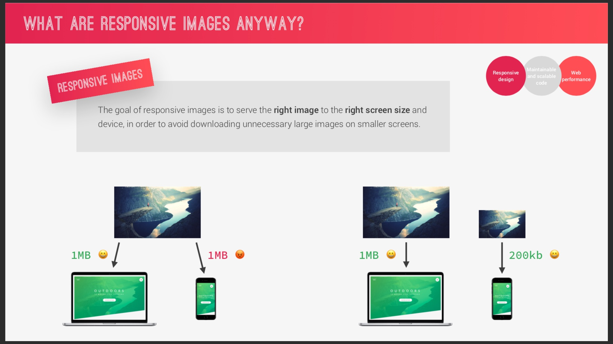
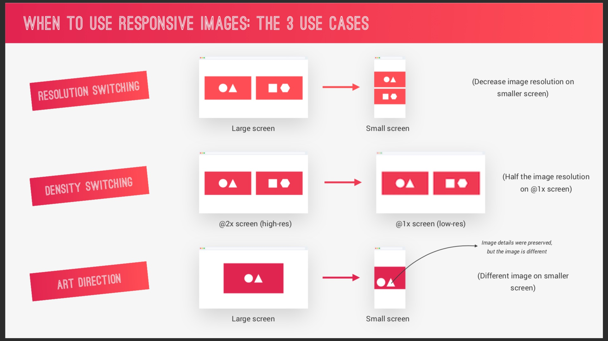

**[⬆ back to top](#table-of-contents)**

### 61. Responsive Images in HTML - Density Switching and Art Direction 

#### Density Switching

Use the srcset attribute on the `` and `<source>` elements, together with density descriptors

```html

```

Test density switching with chrome dev tool

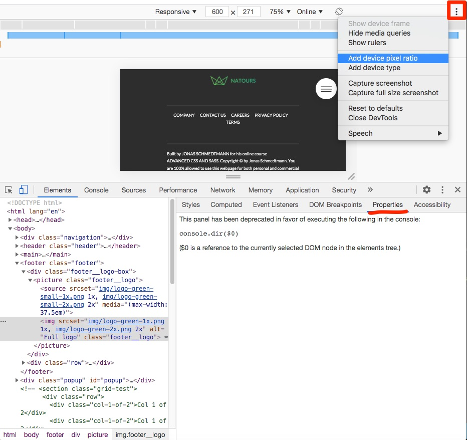

```console
console.dir($0)
$0.currentSrc
```

**[⬆ back to top](#table-of-contents)**

#### Art Direction

- Use the `<picture>` element for art direction
- Write media queries in HTML
- Add src attribute in case old browser don't understand srcset

```html
<picture class="footer__logo">
  <source srcset="img/logo-green-small-1x.png 1x, img/logo-green-small-2x.png 2x" media="(max-width: 37.5em)">
  
</picture>
```

**[⬆ back to top](#table-of-contents)**

### 62. Responsive Images in HTML - Resolution Switching

Allow the browser to decide the best image to download, using the srcset attribute, width descriptors, and the sizes attribute of the `` element.

```html
<div class="composition">
  
</div>
```

```scss
.composition {
  &__photo {
    width: 55%;

    @include respond(tab-port) {  // width < 900px ?
      width: 33.333333%;
    }

    &--p1 {
      @include respond(tab-port) {  // width < 900px ?
        transform: scale(1.2);
      }
    }
  }
}
```

- [Device pixel ratio](https://docs.fastly.com/en/image-optimization-api/dpr)
- 900px = 56.25em
- 600px = 37.5em

DPR = 1

| Device Group     | Resolution    | vw range  | size = breakpoint * vw |
| ---------------- | ------------- | --------- | ---------------------- |
| Phone            | 0 - 600px     | <= 600px  | 600px * 0.3 = 180px    |
| Tablet portrait  | 600 - 900px   | <= 900px  | 900px * 0.2 = 180px    |
| Tablet landscape | 900 - 1200px  | <= 1200px | 300px                  |
| Desktop          | 1200 - 1800px | <= 1800px | 300px                  |
| Big desktop      | 1800 - ~      | >= 1800px | 300px                  |

| Image           | width  |
| --------------- | ------ |
| nat-1.jpg       | 300px  |
| nat-1-large.jpg | 1000px |

| Device Group     | selected vw | composition | &__photo   | &--p1      | actual img width | selected by browser |
| ---------------- | ----------- | ----------- | ---------- | ---------- | ---------------- | ------------------- |
| Phone            | 600px       | 352px       | 33.333333% | scale(1.2) | 140.79           | nat-1.jpg           |
| Tablet portrait  | 900px       | 352px       | 33.333333% | scale(1.2) | 140.79           | nat-1.jpg           |
| Tablet landscape | 1200px      | 486px       | 55%        |            | 267px            | nat-1-large.jpg     |
| Desktop          | 1800px      | 648px       | 55%        |            | 356.39px         | nat-1-large.jpg     |
| Big desktop      | 1800px      | 648px       | 55%        |            | 356.39px         | nat-1-large.jpg     |

DPR = 2

| Device Group     | Resolution    | vw range  | size = breakpoint * vw |
| ---------------- | ------------- | --------- | ---------------------- |
| Phone            | 0 - 600px     | <= 600px  | 600px * 0.3 = 180px    |
| Tablet portrait  | 600 - 900px   | <= 900px  | 900px * 0.2 = 180px    |
| Tablet landscape | 900 - 1200px  | <= 1200px | 300px                  |
| Desktop          | 1200 - 1800px | <= 1800px | 300px                  |
| Big desktop      | 1800 - ~      | >= 1800px | 300px                  |

| Image           | width  |
| --------------- | ------ |
| nat-1.jpg       | 300px  |
| nat-1-large.jpg | 1000px |

| Device Group     | selected vw | composition | &__photo   | &--p1      | actual img width | due to DPR | selected by browser |
| ---------------- | ----------- | ----------- | ---------- | ---------- | ---------------- | ---------- | ------------------- |
| Phone            | 600px       | 352px       | 33.333333% | scale(1.2) | 140.79           | 281.58px   | nat-1.jpg           |
| Tablet portrait  | 900px       | 352px       | 33.333333% | scale(1.2) | 140.79           | 281.58px   | nat-1.jpg           |
| Tablet landscape | 1200px      | 486px       | 55%        |            | 267px            | 534px      | nat-1-large.jpg     |
| Desktop          | 1800px      | 648px       | 55%        |            | 356.39px         | 712.78px   | nat-1-large.jpg     |
| Big desktop      | 1800px      | 648px       | 55%        |            | 356.39px         | 712.78px   | nat-1-large.jpg     |

**[⬆ back to top](#table-of-contents)**

### 63. Responsive Images in CSS

- [dpi](http://uofgts.com/PS/dpi.html) 
- 1x resolution -> 96 dpi
- 2x resolution -> 192 dpi
- condition 1 -> min-resolution: 192dpi and min-width: 37.5em (600px)
- condition 1 -> min-width: 125em (2000px)

How to implement responsive images in CSS?
How to use resolution media queries to target high-resolution screens with 2x?
How to combine multiple conditions in media queries?

```scss
.header {
  background-image: linear-gradient(to right bottom, rgba($color-primary-light, 0.8), rgba($color-primary-dark, 0.8)), url(../img/hero-small.jpg);

  @media  (min-resolution: 192dpi) and (min-width: 37.5em), 
          (min-width: 125em) {
    background-image: linear-gradient(to right bottom, rgba($color-secondary-light, 0.8), rgba($color-secondary-dark, 0.8)), url(../img/hero.jpg);
  }
}
```

**[⬆ back to top](#table-of-contents)**

### 64. Testing for Browser Support with @supports

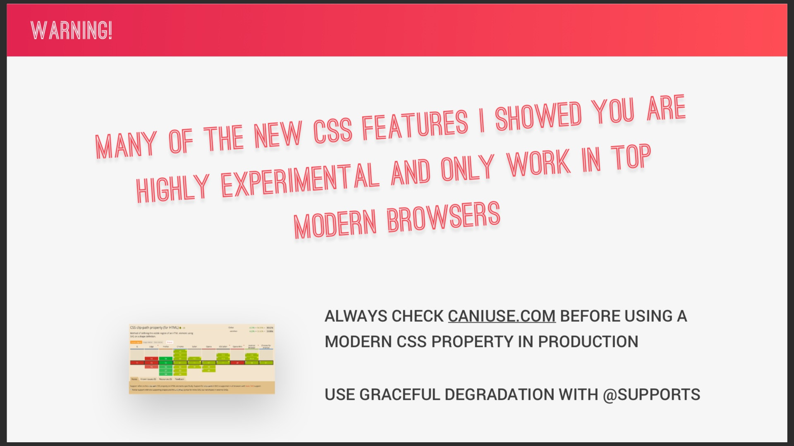

**[⬆ back to top](#table-of-contents)**

#### How to use backdrop-filter? Only work in safari

The [backdrop-filter](https://developer.mozilla.org/en-US/docs/Web/CSS/backdrop-filter) CSS property lets you apply graphical effects such as blurring or color shifting to the area behind an element. Because it applies to everything behind the element, to see the effect you must make the element or its background at least partially transparent.

- use @supports feature queries to check for supported -webkit-backdrop-filter and backdrop-filter properties
- Implement graceful degradation on selected

```scss
.popup {
  background-color: rgba($color-black, .8);

  @supports(-webkit-backdrop-filter: blur(10px)) or (backdrop-filter: blur(10px)) {
    // only work in safari
    -webkit-backdrop-filter: blur(10px);
    backdrop-filter: blur(10px);
    background-color: rgba($color-black, .3);
  }
}
```

**[⬆ back to top](#table-of-contents)**

#### Safari 9 - 13 still require a prefix for the related backface-visibility property

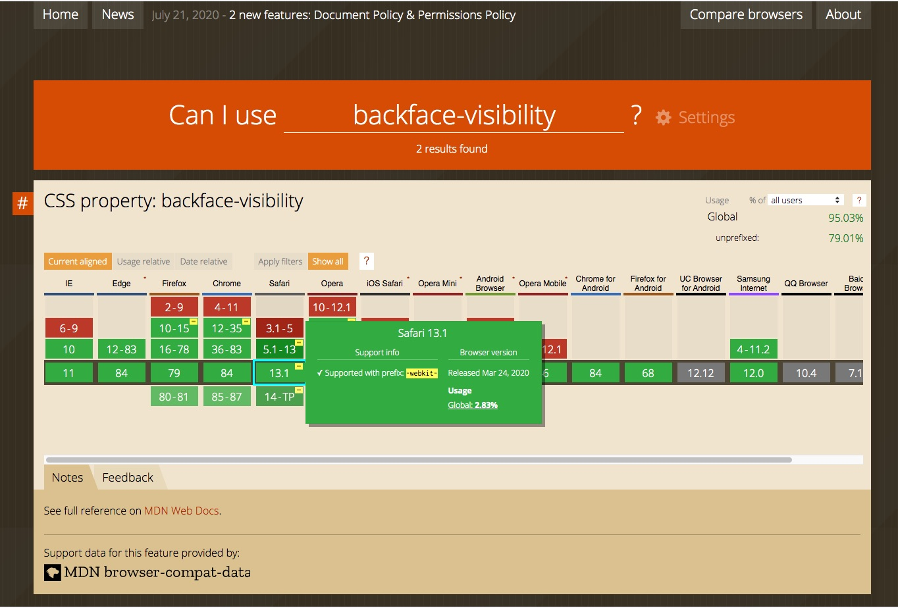

```scss
.card {
  &__side {
    -webkit-backface-visibility: hidden;
    backface-visibility: hidden;
  }
}
```

**[⬆ back to top](#table-of-contents)**

#### Media Queries - Safari don't support standard min/max-resolution

[Media Queries: resolution feature](https://caniuse.com/#feat=css-media-resolution)

```scss
  @media  (min-resolution: 192dpi) and (min-width: 37.5em), 
          (-webkit-min-device-pixel-ratio: 2) and (min-width: 37.5em),
          (min-width: 125em) {
    background-image: linear-gradient(to right bottom, rgba($color-secondary-light, 0.8), rgba($color-secondary-dark, 0.8)), url(../img/hero.jpg);
  }
```

**[⬆ back to top](#table-of-contents)**

### 65. Setting up a Simple Build Process with NPM Scripts

#### Build CSS workflow

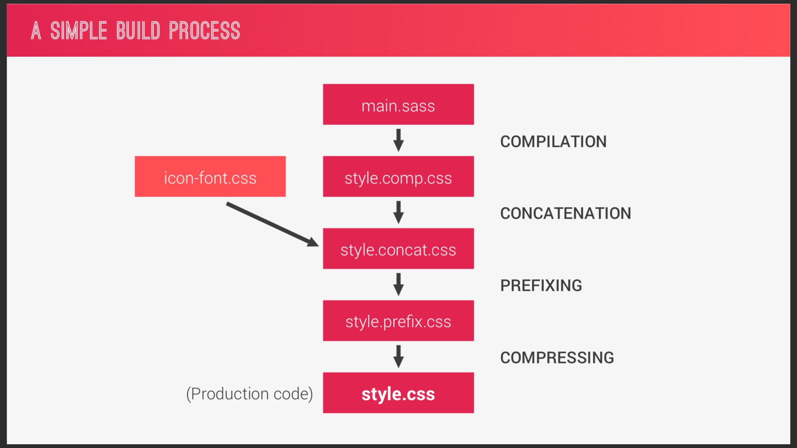

- [concat](https://github.com/gko/concat)
- [postcss-cli](https://github.com/postcss/postcss-cli)
- [autoprefixer](https://github.com/postcss/autoprefixer)
- [npm-run-all](https://github.com/mysticatea/npm-run-all)

```json
"scripts": {
  "compile:sass": "node-sass sass/main.scss css/style.comp.css",
  "concat:css": "concat -o css/style.concat.css css/icon-font.css css/style.comp.css",
  "prefix:css": "postcss --use autoprefixer -b 'last 10 versions' css/style.concat.css -o css/style.prefix.css",
  "compress:css": "node-sass css/style.prefix.css css/style.css --output-style compressed",
  "build:css": "npm-run-all compile:sass concat:css prefix:css compress:css"
}
```

```html
<html lang="en">
  <head>
    <link rel="stylesheet" href="css/style.css">
  </head>
</html>
```

**[⬆ back to top](#table-of-contents)**

#### Development workflow

```json
"scripts": {
  "watch:sass": "node-sass sass/main.scss css/style.css -w",
  "devserver": "live-server",
  "start": "npm-run-all --parallel devserver watch:sass",
}
```

**[⬆ back to top](#table-of-contents)**

### 66. Wrapping up the Natours Project: Final Considerations

#### Change the style of selected text

```scss
::selection {
  background-color: $color-primary;
  color: $color-white;
}
```

**[⬆ back to top](#table-of-contents)**

#### Change media query to cater to touch and non-touch device

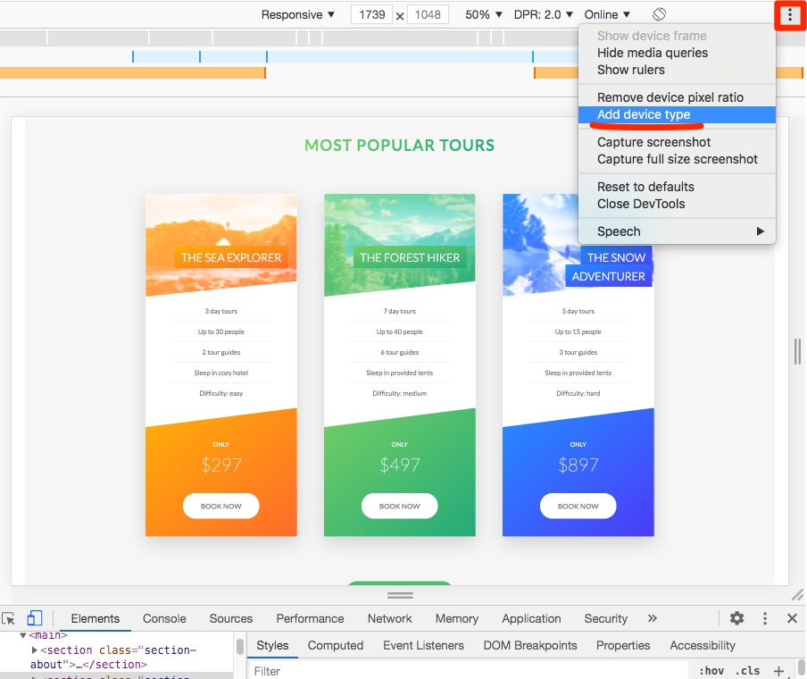

```scss
.card {

  @media  only screen and (max-width: 56.25em), // width < 900px ?
          only screen and (hover: none) {       // touch device

  }
}
```

**[⬆ back to top](#table-of-contents)**

## **Section 7: Trillo Project — Master Flexbox!**

### 68. Why Flexbox: An Overview of the Philosophy Behind Flexbox

Flexbox

- Flexbox is a new module in CSS3 that makes it easy to align elements to one another, in different directions and orders;
- The main idea behind flexbox is to give the container the ability to expand and to shrink elements to best use all the available space;
- Flexbox replaces float layouts, using less, and more readable and logical code; 
- Flexbox completely changes the way that we build one-dimensional layouts;
- A true revolution in CSS!

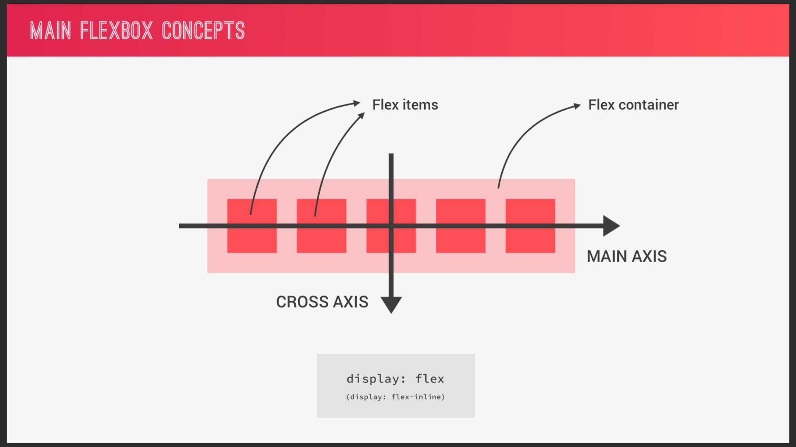
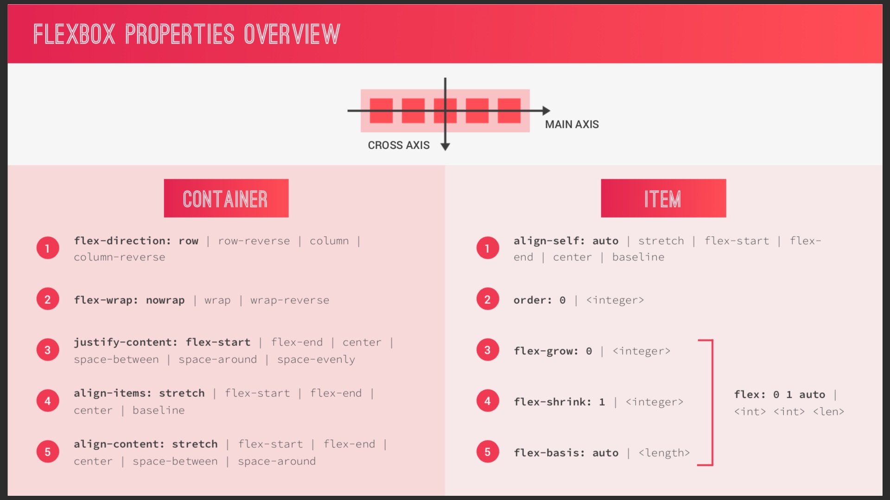

**[⬆ back to top](#table-of-contents)**

### 69. A Basic Intro to Flexbox: The Flex Container

```html
<div class="container">
  <div class="item">1</div>
  <div class="item i2">2</div>
  <div class="item">3</div>
  <div class="item">4</div>
  <div class="item">5</div>
</div>
```

```css
.container {
  background-color:#ccc;
  padding: 10px;
  height: 1000px;
  
  /*   use flexbox */
  display: flex;
  
  /*   set main axis direction */
  flex-direction: row;
  
  /*   control how items are positioned in main axis */
  justify-content: center;
  
  /*   control how items are positioned in cross axis */
  align-items: center;
}
```

**[⬆ back to top](#table-of-contents)**

### 70. A Basic Intro to Flexbox: Flex Items

```html
<div class="container">
  <div class="item">1</div>
  <div class="item i2">2</div>
  <div class="item i3">3</div>
  <div class="item i4">4</div>
  <div class="item">5</div>
</div>
```

```css
.item{
  background-color:#f1425d;
  padding:30px;
  margin:30px;
  color:#fff;
  font-size:40px;
  
  /*   all items grow as much as they can */
  /*   flex-grow: 1; */
    
  /*   shorthand for flex-grow flex-shrink flex-basis*/
  /*   flex: 1; */
}

.i2 {
  height: 200px;
  
  /*   grow 3x more than other items */
  /*   flex-grow: 3; */
    
  /*   grow to 20% of the flex container */
  /*   flex-basis: 20%; */
    
  /*   grow to 300px */
  /*   flex-basis: 300px; */
    
  /*   not allow to shrink */
  /*   flex-shrink: 0; */
  
  flex: 0 1 300px;
}

.i3 {
  order: 1;
  flex: 1;
}

.i4 {
  /*   over-write align-items in container */
  /* align-self: flex-end; */
  
  /*   all flex box items order are 0 by default */
  order: -1;
}
```

**[⬆ back to top](#table-of-contents)**

### 71. A Basic Intro to Flexbox: Adding More Flex Items

```html
<div class="container">
  <div class="item">1</div>
  <div class="item i2">2</div>
  <div class="item i3">3</div>
  <div class="item i4">4</div>
  <div class="item">5</div>
  <div class="item">6</div>
  <div class="item">7</div>
  <div class="item">8</div>
  <div class="item">9</div>
  <div class="item">10</div>
</div>
```

```css
.container{
  /*   wrap all items to new line if container width is not enough*/
  flex-wrap: wrap;
  
  /*   align rows in cross axis */
  align-content: center;
}
```

**[⬆ back to top](#table-of-contents)**

### 72. Project Overview

[trillo](https://trillo.netlify.app/)

**[⬆ back to top](#table-of-contents)**

### 73. Defining Project Settings and Custom Properties

```scss
:root {
  --color-white: #fff;

  --color-primary: #eb2f64;
  --color-primary-light: #FF3366;
  --color-primary-dark: #BA265D;

  --color-grey-light-1: #faf9f9;
  --color-grey-light-2: #f4f2f2;
  --color-grey-light-3: #f0eeee;
  --color-grey-light-4: #ccc;

  --color-grey-dark-1: #333;
  --color-grey-dark-2: #777;
  --color-grey-dark-3: #999;

  --shadow-dark: 0 2rem 6rem rbga(0, 0, 0, .3);
}

* {
  margin: 0;
  padding: 0;
}

*,
*::before,
*::after {
  box-sizing: inherit;
}

html {
  box-sizing: border-box;
  font-size: 62.5%; // 1rem = 10px, 10px/16px = 62.5%
}

body {
  font-family: 'Open Sans', sans-serif;
  font-weight: 400;
  line-height: 1.6;
  background-image: linear-gradient(to right bottom, var(--color-primary-light), var(--color-primary-dark));
  background-size: cover;
  background-repeat: no-repeat;
  min-height: 100vh;
}
```

**[⬆ back to top](#table-of-contents)**

#### How and why to use CSS custom properties?

```scss
// similar to html selector for css
:root {
  --color-primary-light: #FF3366;
  --color-primary-dark: #BA265D;
}

body {
  background-image: linear-gradient(to right bottom, var(--color-primary-light), var(--color-primary-dark));
}
```

**[⬆ back to top](#table-of-contents)**

### 74. Building the Overall Layout

#### How to think about the overall layout of an app?

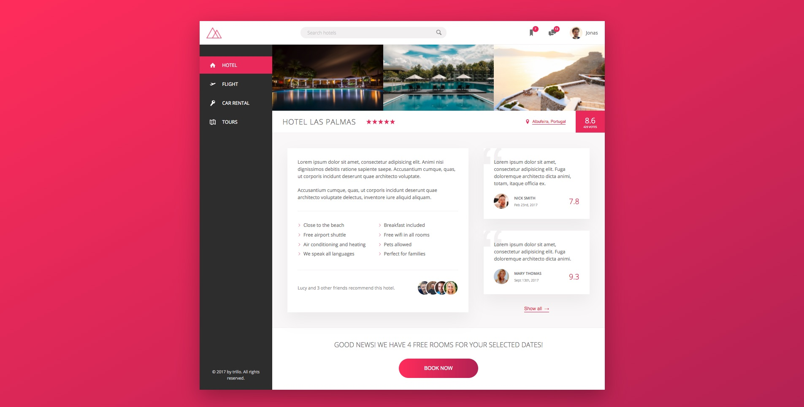

```html
<body>
  <div class="container">
    <header class="header">
      Header part
    </header>
    <div class="content">
      <div class="sidebar">
        Navigation
      </div>
      <main class="hotel-view">
        Hotel view
      </main>
    </div>
  </div>
</body>
```

**[⬆ back to top](#table-of-contents)**

#### Use flexbox in a real-world project for the first time

```scss
.container {
  max-width: 120rem;
  margin: 8rem auto;
  background-color: var(--color-grey-light-2);
  box-shadow: var(--shadow-dark);
  min-height: 50rem;
}

.header {
  height: 7rem;
  background-color: var(--color-white);
  border-bottom: 1px solid var(--color-grey-light-2);
}

.content {
  display: flex;
}

.sidebar {
  background-color: var(--color-grey-dark-1);
  flex: 0 0 18%;
}

.hotel-view {
  background-color: var(--color-white);  
  flex: 1;
}
```

**[⬆ back to top](#table-of-contents)**

### 75. Building the Header - Part 1

Components

- Logo
- Search bar
- User navigations

```html
<header class="header">
  

  <form action="" class="search">
    <input type="text" class="search__input" placeholder="Search hotels">
    <button class="search__button">
      <svg class="search__icon">
        <use xlink:href="img/sprite.svg#icon-magnifying-glass"></use>
      </svg>
    </button>
  </form>

  <nav class="user-nav">
    <div class="user-nav__icon-box">
      <svg class="user-nav__icon">
        <use xlink:href="img/sprite.svg#icon-bookmark"></use>
      </svg>
      <span class="user-nav__notification">7</span>
    </div>
    <div class="user-nav__icon-box">
      <svg class="user-nav__icon">
        <use xlink:href="img/sprite.svg#icon-chat"></use>
      </svg>
      <span class="user-nav__notification">13</span>
    </div>
    <div class="user-nav__user">
      
      <span class="user-nav__user-name">Jonas</span>
    </div>
  </nav>
</header>
```

```scss
// LOGO
.logo {
  height: 3.25rem;
}

// SEARCH
.search {
  &__input {

  }

  &__button {

  }

  &__icon {
    height: 2rem;
    width: 2rem;
  }
}

// USER NAVIGATION
.user-nav {
  &__icon-box {

  }

  &__icon {
    height: 2.25rem;
    width: 2.25rem;
  }

  &__notification {

  }

  &__user {
    
  }

  &__user-photo {
    height: 3.75rem;
    border-radius: 50%;
  }

  &__user-name {
    
  }
}
```

**[⬆ back to top](#table-of-contents)**

#### Why to use SVG icons vs. font icons?

- Icon fonts are mapped to individual Unicode characters, enabling you to store multiple icons within a single file. Fonts are vectors, so icons scale to any size.
- Scalable Vector Graphics (SVG) is an XML-based vector graphics format that can scale to any size without losing clarity.

**[⬆ back to top](#table-of-contents)**

#### How to find, generate and use SVG sprites in HTML?

- [icomoon](icomoon.io)
- use a sprite.svg file to contain all svg to reduce backend calls to 1

```html
<header class="header">
  <form action="" class="search">
    <input type="text" class="search__input" placeholder="Search hotels">
    <button class="search__button">
      <svg class="search__icon">
        <use xlink:href="img/sprite.svg#icon-magnifying-glass"></use>
      </svg>
    </button>
  </form>

  <nav class="user-nav">
    <div class="user-nav__icon-box">
      <svg class="user-nav__icon">
        <use xlink:href="img/sprite.svg#icon-bookmark"></use>
      </svg>
      <span class="user-nav__notification">7</span>
    </div>
  </nav>
</header>
```

**[⬆ back to top](#table-of-contents)**

### 76. Building the Header - Part 2

Search bar Component

```scss
header {
  font-size: 1.4rem;
  height: 7rem;
  background-color: var(--color-white);
  border-bottom: var(--color-grey-light-2);

  display: flex;
  justify-content: space-between;
  align-items: center;
}

// LOGO
.logo {
  height: 3.25rem;
  margin-left: 3rem;
}

// SEARCH
.search {
  flex: 0 0 40%;
  display: flex;
  align-items: center;
  justify-content: center;

  &__input {
    font-family: inherit;
    font-size: inherit;
    color: inherit;
    background-color: var(--color-grey-light-2);
    border: none;
    padding: .7rem 2rem;
    border-radius: 100px;
    width: 90%;
    transition: all .2s;
    margin-right: -3.5rem;

    &:focus {
      outline: none;
      width: 100%;
      background-color: var(--color-grey-light-3);
    }

    &::-webkit-input-placeholder {
      font-weight: 100;
      color: var(--color-grey-light-4);
    }
  }

  &__input:focus + &__button {
    background-color: var(--color-grey-light-3);
  }

  &__button {
    border: none;
    background-color: var(--color-grey-light-2);

    &:focus {
      outline: none;
    }

    &:active {
      transform: translateY(2px);
    }
  }

  &__icon {
    height: 2rem;
    width: 2rem;
    fill: var(--color-grey-dark-3)
  }
}
```

**[⬆ back to top](#table-of-contents)**

#### How to use more advanced flexbox alignment techniques, including justify-content, align-items, align-self and flex?

```scss
header {
  display: flex;
  justify-content: space-between;
  align-items: center;
}

.search {
  flex: 0 0 40%;
  display: flex;
  align-items: center;
  justify-content: center;
}
```

**[⬆ back to top](#table-of-contents)**

#### How to change the color of an SVG icon in CSS?

```scss
.search {
  &__icon {
    height: 2rem;
    width: 2rem;
    fill: var(--color-grey-dark-3)
  }
}
```

**[⬆ back to top](#table-of-contents)**

### 77. Building the Header - Part 3

User navigations Component

```scss
.user-nav {
  align-self: stretch;

  display: flex;

  & > * {
    padding: 0 2rem;
    cursor: pointer;
    height: 100%;
    display: flex;
    align-items: center;
  }

  & > *:hover {
    background-color: var(--color-grey-light-2);
  }

  &__icon-box {
    position: relative;
  }

  &__icon {
    height: 2.25rem;
    width: 2.25rem;
    fill: var(--color-grey-dark-2);
  }

  &__notification {
    font-size: .8rem;
    height: 1.75rem;
    width: 1.75rem;
    border-radius: 50%;
    background-color: var(--color-primary);
    color: var(--color-white);
    position: absolute;
    top: 1.5rem;
    right: 1.1rem;

    display: flex;
    justify-content: center;
    align-items: center;
  }

  &__user-photo {
    height: 3.75rem;
    border-radius: 50%;
    margin-right: 1rem;
  }
}
```

**[⬆ back to top](#table-of-contents)**

### 78. Building the Navigation - Part 1

```scss
.sidebar {
  background-color: var(--color-grey-dark-1);
  
  flex: 0 0 18%;
  display: flex;
  flex-direction: column;
  justify-content: space-between;
}

// SIDE NAVIGATION
.side-nav {
  
  &__item {

  }

  &__link {

  }

  &__icon {
    width: 1.75rem;
    height: 1.75rem;
  }
}

// LEGAL TEXT
.legal {
  font-size: 1.2rem;
  color: var(--color-grey-light-4);
  text-align: center;
  padding: 2.5rem;
}
```

**[⬆ back to top](#table-of-contents)**

#### How to use some more advanced flexbox alignment techniques, including flex-direction, justify-content and align-items?

```scss
.sidebar {
  display: flex;
  flex-direction: column;
  justify-content: space-between;
}
```

**[⬆ back to top](#table-of-contents)**

### 79. Building the Navigation - Part 2

```scss
.side-nav {
  font-size: 1.4rem;
  list-style: none;
  margin-top: 3.5rem;

  &__item {
    position: relative;

    &:not(:last-child) {
      margin-bottom: .5rem;
    }
  }

  &__item::before {
    content: "";
    position: absolute;
    top: 0;
    left: 0;
    height: 100%;
    width: 3px;
    background-color: var(--color-primary);
    transform: scaleY(0);
    transition: transform .2s, 
                width .4s cubic-bezier(1,0,0,1) .2s, 
                background-color .1s;
  }
  
  &__item:hover::before,
  &__item--active::before {
    transform: scaleY(1);
    width: 100%;
  }
  
  &__item:active::before {
    background-color: var(--color-primary-light);
  }

  &__link:link,
  &__link:visited {
    color: var(--color-grey-light-1);
    text-decoration: none;
    text-transform: uppercase;
    display: block;
    padding: 1.5rem 3rem;
    position: relative;
    z-index: 10;

    display: flex;
    align-items: center;
  }

  &__icon {
    width: 1.75rem;
    height: 1.75rem;
    margin-right: 2rem;
    fill: currentColor;
  }
}
```

**[⬆ back to top](#table-of-contents)**

#### How to use scaleY and multiple transition properties with different settings, to create a creative hover effect?

```scss
.side-nav {
  &__item::before {
    content: "";
    position: absolute;
    top: 0;
    left: 0;
    height: 100%;
    width: 3px;
    background-color: var(--color-primary);
    transform: scaleY(0);
    transition: transform .2s, 
                width .4s cubic-bezier(1,0,0,1) .2s, 
                background-color .1s;
  }
  
  &__item:hover::before,
  &__item--active::before {
    transform: scaleY(1);
    width: 100%;
  }
  
  &__item:active::before {
    background-color: var(--color-primary-light);
  }
}
```

**[⬆ back to top](#table-of-contents)**

#### How and why to use the currentColor CSS variable?

currentColor property take the color value of itself or its parent

```html
<a href="" class="side-nav__link">
  <svg class="side-nav__icon">
    <use xlink:href="img/sprite.svg#icon-key"></use>
  </svg>
  <span>Car rental</span>
</a>
```

```scss
.side-nav {
  &__link:link,
  &__link:visited {
    color: var(--color-grey-light-1);
  }

  &__icon {
    fill: currentColor;
  }
}
```

**[⬆ back to top](#table-of-contents)**

### 80. Building the Hotel Overview - Part 1

Hotel Overview Layout

```html
<div class="gallery">
  <figure class="gallery__item">
    
  </figure>
  <figure class="gallery__item">
    
  </figure>
  <figure class="gallery__item">
    
  </figure>
</div>

<div class="overview">
  <h1 class="overview__heading">Hotel Las Palmas</h1>
  <div class="overview__stars">
    <svg class="overview__icon-star">
      <use xlink:href="img/sprite.svg#icon-star"></use>
    </svg>
    <svg class="overview__icon-star">
      <use xlink:href="img/sprite.svg#icon-star"></use>
    </svg>
    <svg class="overview__icon-star">
      <use xlink:href="img/sprite.svg#icon-star"></use>
    </svg>
    <svg class="overview__icon-star">
      <use xlink:href="img/sprite.svg#icon-star"></use>
    </svg>
    <svg class="overview__icon-star">
      <use xlink:href="img/sprite.svg#icon-star"></use>
    </svg>
  </div>
  <div class="overview__location">
    <svg class="overview__icon-location">
      <use xlink:href="img/sprite.svg#icon-location-pin"></use>
    </svg>
    <button class="btn-inline">Albufeira, Portugal</button>
  </div>
  <div class="overview__rating">
    <div class="overview__rating-average">8.6</div>
    <div class="overview__rating-count">429 votes</div>
  </div>                    
</div>
```

```scss
.gallery {
  display: flex;

  &__photo {
    width: 100%;
    display: block;
  }
}

.overview {
  display: flex;

  &__stars {
    // flex: 1;
    // current block expand to fill entire space
    // add full margin to the right of the current content
    margin-right: auto;
  }

  &__icon-star,
  &__icon-location {
    width: 1.75em;
    height: 1.75em;
    fill: var(--color-primary);
  }
}
```

**[⬆ back to top](#table-of-contents)**

#### How to use margin: auto with flexbox, and why it’s so powerful?

<div class="overview">
  <h1 class="overview__heading">Hotel Las Palmas</h1>
  <div class="overview__stars"></div>
  <div class="overview__location"></div>
  <div class="overview__rating"></div>                    
</div>
```

```scss
.overview {
  display: flex;

  &__stars {
    // flex: 1;
    // current block expand to fill entire space
    // add full margin to the right of the current content
    margin-right: auto;
  }
}
```

**[⬆ back to top](#table-of-contents)**

### 81. Building the Hotel Overview - Part 2

```scss
//HOTEL OVERVIEW
.overview {
  display: flex;
  align-items: center;
  border-bottom: 1px solid var(--color-grey-light-2);

  &__heading {
    font-size: 2.25rem;
    font-weight: 300;
    text-transform: uppercase;
    letter-spacing: 1px;
    padding: 1.5rem 3rem;
  }

  &__stars {
    // flex: 1;
    // current block expand to fill entire space
    // add full margin to the right of the current content
    margin-right: auto;
    display: flex;
  }

  &__icon-star,
  &__icon-location {
    width: 1.75em;
    height: 1.75em;
    fill: var(--color-primary);
  }

  &__location {
    font-size: 1.2rem;
    display: flex;
    align-items: center;
  }

  &__icon-location {
    margin-right: .5rem;
  }

  &__rating {
    background-color: var(--color-primary);
    color: var(--color-white);
    margin-left: 3rem;
    padding: 0 2.25rem;
    align-self: stretch;

    display: flex;
    flex-direction: column;
    align-items: center;
    justify-content: center;
  }

  &__rating-average {
    font-size: 2.25rem;
    font-weight: 300;
    margin-bottom: -3px;
  }

  &__rating-count {
    font-size: .8rem;
    text-transform: uppercase;
  }
}

// BUTTON INLINE
.btn-inline {
  border: none;
  color: var(--color-primary);
  font-size: inherit;
  border-bottom: 1px solid currentColor;
  padding-bottom: 2px;
  display: inline-block;
  background-color: transparent;
  cursor: pointer;
  transition: all .2s;

  &:hover {
    color: var(--color-grey-dark-1);
  }

  &:focus {
    outline: none;
    animation: pulsate 1s infinite;
  }
}

@keyframes pulsate {
  0% {
    transform: scale(1);
    box-shadow: none;
  }

  50% {
    transform: scale(1.05);
    box-shadow: 0 1rem 4rem rgba(0,0,0,.25);
  }

  100% {
    transform: scale(1);
    box-shadow: none;
  }
}
```

**[⬆ back to top](#table-of-contents)**

#### Continue to use flexbox properties for easy positioning and alignment.

```html
<div class="gallery">
  <figure class="gallery__item"></figure>
  <figure class="gallery__item"></figure>
  <figure class="gallery__item"></figure>
</div>
<div class="overview">
  <h1 class="overview__heading">Hotel Las Palmas</h1>
  <div class="overview__stars">
    <svg class="overview__icon-star"></svg>
    <svg class="overview__icon-star"></svg>
    <svg class="overview__icon-star"></svg>
    <svg class="overview__icon-star"></svg>
    <svg class="overview__icon-star"></svg>
  </div>
  <div class="overview__location">
    <svg class="overview__icon-location"></svg>
    <button class="btn-inline">Albufeira, Portugal</button>
  </div>
  <div class="overview__rating">
    <div class="overview__rating-average">8.6</div>
    <div class="overview__rating-count">429 votes</div>
  </div>                    
</div>
```

```scss
.gallery {
  display: flex;
}

.overview {
  display: flex;
  align-items: center;

  &__stars {
    margin-right: auto;
    display: flex;
  }

  &__location {
    display: flex;
    align-items: center;
  }

  &__rating {
    display: flex;
    flex-direction: column;
    align-items: center;
    justify-content: center;
  }
}
```

**[⬆ back to top](#table-of-contents)**

#### How to create an infinite animation?

```scss
.btn-inline {
  &:focus {
    animation: pulsate 1s infinite;
  }
}

@keyframes pulsate {
  0% {
    transform: scale(1);
    box-shadow: none;
  }

  50% {
    transform: scale(1.05);
    box-shadow: 0 1rem 4rem rgba(0,0,0,.25);
  }

  100% {
    transform: scale(1);
    box-shadow: none;
  }
}
```

**[⬆ back to top](#table-of-contents)**

### 82. Building the Description Section - Part 1

```html
<div class="detail">
  <div class="description">
    <p class="paragraph">
      Lorem ipsum dolor sit amet, consectetur adipisicing elit. Animi nisi dignissimos debitis ratione sapiente saepe. Accusantium cumque, quas, ut corporis incidunt deserunt quae architecto voluptate.
    </p>
    <p class="paragraph">
      Accusantium cumque, quas, ut corporis incidunt deserunt quae architecto voluptate delectus, inventore iure aliquid aliquam.
    </p>
    <ul class="list">
      <li class="list__item">Close to the bench</li>
      <li class="list__item">Breakfast included</li>
      <li class="list__item">Free airport shuttle</li>
      <li class="list__item">Free wifi in all rooms</li>
      <li class="list__item">Air conditioning and heating</li>
      <li class="list__item">Pets allowed</li>
      <li class="list__item">We speak all languages</li>
      <li class="list__item">Perfect for families</li>
    </ul>
    <div class="recommend">
      <p class="recommend__count">
        Lucy and 3 other friends recommend this hotel.
      </p>
      <div class="recommend__friends">
        
        
        
        
      </div>
    </div>
  </div>
  <div class="user-reviews">
    User reviews
  </div>
</div>
```

```scss
.detail {
  display: flex;
  padding: 4.5rem;
  background-color: var(--color-grey-light-1);
  border-bottom: var(--line);
}

.description {
  font-size: 1.4rem;
  background-color: var(--color-white);
  box-shadow: var(--shadow-light);
  padding: 3rem;

  flex: 0 0 60%;
  margin-right: 4.5rem;
}

.user-reviews {
  background-color: yellowgreen;
  flex: 1;
}
```

**[⬆ back to top](#table-of-contents)**

### 83. Building the Description Section - Part 2

```scss
// PARAGRAPH
.paragraph:not(:last-of-type) {
  margin-bottom: 2rem;
}

// LIST
.list {
  list-style: none;
  margin: 3rem 0;
  padding: 3rem 0;
  border-top: var(--line);
  border-bottom: var(--line);

  display: flex;
  flex-wrap: wrap;

  &__item {
    flex: 0 0 50%;
    margin-bottom: .7rem;
  }

  &__item::before {
    content: "";
    display: inline-block;
    height: 1rem;
    width: 1rem;
    margin-right: .7rem;

    // older browser
    // background-image: url(../img/chevron-thin-right.svg);
    // background-size: cover;

    // newer browser
    background-color: var(--color-primary);
    -webkit-mask-image: url(../img/chevron-thin-right.svg);
    -webkit-mask-size: cover;
    mask-image: url(../img/chevron-thin-right.svg);
    mask-size: cover;
  }
}

// RECOMMEND
.recommend {
  font-size: 1.3rem;
  color: var(--color-grey-dark-3);
  display: flex;
  align-items: center;

  &__count {
    margin-right: auto;
  }

  &__friends {
    display: flex;
  }

  &__photo {
    box-sizing: content-box;
    height: 4rem;
    width: 4rem;
    border-radius: 50%;
    border: 3px solid var(--color-white);

    &:not(:last-child) {
      margin-right: -1.15rem;
    }
  }
}
```

#### Continue to use flexbox, including flex-wrap to build a multi-column list

```html
<ul class="list">
  <li class="list__item">Close to the bench</li>
  <li class="list__item">Breakfast included</li>
  <li class="list__item">Free airport shuttle</li>
  <li class="list__item">Free wifi in all rooms</li>
  <li class="list__item">Air conditioning and heating</li>
  <li class="list__item">Pets allowed</li>
  <li class="list__item">We speak all languages</li>
  <li class="list__item">Perfect for families</li>
</ul>

<div class="recommend">
  <p class="recommend__count">
    Lucy and 3 other friends recommend this hotel.
  </p>
  <div class="recommend__friends">
    
    
    
    
  </div>
</div>
```

```scss
.list {
  display: flex;
  flex-wrap: wrap;

  &__item {
    flex: 0 0 50%;
  }
}

.recommend {
  display: flex;
  align-items: center;
}
```

**[⬆ back to top](#table-of-contents)**

#### How and why to use CSS masks with mask-image and mask-size?

```scss
.list {

  &__item::before {
    background-color: var(--color-primary);
    -webkit-mask-image: url(../img/chevron-thin-right.svg);
    -webkit-mask-size: cover;
    mask-image: url(../img/chevron-thin-right.svg);
    mask-size: cover;
  }
}
```

**[⬆ back to top](#table-of-contents)**

### 84. Building the User Reviews Section

Continue using and practicing flexbox

```html
<div class="user-reviews">
  <figure class="review">
    <blockquote class="review__text">
      Lorem ipsum dolor sit amet, consectetur adipisicing elit. Fuga doloremque architecto dicta animi, totam, itaque officia ex.
    </blockquote>
    <figcaption class="review__user">
      
      <div class="review__user-box">
        <p class="review__user-name">Nick Smith</p>
        <p class="review__user-date">Feb 23rd, 2017</p>
      </div>
      <div class="review__rating">7.8</div>
    </figcaption>
  </figure>

  <figure class="review">
    <blockquote class="review__text">
      Lorem ipsum dolor sit amet, consectetur adipisicing elit. Fuga doloremque architecto dicta animi.
    </blockquote>
    <figcaption class="review__user">
      
      <div class="review__user-box">
        <p class="review__user-name">Mary Thomas</p>
        <p class="review__user-date">Sept 13th, 2017</p>
      </div>
      <div class="review__rating">9.3</div>
    </figcaption>
  </figure>

  <button class="btn-inline">Show all<span>&rarr;</span></button>
</div>
```

```scss
.detail {
  font-size: 1.4rem;
}

.user-reviews {
  flex: 1;
  display: flex;
  flex-direction: column;
  align-items: center;
}

.review {
  background-color: var(--color-white);
  box-shadow: var(--shadow-light);
  padding: 3rem;
  margin-bottom: 3.5rem;
  position: relative;
  overflow: hidden;

  &__text {
    margin-bottom: 2rem;
    z-index: 20;
    position: relative;
  }

  &__user {
    display: flex;
    align-items: center;
  }

  &__photo {
    height: 4.5rem;
    width: 4.5rem;
    border-radius: 50%;
    margin-right: 1.5rem;
  }

  &__user-box {
    margin-right: auto;
  }

  &__user-name {
    font-size: 1.1rem;
    font-weight: 600;
    text-transform: uppercase;
    margin-bottom: .4rem;
  }

  &__user-date {
    font-size: 1rem;
    color: var(--color-grey-dark-3);
  }

  &__rating {
    color: var(--color-primary);
    font-size: 2.2rem;
    font-weight: 300;
  }

  &::before {
    content: "\201C";
    position: absolute;
    top: -2.75rem;
    left: -1rem;
    line-height: 1;
    font-size: 20rem;
    color: var(--color-grey-light-2);
    font-family: sans-serif;
    z-index: 1;
  }
}

.btn-inline {
  transition: all .2s;

  & span {
    margin-left: 3px;
    transition: margin-left .2s;
  }

  &:hover {
    color: var(--color-grey-dark-1);

    span {
      margin-left: 8px;
    }
  }
```

**[⬆ back to top](#table-of-contents)**

### 85. Building the CTA Section

Yet another creative and modern hover effect

```html
<div class="cta">
  <h2 class="cta__book-now">
    Good news! We have 4 free rooms for your selected dates!
  </h2>
  <button class="btn">
    <span class="btn__visible">Book now</span>
    <span class="btn__invisible">Only 4 rooms left</span>
  </button>
</div>
```

```scss
.cta {
  padding: 3.5rem 0;
  text-align: center;

  &__book-now {
    font-size: 2rem;
    font-weight: 300;
    text-transform: uppercase;
    margin-bottom: 2.5rem;
  }
}

.btn {
  font-size: 1.5rem;
  font-weight: 300;
  text-transform: uppercase;
  border-radius: 100px;
  border: none;
  background-image: linear-gradient(to right, var(--color-primary-light), var(--color-primary-dark));
  color: var(--color-white);
  position: relative;
  overflow: hidden;
  cursor: pointer;

  & > * {
    display: inline-block;
    height: 100%;
    width: 100%;
    transition: all .2s;
  }

  &__visible {
    padding: 2rem 7.5rem;
  }

  &__invisible {
    position: absolute;
    padding: 2rem 0;
    left: 0;
    top: -100%;
  }

  &:hover {
    background-image: linear-gradient(to left, var(--color-primary-light), var(--color-primary-dark));
  }

  &:hover &__visible {
    transform: translateY(100%);
  }

  &:hover &__invisible {
    top: 0;
  }

  &:focus {
    outline: none;
    animation: pulsate 1s infinite;
  }
}
```

**[⬆ back to top](#table-of-contents)**

### 86. Writing Media Queries - Part 1
### 87. Writing Media Queries - Part 2

- CSS variables are not working for media queries
- We use SCSS variables for media queries

```scss
$bp-largest: 75em;     // 1200px
$bp-large: 68.75em;    // 1100px
$bp-medium: 56.25em;   // 900px
$bp-small: 37.5em;     // 600px
$bp-smallest: 31.25em; // 500px

html {
  font-size: 62.5%; // 1rem = 10px, 10px/16px = 62.5%

  @media only screen and (max-width: $bp-large) {
    font-size: 50%;
  }
}

.container {
  max-width: 120rem;
  margin: 8rem auto;

  @media only screen and (max-width: $bp-largest) {
    margin: 0;
    max-width: 100%;
    width: 100%;
  }
}

.header {
  height: 7rem;
  display: flex;
  justify-content: space-between;
  align-items: center;

  @media only screen and (max-width: $bp-smallest) {
    flex-wrap: wrap;
    align-content: space-around;
    height: 11rem;
  }
}

.content {
  display: flex;

  @media only screen and (max-width: $bp-medium) {
    flex-direction: column;
  }
}

.detail {
  display: flex;
  padding: 4.5rem;

  @media only screen and (max-width: $bp-medium) {
    padding: 3rem;
  }

  @media only screen and (max-width: $bp-small) {
    flex-direction: column;
  }
}

.description {
  padding: 3rem;
  margin-right: 4.5rem;

  @media only screen and (max-width: $bp-medium) {
    padding: 2rem;
    margin-right: 3rem;
  }

  @media only screen and (max-width: $bp-small) {
    margin-right: 0;
    margin-bottom: 3rem;
  }
}

.search {
  flex: 0 0 40%;

  display: flex;
  align-items: center;
  justify-content: center;

  @media only screen and (max-width: $bp-smallest) {
    order: 1;
    flex: 0 0 100%;
    background-color: var(--color-grey-light-2);
  }
}

.side-nav {
  margin-top: 3.5rem;

  @media only screen and (max-width: $bp-medium) {
    display: flex;
    margin: 0;
  }

  &__item {

    &:not(:last-child) {
      margin-bottom: .5rem;

      @media only screen and (max-width: $bp-medium) {
        margin: 0;
      }
    }

    @media only screen and (max-width: $bp-medium) {
      flex: 1;
    }
  }

  &__link:link,
  &__link:visited {
    padding: 1.5rem 3rem;

    @media only screen and (max-width: $bp-medium) {
      justify-content: center;
      padding: 2rem;
    }

    @media only screen and (max-width: $bp-small) {
      flex-direction: column;
      padding: 1.5rem .5rem;
    }
  }

  &__icon {
    width: 1.75rem;
    height: 1.75rem;
    margin-right: 2rem;

    @media only screen and (max-width: $bp-small) {
      margin-right: 0;
      margin-bottom: .7rem;
      width: 1.5rem;
      height: 1.5rem;
    }
  }
}

.legal {
  @media only screen and (max-width: $bp-medium) {
    display: none;
  }
}

.overview {
  &__heading {
    font-size: 2.25rem;
    padding: 1.5rem 3rem;

    @media only screen and (max-width: $bp-small) {
      font-size: 1.8rem;
      padding: 1.25rem 2rem;
    }
  }

  &__rating {
    padding: 0 2.25rem;

    @media only screen and (max-width: $bp-small) {
      padding: 0 1.5rem;
    }
  }

  &__rating-average {
    font-size: 2.25rem;

    @media only screen and (max-width: $bp-small) {
      font-size: 1.8rem;
    }
  }

  &__rating-count {
    font-size: .8rem;

    @media only screen and (max-width: $bp-small) {
      font-size: .5rem;
    }
  }
}

.review {
  padding: 3rem;
  margin-bottom: 3.5rem;

  @media only screen and (max-width: $bp-medium) {
    padding: 2rem;
    margin-bottom: 3rem;
  }
}

.cta {
  padding: 3.5rem 0;

  @media only screen and (max-width: $bp-medium) {
    padding: 2.5rem 0;
  }
}
```

**[⬆ back to top](#table-of-contents)**

### 88. Wrapping up the Trillo Project: Final Considerations
**[⬆ back to top](#table-of-contents)**

## **Section 8: A Quick Introduction to CSS Grid Layouts**
**[⬆ back to top](#table-of-contents)**

## **Section 9: Nexter Project — Master CSS Grid Layouts!**
**[⬆ back to top](#table-of-contents)**

## **Section 10: That's It, Everyone!**
**[⬆ back to top](#table-of-contents)**