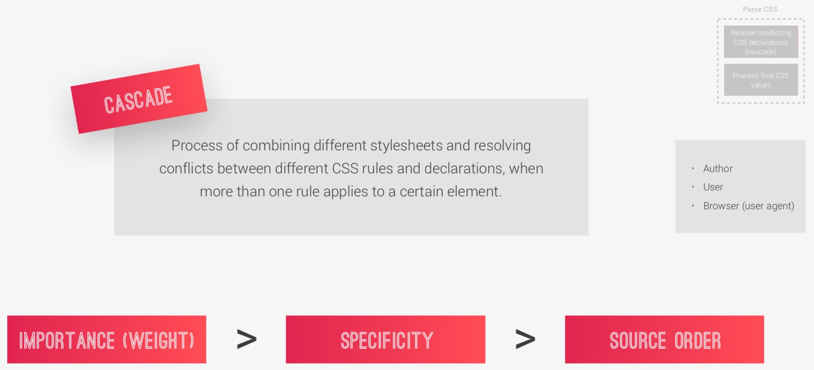

# Advanced CSS and Sass: Flexbox, Grid, Animations and More!

## Table of Contents
- [Advanced CSS and Sass: Flexbox, Grid, Animations and More!](#advanced-css-and-sass-flexbox-grid-animations-and-more)
  - [Table of Contents](#table-of-contents)
  - [**Section 1: Welcome, Welcome, Welcome!**](#section-1-welcome-welcome-welcome)
  - [**Section 2: Natours Project — Setup and First Steps (Part 1)**](#section-2-natours-project--setup-and-first-steps-part-1)
    - [4. Section Intro](#4-section-intro)
    - [5. Project Overview](#5-project-overview)
    - [6. Building the Header - Part 1](#6-building-the-header---part-1)
      - [The best way to perform a basic reset using the universal selector](#the-best-way-to-perform-a-basic-reset-using-the-universal-selector)
      - [How to set project-wide font definitions?](#how-to-set-project-wide-font-definitions)
      - [How to clip parts of elements using clip-path?](#how-to-clip-parts-of-elements-using-clip-path)
    - [7. Building the Header - Part 2](#7-building-the-header---part-2)
    - [8. Creating Cool CSS Animations](#8-creating-cool-css-animations)
      - [How to create CSS animations using @keyframes and the animation property?](#how-to-create-css-animations-using-keyframes-and-the-animation-property)
    - [9. Building a Complex Animated Button - Part 1](#9-building-a-complex-animated-button---part-1)
      - [What pseudo-classes are?](#what-pseudo-classes-are)
      - [How to create a creative hover animation effect using the transition property?](#how-to-create-a-creative-hover-animation-effect-using-the-transition-property)
    - [10. Building a Complex Animated Button - Part 2](#10-building-a-complex-animated-button---part-2)
      - [What pseudo-elements are?](#what-pseudo-elements-are)
      - [How and why to use the ::after pseudoelement;](#how-and-why-to-use-the-after-pseudoelement)
  - [**Section 3: How CSS Works: A Look Behind the Scenes**](#section-3-how-css-works-a-look-behind-the-scenes)
    - [12. Three Pillars of Writing Good HTML and CSS (Never Forget Them!)](#12-three-pillars-of-writing-good-html-and-css-never-forget-them)
    - [13. How CSS Works Behind the Scenes: An Overview](#13-how-css-works-behind-the-scenes-an-overview)
    - [14. How CSS is Parsed, Part 1: The Cascade and Specificity](#14-how-css-is-parsed-part-1-the-cascade-and-specificity)
    - [15. Specificity in Practice](#15-specificity-in-practice)
    - [16. How CSS is Parsed, Part 2: Value Processing](#16-how-css-is-parsed-part-2-value-processing)
    - [17. How CSS is Parsed, Part 3: Inheritance](#17-how-css-is-parsed-part-3-inheritance)
    - [18. Converting px to rem: An Effective Workflow](#18-converting-px-to-rem-an-effective-workflow)
    - [19. How CSS Renders a Website: The Visual Formatting Model](#19-how-css-renders-a-website-the-visual-formatting-model)
    - [20. CSS Architecture, Components and BEM](#20-css-architecture-components-and-bem)
    - [21. Implementing BEM in the Natours Project](#21-implementing-bem-in-the-natours-project)
  - [**Section 4: Introduction to Sass and NPM**](#section-4-introduction-to-sass-and-npm)
  - [**Section 5: Natours Project — Using Advanced CSS and Sass (Part 2)**](#section-5-natours-project--using-advanced-css-and-sass-part-2)
  - [**Section 6: Natours Project — Advanced Responsive Design (Part 3)**](#section-6-natours-project--advanced-responsive-design-part-3)
  - [**Section 7: Trillo Project — Master Flexbox!**](#section-7-trillo-project--master-flexbox)
  - [**Section 8: A Quick Introduction to CSS Grid Layouts**](#section-8-a-quick-introduction-to-css-grid-layouts)
  - [**Section 9: Nexter Project — Master CSS Grid Layouts!**](#section-9-nexter-project--master-css-grid-layouts)
  - [**Section 10: That's It, Everyone!**](#section-10-thats-it-everyone)

## **Section 1: Welcome, Welcome, Welcome!**

- [Course Material and FAQ for my Advanced CSS Course](https://github.com/jonasschmedtmann/advanced-css-course)
- [Jonas' resources page](http://codingheroes.io/resources)
- [Jonas Schmedtmann](https://www.youtube.com/channel/UCNsU-y15AwmU2Q8QTQJG1jw)

**[⬆ back to top](#table-of-contents)**

## **Section 2: Natours Project — Setup and First Steps (Part 1)**

### 4. Section Intro

[Natours](https://natours.netlify.app)
  
**[⬆ back to top](#table-of-contents)**

### 5. Project Overview

[Starter](https://github.com/jonasschmedtmann/advanced-css-course/tree/master/Natours/starter)
  
**[⬆ back to top](#table-of-contents)**

### 6. Building the Header - Part 1

#### The best way to perform a basic reset using the universal selector

```html
<body>
  <header class="header">

  </header>
</body>
```

```css
* {
  margin: 0;
  padding: 0;
  box-sizing: border-box; 
}
```

**[⬆ back to top](#table-of-contents)**

#### How to set project-wide font definitions?

```css
body {
  font-family: "Lato", sans-serif;
  font-weight: 400;
  font-size: 16px;
  line-height: 1.7;
  color: #777;
  padding: 30px;
}
```

**[⬆ back to top](#table-of-contents)**

#### How to clip parts of elements using clip-path?

- [CSS clip-path maker](https://bennettfeely.com/clippy/)
```css
.header {
  clip-path: polygon(0 0, 100% 0, 100% 75vh, 0 100%); 
}
```

**[⬆ back to top](#table-of-contents)**

### 7. Building the Header - Part 2

```html
<body>
  <header class="header">
    <div class="logo-box">
      
    </div>
    <div class="text-box">
      <h1 class="heading-primary">
        <span class="heading-primary-main">Outdoors</span>
        <span class="heading-primary-sub">is where life happens</span>
      </h1>
    </div>
  </header>
</body>
```

```css
.header {
  position: relative;
}

.logo-box {
  position: absolute;
  top: 40px;
  left: 40px;
}

.logo {
  height: 35px;
}

/* The easiest way to center anything with the transform, top and left properties. */
.text-box {
  position: absolute;
  top: 40%;
  left: 50%;
  transform: translate(-50%, -50%);
}

.heading-primary {
  color: #fff;
  text-transform: uppercase;
}

.heading-primary-main {
  display: block;
  font-size: 60px;
  font-weight: 400;
  letter-spacing: 35px;
}

.heading-primary-sub {
  display: block;
  font-size: 20px;
  font-weight: 700;
  letter-spacing: 17.4px;
}
```

**[⬆ back to top](#table-of-contents)**

### 8. Creating Cool CSS Animations

#### How to create CSS animations using @keyframes and the animation property?

```css
.heading-primary {
  backface-visibility: hidden;
}

.heading-primary-main {
  animation-name: moveInLeft;
  animation-duration: 1s;
  animation-timing-function: ease-out;
}

.heading-primary-sub {
  animation: moveInRight 1s ease-out;
}

@keyframes moveInLeft {
  0% {
    opacity: 0;
    transform: translateX(-100px); 
  }
  
  80% {
    transform: translateX(10px); 
  }

  100% {
    opacity: 1;
    transform: translate(0); 
  } 
}

@keyframes moveInRight {
  0% {
    opacity: 0;
    transform: translateX(100px); 
  }
  
  80% {
    transform: translateX(-10px); 
  }

  100% {
    opacity: 1;
    transform: translate(0); 
  } 
}
```

**[⬆ back to top](#table-of-contents)**

### 9. Building a Complex Animated Button - Part 1

#### What pseudo-classes are?

A CSS pseudo-class is a keyword added to a selector that specifies a special state of the selected element(s)

For example, :link, :visited, :hover, :active

**[⬆ back to top](#table-of-contents)**

#### How to create a creative hover animation effect using the transition property?

```html
<a href="" class="btn btn-white">Discover our tours</a>
```

```css
.btn:link,
.btn:visited {
  text-transform: uppercase;
  text-decoration: none;
  padding: 15px 40px;
  display: inline-block;
  border-radius: 100px;
  transition: all .2s;
}

.btn:hover {
  transform: translateY(-3px);
  box-shadow: 0 10px 20px rgba(0, 0, 0, .2);
}

.btn:active {
  transform: translateY(-1px);
  box-shadow: 0 5px 10px rgba(0, 0, 0, .2);
}

.btn-white {
  background-color: #fff;
  color: #777;
}
```

**[⬆ back to top](#table-of-contents)**

### 10. Building a Complex Animated Button - Part 2

#### What pseudo-elements are?

A CSS pseudo-element is a keyword added to a selector that lets you style a specific part of the selected element(s). 

For example, ::after

**[⬆ back to top](#table-of-contents)**

#### How and why to use the ::after pseudoelement; 

In CSS, ::after creates a pseudo-element that is the last child of the selected element. It is often used to add cosmetic content to an element with the content property. It is inline by default.

```css
@keyframes moveInBottom {
  0% {
    opacity: 0;
    transform: translateY(30px); 
  }

  100% {
    opacity: 1;
    transform: translate(0); 
  } 
}

.btn:link,
.btn:visited {
  position: relative;
}

.btn::after {
  content: "";
  display: inline-block;
  height: 100%;
  width: 100%;
  border-radius: 100px;
  position: absolute;
  top: 0;
  left: 0;
  z-index: -1;
  transition: all .4s;
}

.btn-white::after {
  background-color: #fff;
}

.btn:hover::after {
  transform: scaleX(1.4) scaleY(1.6);
  opacity: 0;
}

.btn-animated {
  animation: moveInBottom .5s ease-out .75s;
  animation-fill-mode: backwards;
}
```

**[⬆ back to top](#table-of-contents)**

## **Section 3: How CSS Works: A Look Behind the Scenes**

### 12. Three Pillars of Writing Good HTML and CSS (Never Forget Them!)

| Responsive design             | Maintainable and scalable code | Web performance        |
| ----------------------------- | ------------------------------ | ---------------------- |
| Fluid layouts                 | Clean                          | Less HTTP requests     |
| Media queries                 | Easy-to-understand             | Less code              |
| Responsive images             | Growth                         | Compress code          |
| Correct units                 | Reusable                       | Use a CSS preprocessor |
| Desktop-first vs mobile-first | How to organize files          | Less images            |
|                               | How to name classes            | Compress images        |
|                               | How to structure HTML          |                        |

**[⬆ back to top](#table-of-contents)**

### 13. How CSS Works Behind the Scenes: An Overview


**[⬆ back to top](#table-of-contents)**

### 14. How CSS is Parsed, Part 1: The Cascade and Specificity





Maintainable and scalable code

- CSS declarations marked with !important have the highest priority;
- But, only use !important as a last resource. It’s better to use correct specificities — *more maintainable code!*
- Inline styles will always have priority over styles in external stylesheets;
- A selector that contains *1* ID is more specific than one with *1000* classes;
- A selector that contains *1* class is more specific than one with *1000* elements;
- The universal selector * has no specificity value (0, 0, 0, 0);
- Rely more on *specificity* than on the *order* of selectors;
- But, rely on order when using 3rd-party stylesheets — always put your author stylesheet last.

**[⬆ back to top](#table-of-contents)**

### 15. Specificity in Practice

- [Specificity Calculator](https://specificity.keegan.st)
- [CSS Specificity calculator](https://polypane.app/css-specificity-calculator)

```html
<nav id="nav">
  <div class="pull-right">
    <a class="button button-danger" href="link.html">Don't click here!</a>
  </div>
</nav>
```

```css
body {
  padding: 50px;
}

.button {
  font-size: 20px;
  color: white;
  background-color: blue e
}

a {
  background-color: purple;
}

/* (Inline, IDs, Classes, Elements) */
/* (0, 1, 2, 2) */
#nav div.pull-right a.button {
  background-color: orangered;
}

/* (0, 1, 3, 2) */
#nav div.pull-right a.button:hover {
  background-color: green;
}

/* (0, 1, 2, 1) */
#nav a.button:hover {
  background-color: yellow;
}
```

**[⬆ back to top](#table-of-contents)**

### 16. How CSS is Parsed, Part 2: Value Processing
**[⬆ back to top](#table-of-contents)**

### 17. How CSS is Parsed, Part 3: Inheritance
**[⬆ back to top](#table-of-contents)**

### 18. Converting px to rem: An Effective Workflow
**[⬆ back to top](#table-of-contents)**

### 19. How CSS Renders a Website: The Visual Formatting Model
**[⬆ back to top](#table-of-contents)**

### 20. CSS Architecture, Components and BEM
**[⬆ back to top](#table-of-contents)**

### 21. Implementing BEM in the Natours Project
**[⬆ back to top](#table-of-contents)**

## **Section 4: Introduction to Sass and NPM**
**[⬆ back to top](#table-of-contents)**

## **Section 5: Natours Project — Using Advanced CSS and Sass (Part 2)**
**[⬆ back to top](#table-of-contents)**

## **Section 6: Natours Project — Advanced Responsive Design (Part 3)**
**[⬆ back to top](#table-of-contents)**

## **Section 7: Trillo Project — Master Flexbox!**
**[⬆ back to top](#table-of-contents)**

## **Section 8: A Quick Introduction to CSS Grid Layouts**
**[⬆ back to top](#table-of-contents)**

## **Section 9: Nexter Project — Master CSS Grid Layouts!**
**[⬆ back to top](#table-of-contents)**

## **Section 10: That's It, Everyone!**
**[⬆ back to top](#table-of-contents)**